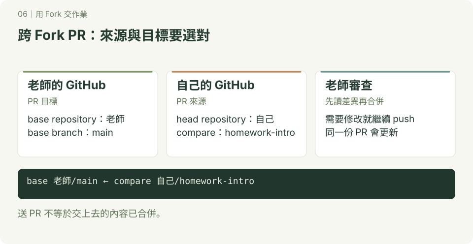

# 用 Fork 交作業

**一起開發 · 第 06 章**　[學習路線](../README.md)

你想修改老師的專案，但沒有直接寫入權限。Fork 讓你在自己帳號的副本中工作，再用 PR 提出修改。

先完成 [分支練習](../分支/README.md) 與 [GitHub 基本操作](../github/README.md)，準備帳號與 Git 操作的登入方式。




使用另一個允許 Fork 的練習儲存庫，例如老師的 `class-homework`。本章是一條獨立流程，先確認老師提供的網址與主要分支名稱。此處用 HTTPS 示範；已設 SSH 者可換用對應 SSH 網址，origin／upstream 概念不變。

1. 在老師的 GitHub 儲存庫按 Fork，建立到自己帳號的副本。
2. clone **自己的 Fork**。把 `YOUR_ACCOUNT`、`TEACHER_ACCOUNT` 換成實際帳號，確認老師的主要分支是 main。

```bash
git clone https://github.com/YOUR_ACCOUNT/class-homework.git
cd class-homework
git remote add upstream https://github.com/TEACHER_ACCOUNT/class-homework.git
git remote -v
git switch main
git fetch upstream
git merge --ff-only upstream/main
git switch -c homework-intro
printf '# 我的作業\n這是我的自我介紹。\n' > introduction.md
git add introduction.md
git diff --staged
git commit -m "新增自我介紹作業"
git push -u origin homework-intro
```

origin 是自己的 Fork，upstream 是老師的原專案。練習中的 main 只用來同步老師版本；若 `--ff-only` 拒絕，表示本地 main 已分岔，先檢查歷史，不要用 force 跳過。

3. 在 GitHub 建立 PR，必要時選 compare across forks：**base repository 選老師的專案、base 選 main；head repository 選自己的 Fork、compare 選 homework-intro**。
4. 老師要求修改時，繼續在 homework-intro 修改、commit、push。老師合併後，再同步老師的 main。

同步操作位置：自己電腦的 class-homework，先確認工作區乾淨。

```bash
git switch main
git fetch upstream
git merge --ff-only upstream/main
git push origin main
```

預期自己的本地 main 與 Fork 的 main 都收到老師已合併的內容。你只 push 自己的 origin，不需要老師專案的寫入權限。

## 換你自己做

Fork 老師指定的練習專案，用新的任務分支新增一份自我介紹，向老師的 main 提出 PR。老師合併後，同步自己的 main 與 Fork。

完成標準：PR 的目標是老師專案、來源是自己的任務分支；能解釋 origin 與 upstream 指向誰，並在合併後更新自己的副本。

---

[← GitHub 共同開發](../協作與PullRequest/README.md)　｜　[worktree：多任務工作 →](../worktree/README.md)
