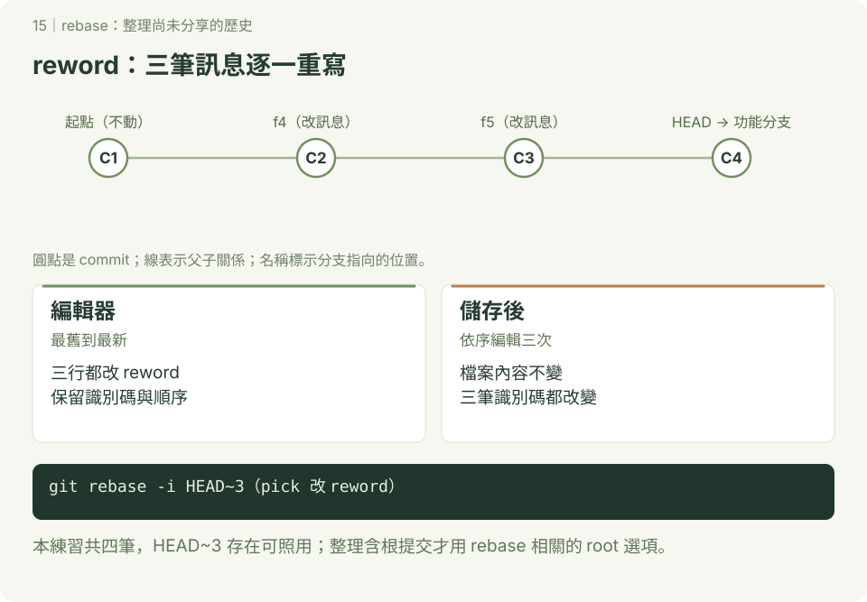

# rebase：整理自己的提交歷史

**延伸圖解 · 第 15 章**　[學習路線](../README.md) · [互動圖解](../docs/README.md)

本章附 SVG 圖解；可先讀 [互動版使用說明](../docs/README.md)，再用瀏覽器開啟 `docs/index.html#rebase/1`，按下一步觀察變化。GitHub 的 README 顯示靜態圖，下載教材後即可離線操作互動版。

先完成 [分支](../分支/README.md)、[reset](../git_reset/README.md) 與 [amend](../修改目前commit/README.md)。rebase 會重新套用提交，可能重建識別碼；本章只整理自己尚未分享的練習分支。



## 1. 照做：準備起點加三筆提交

使用終端機或 Git Bash，已設定身分，在尚無 rebase-demo 的位置開始。互動操作會開啟編輯器，先熟悉 [儲存與離開](../環境安裝與設定/README.md)。

```bash
mkdir rebase-demo
cd rebase-demo
git init -b main
printf '# 起點\n' > README.md
git add README.md
git commit -m "建立練習起點"
git switch -c feature-pages
touch f4.html
git add f4.html
git commit -m "新增 f4"
touch f5.html
git add f5.html
git commit -m "新增 f5"
touch f6.html
git add f6.html
git commit -m "新增 f6"
git branch before-rebase
git status --short
```

共有四筆提交，before-rebase 留住整理前的版本。本練習共四筆，故 `HEAD~3` 存在，可照用；`HEAD~3` 必須存在：**如果整個儲存庫只有三筆，第三次回溯超過 root，不能照用這個指令**。整理包含根提交的歷史另有 `git rebase -i --root`，先不混入本練習。

## 2. 照做：改三筆訊息

```bash
git rebase -i HEAD~3
```

編輯器按最舊到最新列出三筆提交；識別碼依你的專案不同。保留實際識別碼與順序，只把三行開頭的 pick 改成 reword：

```text
reword 實際識別碼 新增 f4
reword 實際識別碼 新增 f5
reword 實際識別碼 新增 f6
```

這是編輯器內容示意，不是 shell 指令。儲存離開後，三筆都選 reword，會依序進行**三次**訊息編輯；分別改成「新增 f4.html」、「新增 f5.html」、「新增 f6.html」。

```bash
git log --oneline -4
git diff before-rebase HEAD
git status --short
```

預期仍四筆提交、訊息改好，檔案差異與 status 都沒有輸出。

## 3. 照做：三筆合成一筆

接續同一個 feature-pages：

```bash
git rebase -i HEAD~3
```

保留第一行 pick，後兩行改 squash：

```text
pick 實際識別碼 新增 f4.html
squash 實際識別碼 新增 f5.html
squash 實際識別碼 新增 f6.html
```

squash 把該提交合到前面累積的提交，並讓你整理訊息；最後訊息改為「新增三個練習頁面」。不要 squash 第一行，因為範圍內沒有前一筆可合。

```bash
git rev-list --count HEAD
git show --stat HEAD
git diff before-rebase HEAD
```

預期現在只有起點與合併後提交，共兩筆；三個頁面都在，與整理前檔案相同。`fixup` 也會合到前面，但一般 fixup 丟棄該筆訊息、沿用前面的訊息；與 squash 的訊息處理不同。

## 4. 照做：把最後一筆拆成兩筆

接續上節，目前最後一筆新增三個檔案：

```bash
git rebase -i HEAD~1
```

將唯一一行 pick 改成 edit，儲存離開。Git 停在該提交時：

```bash
git reset --mixed HEAD^
git status --short
git add f4.html
git commit -m "新增 f4.html"
git add f5.html f6.html
git commit -m "新增 f5.html 與 f6.html"
git rebase --continue
git rev-list --count HEAD
git diff before-rebase HEAD
git status --short
```

預期 reset 後三個新檔案未追蹤，分批 add／commit 後總共三筆，與整理前內容相同，工作區乾淨。拆分不用把三個檔案重新寫一遍；是把原變更分成不同提交。

## 5. 卡關與同步上游（查詢用）

遇到衝突：讀 `git status`，修正列出的檔案、移除衝突標記，`git add 實際檔名` 後 `git rebase --continue`。仍在 rebase 中時可用 `git rebase --abort` 取消本次操作；不要直接 reset 猜測狀態。`--skip` 會略過一筆提交，不能當成一般解衝突方法。

另一種用途是在自己功能分支用 `git fetch origin`、`git rebase origin/main`，把自己的提交重新套用到最新 main。這與本章互動整理有共同原理，但不是要接著執行的步驟。已共享的分支改寫需團隊約定；本教材的初學協作先使用 merge。

完成標準：能用 before-rebase 比較檔案內容，說明為什麼提交數量與識別碼變了，成果卻相同。before-rebase 是尚未整合的舊歷史，branch -d 可能拒絕；先保留它用來比較，不需要強行刪除。

參考：[git rebase 官方文件](https://git-scm.com/docs/git-rebase)。
