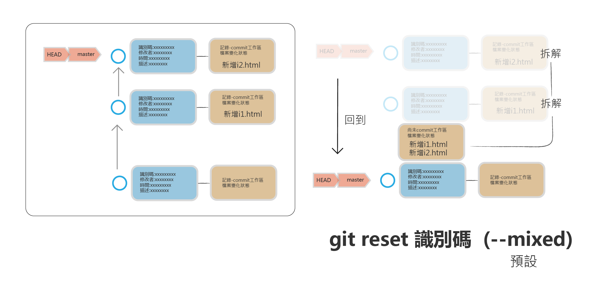
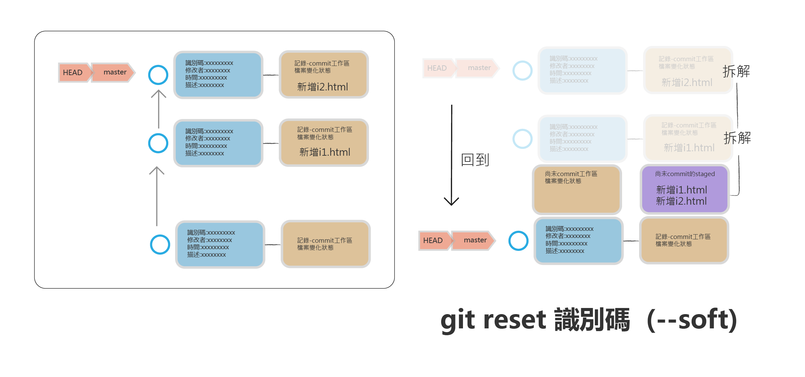
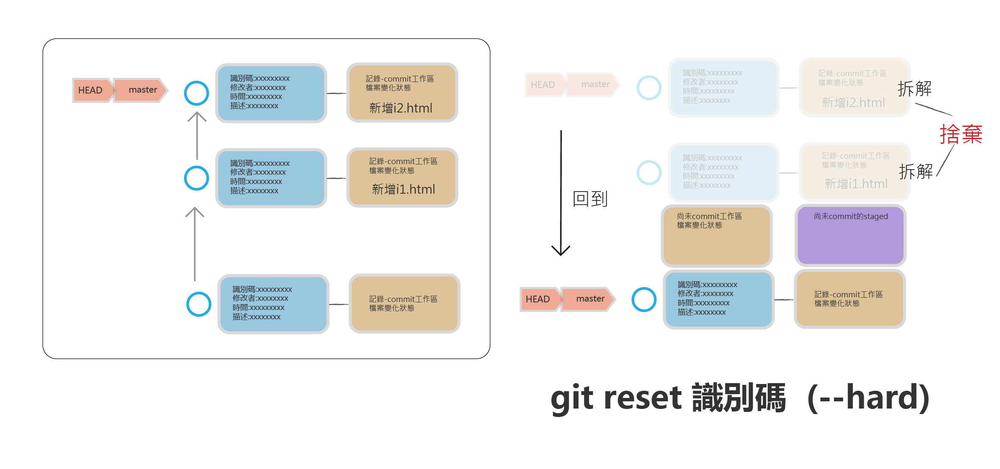

# git reset (--hard,--soft,--mixed)
> 注意  小心會修改工作目錄內的檔案和內容
> 回到前面記錄點(commit)
> 有3種模式 --hard,--soft,--mixed

## 預設模式(—mixed)

> 回到指定的commit,先前commit拆解的檔案,進入尚未commit的工作區



```
$ touch i1.html
$ git add i1.html
$ git commit -m “增加i1.html”

$ touch i2.html
$ git add h2.html
$ git commit -m “增加i2.html”

$ git log --oneline
______________________________________

fa7a416 (HEAD -> master) 增加i2.html
f6679ed 增加i1.html
3c24296 修改.gitignore
cca5666 增加h.cer檔案和hfloder目錄
cd28b1e 增加.gitignore
d2600eb 新增f1.html,f2.html 新增f3.html
059c439 “加入新增d1.html,d2.html,d3.html,d3.html加入內容“
bfe5b85 新增c1.html,c2.html,c3.html,c3.html加入內容
63d60eb 建立b3.html
58718cc 建立b2.html
6421101 建立b1.html
454c953 建立3個a檔案


$ git reset 3c24296      #回到3c24296

$ git status
________________________________________
On branch master
Untracked files:
  (use "git add <file>..." to include in what will be committed)
        i1.html
        i2.html

nothing added to commit but untracked files present (use "git add" to track)

$ git log --oneline
_____________________________________
3c24296 (HEAD -> master) 修改.gitignore
cca5666 增加h.cer檔案和hfloder目錄
cd28b1e 增加.gitignore
d2600eb 新增f1.html,f2.html 新增f3.html
059c439 “加入新增d1.html,d2.html,d3.html,d3.html加入內容“
bfe5b85 新增c1.html,c2.html,c3.html,c3.html加入內容
63d60eb 建立b3.html
58718cc 建立b2.html
6421101 建立b1.html
454c953 建立3個a檔案

```

- HEAD回到3c24296
- 先前commit拆解的檔案回到尚未commit的工作區域

## 回復到原來的commit

> commit 實際是沒被拆解！只要記的先前的commit識別碼.就可以回復

```
$ git reset fa7a416  #復原到最先的commit
$ git log --oneline
_______________________________
fa7a416 (HEAD -> master) 增加i2.html
f6679ed 增加i1.html
3c24296 修改.gitignore
cca5666 增加h.cer檔案和hfloder目錄
cd28b1e 增加.gitignore
d2600eb 新增f1.html,f2.html 新增f3.html
059c439 “加入新增d1.html,d2.html,d3.html,d3.html加入內容“
bfe5b85 新增c1.html,c2.html,c3.html,c3.html加入內容
63d60eb 建立b3.html
58718cc 建立b2.html
6421101 建立b1.html
454c953 建立3個a檔案
```

- 回復到原先的commit

## soft模式(--soft)

> 回到指定的commit,先前commit拆解的檔案,進入尚未commit的staged區



```
$ git log --oneline
_____________________________
fa7a416 (HEAD -> master) 增加i2.html
f6679ed 增加i1.html
3c24296 修改.gitignore
cca5666 增加h.cer檔案和hfloder目錄
cd28b1e 增加.gitignore
d2600eb 新增f1.html,f2.html 新增f3.html
059c439 “加入新增d1.html,d2.html,d3.html,d3.html加入內容“
bfe5b85 新增c1.html,c2.html,c3.html,c3.html加入內容
63d60eb 建立b3.html
58718cc 建立b2.html
6421101 建立b1.html
454c953 建立3個a檔案

$ git reset c324296 --soft
$ git status
____________________________________
On branch master
Changes to be committed:
  (use "git restore --staged <file>..." to unstage)
        new file:   i1.html
        new file:   i2.html
        
$ git log --oneline
_______________________________________
3c24296 (HEAD -> master) 修改.gitignore
cca5666 增加h.cer檔案和hfloder目錄
cd28b1e 增加.gitignore
d2600eb 新增f1.html,f2.html 新增f3.html
059c439 “加入新增d1.html,d2.html,d3.html,d3.html加入內容“
bfe5b85 新增c1.html,c2.html,c3.html,c3.html加入內容
63d60eb 建立b3.html
58718cc 建立b2.html
6421101 建立b1.html
454c953 建立3個a檔案

```

- 回到commit 3c24296
- 被拆解的commit檔案,進入staged內

## 回復到原來的commit

> commit 實際是沒被拆解！只要記的先前的commit識別碼.就可以回復

```
$ git reset fa7a416  #復原到最先的commit
$ git log --oneline
_______________________________
fa7a416 (HEAD -> master) 增加i2.html
f6679ed 增加i1.html
3c24296 修改.gitignore
cca5666 增加h.cer檔案和hfloder目錄
cd28b1e 增加.gitignore
d2600eb 新增f1.html,f2.html 新增f3.html
059c439 “加入新增d1.html,d2.html,d3.html,d3.html加入內容“
bfe5b85 新增c1.html,c2.html,c3.html,c3.html加入內容
63d60eb 建立b3.html
58718cc 建立b2.html
6421101 建立b1.html
454c953 建立3個a檔案
```

- 回復到原先的commit


## hard模式(--hard)

> 回到指定的commit,捨棄先前commit拆解的檔案



```
$ git log --oneline
_____________________________
fa7a416 (HEAD -> master) 增加i2.html
f6679ed 增加i1.html
3c24296 修改.gitignore
cca5666 增加h.cer檔案和hfloder目錄
cd28b1e 增加.gitignore
d2600eb 新增f1.html,f2.html 新增f3.html
059c439 “加入新增d1.html,d2.html,d3.html,d3.html加入內容“
bfe5b85 新增c1.html,c2.html,c3.html,c3.html加入內容
63d60eb 建立b3.html
58718cc 建立b2.html
6421101 建立b1.html
454c953 建立3個a檔案

$ git reset --hard
$ git status
__________________________________
On branch master
nothing to commit, working tree clean

$ git log --oneline
___________________________________
fa7a416 (HEAD -> master) 增加i2.html
f6679ed 增加i1.html
3c24296 修改.gitignore
cca5666 增加h.cer檔案和hfloder目錄
cd28b1e 增加.gitignore
d2600eb 新增f1.html,f2.html 新增f3.html
059c439 “加入新增d1.html,d2.html,d3.html,d3.html加入內容“
bfe5b85 新增c1.html,c2.html,c3.html,c3.html加入內容
63d60eb 建立b3.html
58718cc 建立b2.html
6421101 建立b1.html
454c953 建立3個a檔案
```


回到指定的commit,捨棄先前commit拆解的檔案

##  git reflog

> 可以查詢到所有commit的動作記錄！就可以查到先前被拆解的commit識別碼

```
$ git reflog
__________________________________
fa7a416 (HEAD -> master) HEAD@{0}: reset: moving to fa7a416
3c24296 HEAD@{1}: reset: moving to 3c24296
fa7a416 (HEAD -> master) HEAD@{2}: reset: moving to fa7a416
3c24296 HEAD@{3}: reset: moving to 3c24296
fa7a416 (HEAD -> master) HEAD@{4}: reset: moving to fa7a416
3c24296 HEAD@{5}: reset: moving to 3c24296
fa7a416 (HEAD -> master) HEAD@{6}: commit: 增加i2.html
f6679ed HEAD@{7}: commit: 增加i1.html
3c24296 HEAD@{8}: commit: 修改.gitignore
cca5666 HEAD@{9}: commit: 增加h.cer檔案和hfloder目錄
cd28b1e HEAD@{10}: commit: 增加.gitignore
d2600eb HEAD@{11}: commit (amend): 新增f1.html,f2.html
aa7edbe HEAD@{12}: commit (amend): 新增f1.html,f2.html
fcf905a HEAD@{13}: commit: 新增f1.html
059c439 HEAD@{14}: reset: moving to 059c439
59b62a4 HEAD@{15}: commit: 新增H1.html
0a7a99e HEAD@{16}: commit (amend): 重新修改commit說明
c1a6019 HEAD@{17}: reset: moving to c1a6019
d4e1b24 HEAD@{18}: reset: moving to d4e1b24
c1a6019 HEAD@{19}: reset: moving to c1a6019
d4e1b24 HEAD@{20}: commit: 刪除e1.html,e2.html,e3.html
c1a6019 HEAD@{21}: reset: moving to c1a6019
6633812 HEAD@{22}: reset: moving to 6633812
c1a6019 HEAD@{23}: commit: 新增e1.html,e2.html,e3.html
059c439 HEAD@{24}: reset: moving to 059c439
6633812 HEAD@{25}: reset: moving to 6633812

```