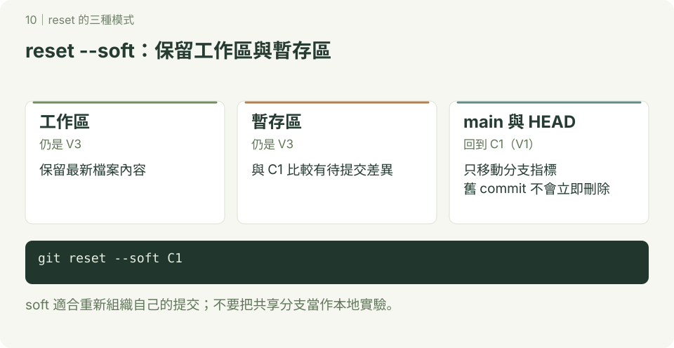

# reset 的三種模式

**復原與整理 · 第 10 章**　[學習路線](../README.md)


本章比較 `git reset [--soft|--mixed|--hard] 目標提交`：在一般分支上會移動目前分支，再依模式更新暫存區或工作區。它不是立即刪除 commit；但會改變分支可見的歷史。只在獨立練習專案操作，已分享的錯誤優先追加修正或 revert。

## 1. 三種模式



| 模式 | 目前分支 | 暫存區 | 工作區 |
| --- | --- | --- | --- |
| `--soft` | 移到目標 | 保留原版本 | 保留原內容 |
| `--mixed`（預設） | 移到目標 | 改為目標版本 | 保留原內容 |
| `--hard` | 移到目標 | 改為目標版本 | 受追蹤內容改為目標版本 |

hard 會丟棄受追蹤內容的未提交修改，也可能覆蓋或刪除擋住還原路徑的未追蹤檔案；它不是通用的「刪除所有未追蹤檔案」指令。`git reset -- 檔名` 是另一種只更新暫存區、不移動分支的用法，初學可用 `git restore --staged` 表達取消暫存。

## 2. 照做：準備相同起點

已設定提交身分，在終端機或 Git Bash 的新練習位置操作；reset-demo 尚未存在。

```bash
mkdir reset-demo
cd reset-demo
git init -b main
printf 'V1\n' > version.txt
git add version.txt
git commit -m "版本 V1"
printf 'V2\n' > version.txt
git add version.txt
git commit -m "版本 V2"
printf 'V3\n' > version.txt
git add version.txt
git commit -m "版本 V3"
git branch lesson-start
git status --short
```

預期 main 有三筆提交，檔案是 V3，status 沒有輸出。lesson-start 是留在 V3 的備用分支名稱，讓三次比較能回到相同起點；它不會隨 main 的 reset 移動。

## 3. soft：保留已暫存差異


```bash
git reset --soft HEAD~2
git status --short
cat version.txt
git show HEAD:version.txt
git diff --staged
```

預期 `M  version.txt`；工作區與暫存區仍是 V3，HEAD 是 V1，staged 差異是 V1 → V3。兩筆提交不再由 main 指向，仍由 lesson-start 保留。

回相同起點再比較：

```bash
git reset --soft lesson-start
git status --short
```

預期乾淨、main 又在 V3。

## 4. mixed：保留未暫存差異


```bash
git reset --mixed HEAD~2
git status --short
cat version.txt
git show HEAD:version.txt
git diff
```

預期 ` M version.txt`；HEAD 與暫存區是 V1，工作區仍是 V3。要重新提交就必須再 add。

```bash
git reset --mixed lesson-start
git status --short
```

工作區仍是 V3，暫存區與 main 回到 V3，因此又乾淨。

## 5. hard：連工作區一起還原

hard 會把目前分支、暫存區、受追蹤的工作區內容都改為目標版本（對照前兩節的圖，第三個區域也會一起還原）。

以下只在本章 reset-demo、已確認沒有其他要保留修改時執行：

```bash
git reset --hard HEAD~2
git status --short
cat version.txt
```

預期沒有待處理差異，內容改成 V1。備用分支仍保留已提交 V3，所以可以回去：

```bash
git reset --hard lesson-start
cat version.txt
git branch -d lesson-start
```

預期 V3，完成後只剩 main。能找回是因為 V3 已提交且仍有名稱指向它，不代表 hard 能找回未提交修改。

## 6. 已移走的 commit 怎麼找？

`git reflog` 記錄本機參照的移動；可能找到 reset 前的識別碼。查到後，可先用 `git show 識別碼` 確認，再用 `git branch recovered 識別碼` 建立保留分支，避免立刻再次 reset。

reflog 不是遠端共享紀錄，也不是永久備份；紀錄與無法到達的物件可能到期被清理，整個 .git 遺失時也不能靠它復原。

## 7. 自己做

在另一個練習專案做三筆版本，再比較三種模式。驗收時同時指出 HEAD、暫存區與工作區的版本；不能只說「退回兩筆」。

參考：[git reset](https://git-scm.com/docs/git-reset)、[git reflog](https://git-scm.com/docs/git-reflog)。


---

[← 還原檔案與取消暫存](../回復被刪除的檔案或被編輯的內容/README.md)　｜　[整理最後一筆提交 →](../修改目前commit/README.md)
