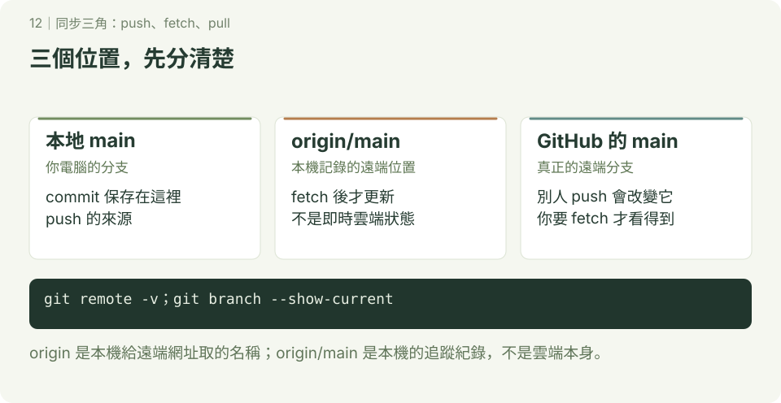

# GitHub 基本操作

**延伸圖解 · 第 12 章**　[學習路線](../README.md)


Git 管理本地版本，GitHub 提供遠端儲存庫與共同開發功能。先完成前四章，再準備本章的帳號與連線；合作實作見 [GitHub 共同開發](../協作與PullRequest/README.md)。



## 1. 提交身分與登入分開設定

`git config user.name`、`user.email` 寫入提交資訊，不會讓你取得 GitHub 權限。先申請 GitHub 帳號，再選一種 Git 連線方式：

- HTTPS：使用登入／憑證工具，必要時使用 personal access token。
- SSH：使用自己的金鑰，參考 [SSH 設定](../ssh/README.md)。

GitHub 帳號密碼不能作為 HTTPS Git 操作的密碼。憑證設定見 [憑證章節](../credential/README.md)，不需要為了登入重建儲存庫。

## 2. 路線 A：已有遠端專案，從 clone 開始

下方 OWNER 與網址要換成實際帳號及儲存庫。先選未使用的資料夾位置：

```bash
git clone https://github.com/OWNER/class-team-demo.git
cd class-team-demo
git remote -v
git branch --show-current
git status
```

clone 自動設定 origin，並依遠端預設分支取出檔案。不需要再 init 或再次 `remote add origin`。本教材練習的預設分支是 main，其他專案請看實際名稱。

## 3. 路線 B：自己的本地專案，推到全新空白遠端

這是另一條獨立路線，不要接著路線 A 做。先在 GitHub 建立 class-first-repo，選擇適合的可見性，**不要先新增 README、LICENSE 或 .gitignore**，讓遠端保持空白；避免本地與遠端各自建立不相干的起點。

在終端機或 Git Bash 的新練習位置開始，確認 class-first-repo 尚未存在，已設定提交身分：

```bash
mkdir class-first-repo
cd class-first-repo
git init -b main
printf '# 我的第一個遠端專案\n' > README.md
git add README.md
git commit -m "建立專案說明"
git remote add origin https://github.com/OWNER/class-first-repo.git
git remote -v
git push -u origin main
```

OWNER 要替換。成功後重新整理 GitHub，應看到 README 與提交。`-u` 設定本地 main 的上游追蹤關係。已有自己的本地專案時，先確認目前分支、提交與遠端，不要重複執行初始化步驟。

如果遠端已經有 README，初學改走 clone 路線，把要加入的本地檔案複製進去、檢查後提交；不要用 force 覆蓋遠端，或隨意加上 `--allow-unrelated-histories` 合併無關歷史。

## 4. origin、origin/main、main 是什麼？

| 名稱 | 意思 |
| --- | --- |
| origin | 本機給遠端網址取的名稱，可以修改 |
| main | 本地分支 |
| origin/main | 本機記錄的遠端 main 位置，fetch 後更新 |
| GitHub 的 main | 真正保存在遠端的分支 |

origin/main 不是即時雲端狀態；別人 push 後，你尚未 fetch 時它可能還在舊位置。

## 5. fetch、pull、push（查詢用）

| 指令 | 做了什麼？ |
| --- | --- |
| `git fetch origin` | 下載物件、更新遠端追蹤紀錄，不自動整合工作區 |
| `git pull --ff-only origin main` | fetch 後只接受 fast-forward；分岔時拒絕 |
| `git pull --no-rebase origin main` | fetch 後以 merge 整合，可能 fast-forward、建立合併提交或衝突 |
| `git pull --rebase origin main` | fetch 後把自己的提交重套到遠端版本，可能改識別碼與遇到衝突 |
| `git push -u origin <任務分支>` | 上傳指定分支並設定上游關係 |

pull 把指定來源整合到**目前分支**，不會因為寫 origin main 就自動切到本地 main。開始前先確認分支與工作區。單獨 pull 的行為受設定與版本影響，教材明確指定策略。

push 只上傳提交，不包含尚未提交的檔案，也不自動替你合併功能分支與 main。不要為方便一次推所有分支或標籤；先分享本次需要的版本。

## 6. 修改遠端與卡關

下面是依需要選用的查詢指令：

| 目的 | 指令 |
| --- | --- |
| 看遠端網址 | `git remote -v` |
| 更新已存在的 origin 網址 | `git remote set-url origin <實際網址>` |
| 移除 origin 設定 | `git remote remove origin` |
| 清理已消失的遠端分支追蹤紀錄 | `git fetch --prune origin` |

remove origin 只移除本機的遠端設定與相關追蹤紀錄，不會刪 GitHub 專案。push 出現 non-fast-forward 是遠端拒絕更新分支，不等於已發生檔案衝突；先 fetch 看歷史，參考 [常見錯誤](../github常見的錯誤訊息/README.md)。

## 7. 路線 C：用 GitHub CLI 建立 repo 並直接 push

這是替代網站建庫的方式，三條路線三選一就好，不要把網站建庫與 CLI 建庫重複執行。想在終端機一次完成「建立遠端＋上傳」，就用這一條。

先確認已安裝 `gh`，再登入並檢查狀態：

```bash
gh --version
gh auth login
gh auth status
```

`gh auth login` 依提示選 GitHub.com、HTTPS、瀏覽器登入；`gh auth status` 有帳號與 token 狀態才算成功。這只代表 CLI 的登入，不代表 SSH 或其他 helper 用同一帳號。

### 照做：本地已有提交，一鍵建庫並上傳

這是另一條獨立路線，不要接著路線 A、B 做。在新練習位置開始，確認 class-cli-demo 尚未存在：

```bash
mkdir class-cli-demo
cd class-cli-demo
git init -b main
printf '# CLI 建立的專案\n' > README.md
git add README.md
git commit -m "建立專案說明"
git status --short
```

確認 status 沒有輸出（已提交乾淨），且還沒有設定 origin，再執行：

```bash
git remote -v
gh repo create class-cli-demo --private --source=. --remote=origin --push
```

- `class-cli-demo` 是遠端名稱，請換成自己的練習名稱。
- `--private` 建私人庫，練習用建議先私人；要公開才改 `--public`，建立後也可在網頁改可見性。
- `--source=.` 指目前資料夾的本地專案，`--remote=origin` 把遠端命名為 origin，`--push` 建好後直接把 main 推上去。

預期 `git remote -v` 出現 origin 的 GitHub 網址，終端機顯示 push 進度，重新整理 GitHub 就看到 README 與提交。接著驗證：

```bash
git remote -v
git branch --show-current
git status --short
gh repo view --web
```

預期目前分支是 main、status 沒有輸出，`gh repo view --web` 開啟剛建立的遠端頁面。之後新增提交照常用 `git push`，不需要每次都 `gh repo create`。

### 只建空庫、不上傳，何時用？

還沒有本地提交、只想先佔一個空遠端時，在任意位置執行：

```bash
gh repo create class-empty-demo --private
```

這只建遠端，不設定 origin 也不 push，等同網站建庫的「空白遠端」。之後要上傳，走路線 B 的 `remote add origin`＋`push -u origin main`。已經用 `--source=. --push` 的人不要再重複建一次。

| 方式 | 適合情況 | 指令 |
| --- | --- | --- |
| 網站建庫＋手動 push | 熟悉網頁流程 | 網頁建空白庫，再 `remote add`＋`push -u origin main` |
| CLI 一鍵建庫並上傳 | 本地已有提交，想一次推上 GitHub | `gh repo create 名稱 --private --source=. --remote=origin --push` |
| CLI 只建空庫 | 先佔遠端、稍後再傳 | `gh repo create 名稱 --private` |

### 卡關先查這三個

- `remote origin already exists`：本地已有 origin，先用 `git remote -v` 確認，不要重複 create；要用 CLI 接管，先 `git remote remove origin` 再重來，或直接手動 push。
- 名稱已存在：遠端已有同名庫，換一個名稱，或到網頁確認是不是自己之前建的。
- 可見性選錯：public／private 建完都可在 GitHub 儲存庫 Settings 改，不需要刪庫重建。作業、練習先用 private。

完成標準：能在 GitHub 找到自己上傳的提交，說出本地 main、origin/main 與遠端 main 的差別，並說出 `gh repo create --source=. --push` 與網站建庫的差別。接著完成 [兩人 PR 練習](../協作與PullRequest/README.md)。

參考：[GitHub 驗證方式](https://docs.github.com/en/authentication/keeping-your-account-and-data-secure/about-authentication-to-github)、[git pull](https://git-scm.com/docs/git-pull)、[GitHub CLI 手冊](https://cli.github.com/manual/)。
