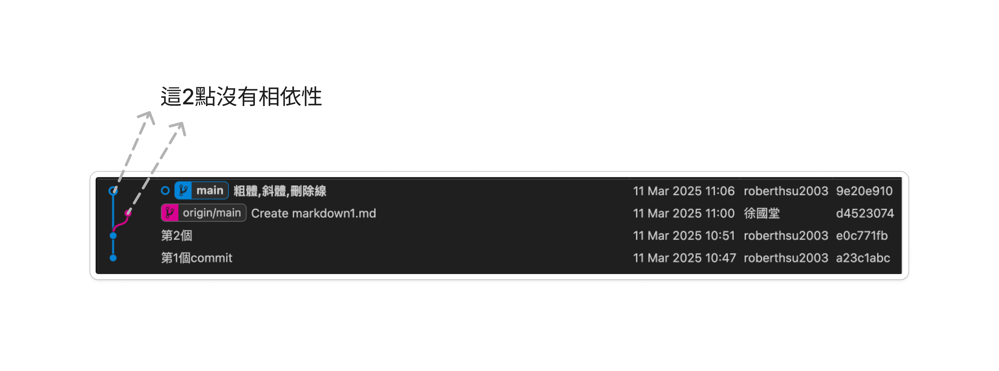
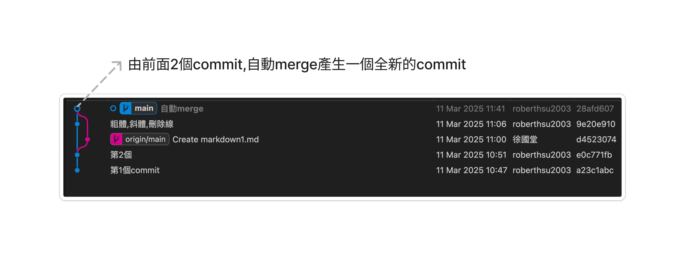
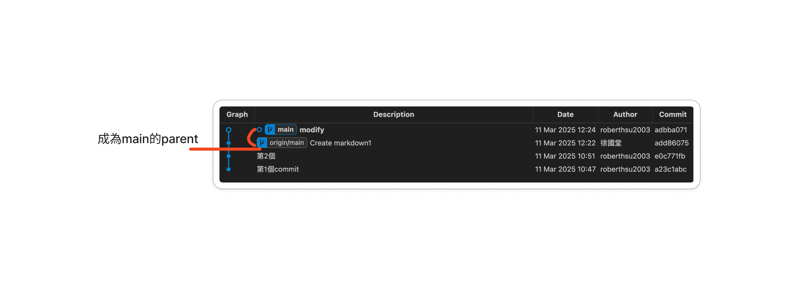
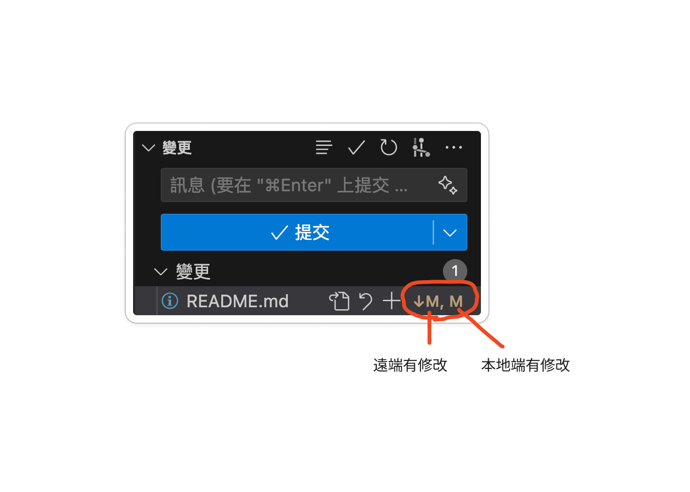
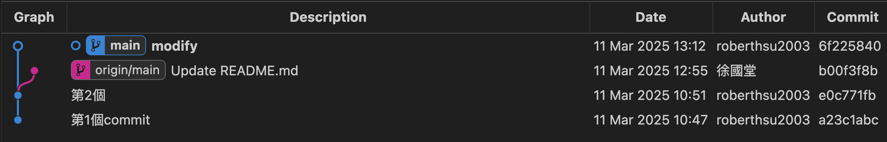
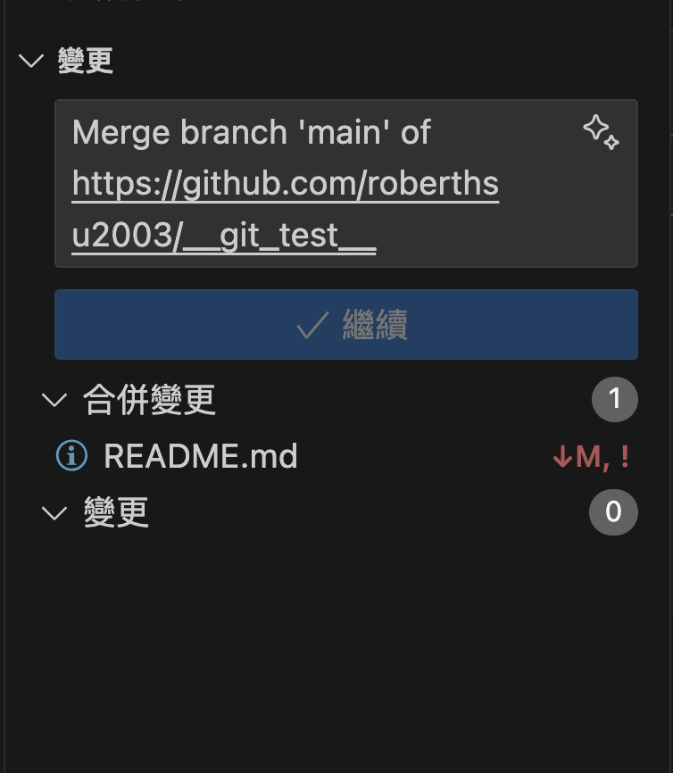
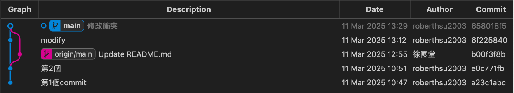
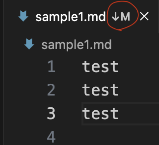
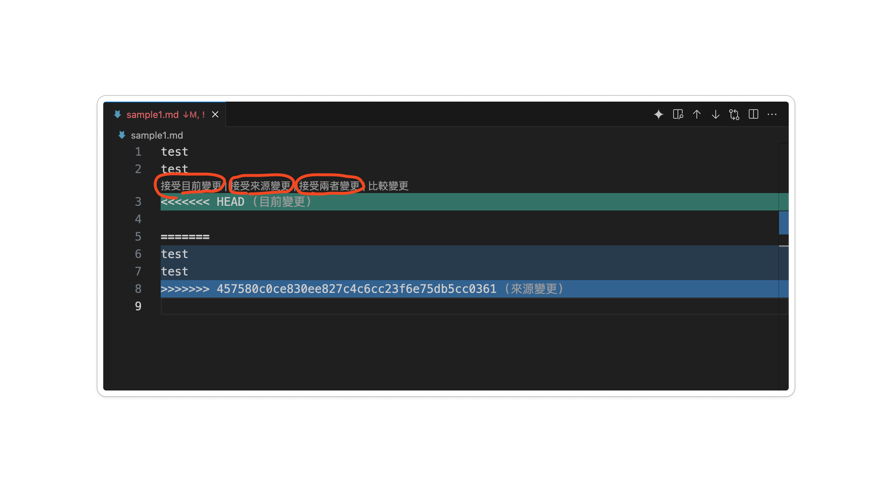
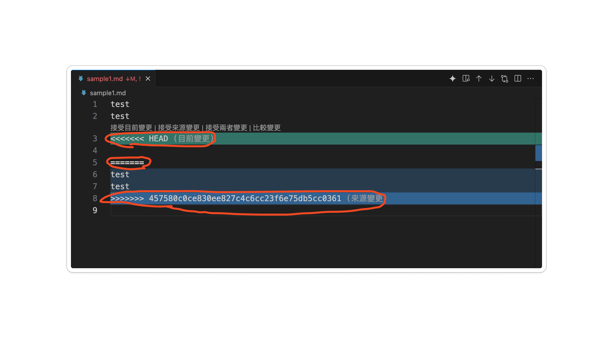

# GitHub 常見錯誤：先辨認狀態再處理

這是查詢章節，各節是不同狀況，不要全部連續執行。開始先看 `git status`、`git branch --show-current`、`git remote -v`。下面以 main 與 origin 為例，實際專案要換成正確名稱。

## 1. push 被拒絕：non-fast-forward

這表示遠端分支更新不能直接由你要推的版本往前移，可能遠端比你新、兩邊分岔，或本地改寫了歷史；**push 本身不會在本地執行檔案合併**。

```bash
git fetch origin
git status
git log --oneline --graph --all --decorate -12
```

若本地 main 只是落後、工作區乾淨，在 main 可用 `git pull --ff-only origin main` 更新。若兩邊各有提交，先確認哪些內容要保留；初學的合併方式是 `git merge --no-edit origin/main`，完成檢查後再 push。如果出現衝突，依第 3 節處理。不要直接 force push 共享 main。

自己的未分享提交也可 rebase，但會改寫歷史，詳見 [rebase](../git_rebase/README.md)。一般 pull 不保證預設 merge，也不保證一定會建立 merge commit。

## 2. pull／merge 被未提交修改擋住

常見訊息是 local changes would be overwritten，或 untracked working tree files would be overwritten。這是避免覆蓋目前檔案，**不等於已進入合併衝突**。

先閱讀 diff 與未追蹤檔案，選一種方法：

- 已完成的工作：在正確任務分支提交，再整合上游。
- 未完成而要保留：`git stash push -u -m "同步前保留草稿"`，更新後用 `git stash apply` 取回，確認無誤才 `git stash drop`。apply 也可能衝突；-u 不包含被忽略檔案。
- 確認不要的指定檔案修改：才用 restore；未追蹤檔案可先移到專案外保留。

不要把 restore 當預設解法，它會丟掉未暫存內容。編輯器的提示仍要用 git status 確認，不要只看圖示猜測。

## 3. 合併已開始，CONFLICT (content)

先讀 `git status` 確認正在 merge 還是 rebase。一般 merge 的衝突可能如下：

```text
<<<<<<< HEAD
本地內容
=======
來源分支內容
>>>>>>> origin/main
```

與同學確認正確結果，手動編輯或使用編輯器的合併工具，移除標記。不能只刪標記而不檢查保留的內容。

一般 merge 完成方式（檔名要換成實際路徑）：`git add 實際檔名`，再 `git commit -m "整合變更並解決衝突"`，執行專案檢查後 push。仍在 merge 中，決定取消時用 `git merge --abort`；它會嘗試回到合併前，因此最好在開始整合前讓工作區乾淨。

若正在 rebase，修正與 add 後用 `git rebase --continue`；取消用 `git rebase --abort`。不要用 merge --abort 結束 rebase，也不要在 abort 後照抄 reset --hard HEAD^ 刪掉另一筆提交。

## 4. pull 已完成，想撤回

先問「已 push 或分享了嗎？」以及「是 fast-forward、merge 還是 rebase？」不能一律 reset 到 HEAD^。

未分享且沒有待保留的未提交內容時，可查 `git reflog` 找 pull 前的**實際識別碼**，先建立 backup-before-undo 分支保留目前版本，再評估 reset。`ORIG_HEAD` 可能記錄操作前位置，但會被後續操作覆蓋，需先 show／reflog 確認；不要直接執行 hard。

已分享時用新的修正 commit；要撤銷整個 merge，需用 `git revert -m 主線編號 合併識別碼` 並理解哪個父提交是主線與後續合併的影響，不把 -m 1 當通用答案。初學先請老師一起檢查歷史。

## 5. Authentication failed／Permission denied (publickey)

HTTPS 查 [憑證](../credential/README.md)，SSH 查 [SSH 設定](../ssh/README.md)。確認網址、實際登入帳號、金鑰或 token、儲存庫存取權限。改 user.name 不會解決登入錯誤。

## 6. origin already exists／src refspec main does not match any

origin already exists：用 `git remote -v` 查已有設定，必要時 set-url，不要重複 add。

src refspec main does not match any：可能尚未有第一筆 commit，或分支名稱並非 main。用 status、branch 與 log 確認後再提交／推送正確分支，不要為解決錯誤亂建新的空歷史。

## 7. 課堂衝突練習

兩人在不同任務分支改 README 的同一行，各自提交並送 PR。先合併一份，第二人把 origin/main 合併到自己的分支，按照第 3 節整理成兩人同意的內容，再 push 更新 PR。完成標準：沒有衝突標記，兩人能解釋最終內容與合併方向。

舊版截圖供對照，不代表每個版本的介面與訊息都相同：





















參考：[git merge](https://git-scm.com/docs/git-merge)、[git reflog](https://git-scm.com/docs/git-reflog)、[git revert](https://git-scm.com/docs/git-revert)。
