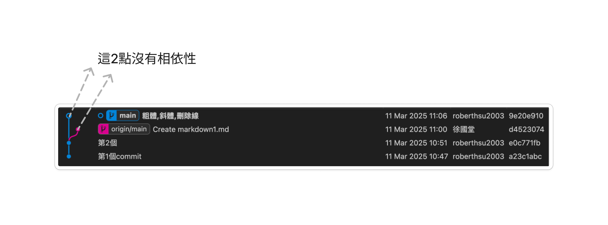
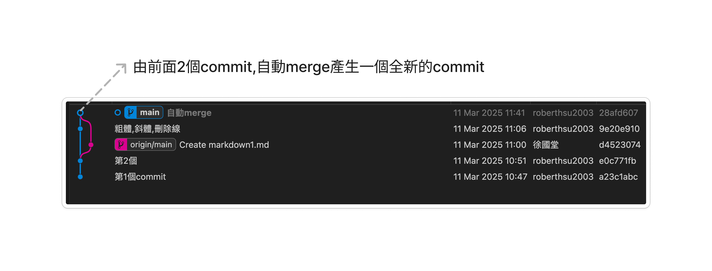
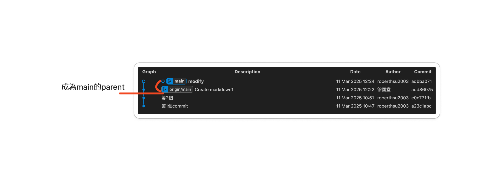
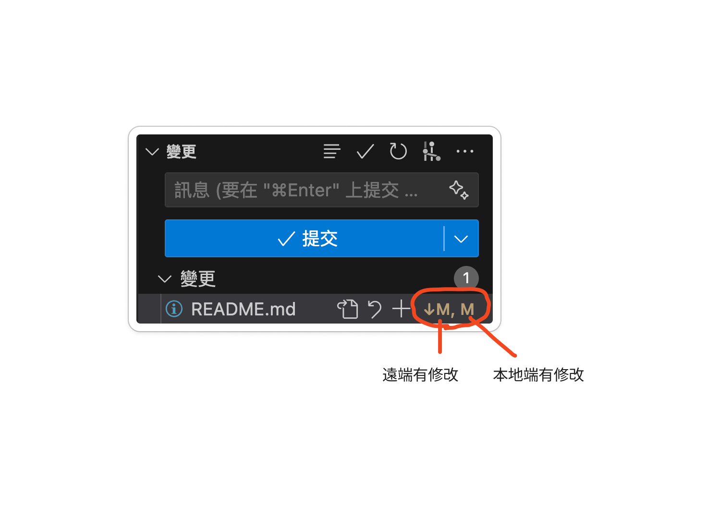
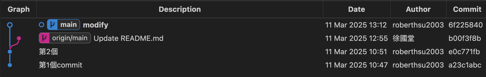
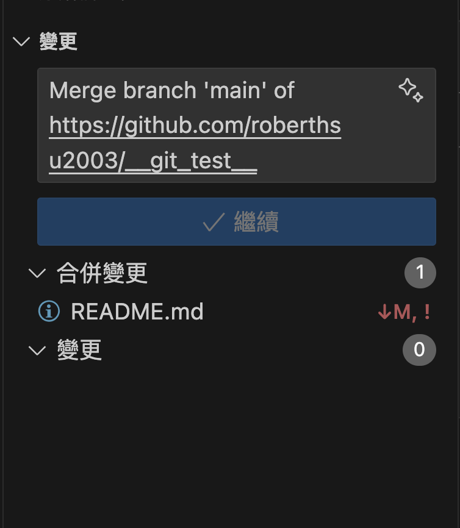
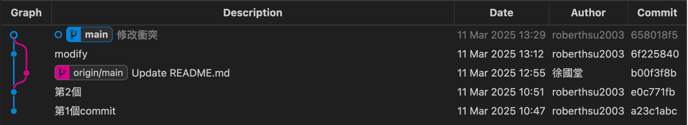

# github常遇的錯誤
- push(推送)時出現的錯誤訊息(non-fast-forward error)


###  狀況1 push(推送)時出現的錯誤訊息

- 問題是因為遠端 main 分支有新的提交，而你的本地 main 分支落後於遠端版本，導致 Git 拒絕推送 (non-fast-forward error)。

```
roberthsu2003@xuguotangdeMBP test % git push
To https://github.com/roberthsu2003/__git_test__.git
 ! [rejected]        main -> main (non-fast-forward)
error: failed to push some refs to 'https://github.com/roberthsu2003/__git_test__.git'
hint: Updates were rejected because the tip of your current branch is behind
hint: its remote counterpart. If you want to integrate the remote changes,
hint: use 'git pull' before pushing again.
hint: See the 'Note about fast-forwards' in 'git push --help' for details.
```

- **依command觀察**

> [!TIP]
> → 使用fetch命令取得remote分支的資訊


```bash
git fetch origin && git status
```

- **依圖型觀察:main和origin/main分叉**



#### 解決方法1
- 自動fetch
- auto merge

```bash
git pull #先pull
git push #再push #多了一個merge的commit
```




####  解決方法2
- rebase (下拉下來的commit,成為本地端commit的parent)

```bash 
git pull --rebase origin main
```




**如果rebase 過程中遇到衝突，Git 會停止並讓你手動解決。**

- 編輯有衝突的檔案，解決衝突後，執行：

```base
git add <修正過的檔案>
git rebase --continue
```


**如果想要放棄 rebase，可以執行：**

```bash
git rebase --abort
```


###  狀況2 本地端和遠端出現檔案衝突

- **本地端還沒有建立commit時,在vscode就可以知道檔案是否衝突**


#### 解決方法

```bash
git restore 檔案名稱 #回覆衝突檔案
git pull #檔案沒衝突後,將雲端提取下來
```

###  狀況3 pull(提取)出現檔案衝突

- **由於有分叉,所以先pull下來**



**檔案衝突的訊息**

- **會告知您那一個檔案衝突**

```bash
roberthsu2003@xuguotangdeMBP test % git pull
Auto-merging README.md
CONFLICT (content): Merge conflict in README.md
Automatic merge failed; fix conflicts and then commit the result.
```

- **vscode衝突的畫面**


#### 解法方法1

**修改衝突檔案**

- **會幫我們標註那些行有衝突**

```
<<<<<<< HEAD
專門處理commit衝突方法2
=======
專門處理commit衝突方法1
>>>>>>> b00f3f8b8b6c3753e7e86d2ed72f2da67e5f7e09
```

- **手動修改**

```
專門處理commit衝突方法1
```

- **建立新的commit**

```bash
git add .
git commit -m "修改衝突"
git push
```



#### 解決方法2

**取法pull的動作**

當 git pull 遇到衝突時，Git 其實是在執行 git fetch + git merge，如果你想取消這個合併，可以執行：

```bash
git merge --abort
```

這將會 **取消merge**，並讓你的分支回到 git pull 之前的狀態。


#### 解決方法3

**使用 git reset --hard 回到 pull 之前的狀態（注意會丟失未提交的變更)**

如果 git merge --abort 沒有作用（例如你已經手動解決了一些衝突），你可以用 git reset --hard 來強制回到 git pull 之前：

```bash
git reset --hard HEAD
```

注意： 這會丟失所有未提交的變更，請謹慎使用。

### 問題:如果 git pull 已經完成但想撤銷

如果 git pull 已經成功執行（即 merge 也完成了），但你想回到 pull 之前的狀態，你可以使用：

```bash
git reset --hard ORIG_HEAD
```

這會創建一個新的 commit 來 撤銷 git pull 帶來的變更。


