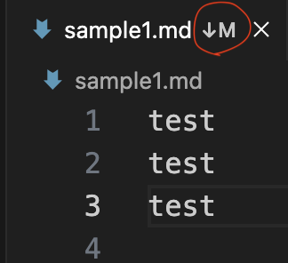
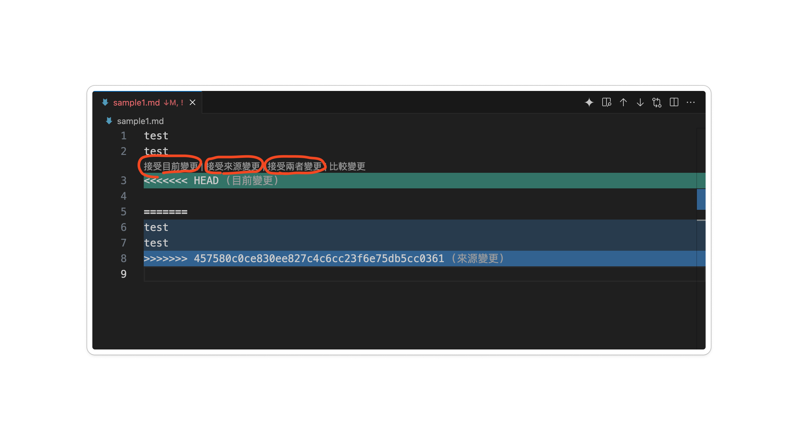
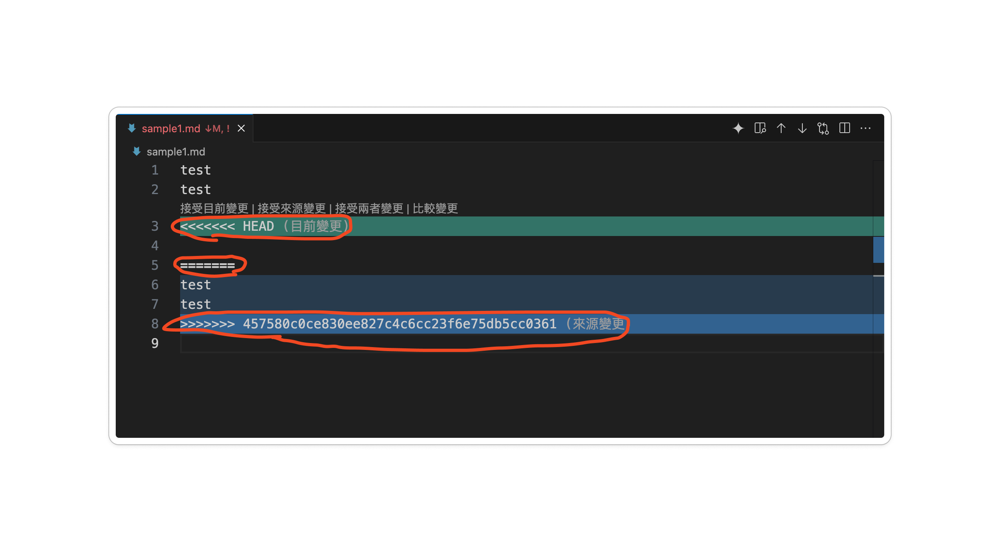

# github常遇的錯誤
- [push(推送)時出現的錯誤訊息(non-fast-forward error)](#狀況1)
- [push(推送) push時本地端和遠端出現檔案衝突](#狀況2)
- [pull(提取)出現檔案衝突](#狀況3)
- [pull成功完成後取消前一次的pull](#狀況4)

<a name="狀況1"></a>
## 狀況1 push(推送)時出現的錯誤訊息

- 問題是因為遠端 main 分支有新的提交，而你的本地 main 分支落後於遠端版本，導致 Git 拒絕推送 (non-fast-forward error)。

- 因為在github上不會自動merge

```
roberthsu2003@xuguotangdeMBP test % git push
To https://github.com/roberthsu2003/__git_test__.git
 ! [rejected]        main -> main (non-fast-forward)
error: failed to push some refs to 'https://github.com/roberthsu2003/__git_test__.git'
hint: Updates were rejected because the tip of your current branch is behind
hint: its remote counterpart. If you want to integrate the remote changes,
hint: use 'git pull' before pushing again.
hint: See the 'Note about fast-forwards' in 'git push --help' for details.
```

- **依command觀察**

> [!TIP]
> → 使用fetch命令取得remote分支的資訊


```bash
git fetch origin && git status
```

- **依圖型觀察:main和origin/main分叉**


#### 解決方法1

> [!TIP]
> → 使用命令pull
>> 注意預設會在local自動merge,所以會要求您提供merge的敘述文字\
>> 預設敘述文字的`#`是註解,被排除為敘述文字

```bash
git pull #先pull,要寫敘文字
git push #再push #多了一個merge的commit
```


####  解決方法2
- rebase (下拉下來的commit,成為本地端commit的parent)

```bash 
git pull --rebase origin main
```


> [!WARNING]
> → 如果rebase 過程中遇到衝突，Git 會停止並讓你手動解決。

**1️⃣有衝突的檔案，解決衝突後，執行：**

```base
git add <修正過的檔案>
git rebase --continue
```


**2️⃣如果想要放棄 rebase，可以執行：**

```bash
git rebase --abort
```

---

<a name="狀況2"></a>
##  狀況2 push時本地端和遠端出現檔案衝突

> [!TIP]
> 透過vscode可以快速發現
>> 2種方式

## 第1種方式-先pull下來,修改衝突檔
**解法方式**
[使用狀況3的解決衝突方式](#狀況3)

### 第2種方式-正在編輯時發現



**→解決方法:**
1. 回復至未編輯的狀態(discard changes in working directory)\
2. 再git pull

```bash
git restore <檔案名稱> #回復衝突檔案
git pull #檔案沒衝突後,將雲端提取下來
```

### 第3種方式-在原始檔控制內發現
- **本地端還沒有建立commit時,在vscode就可以知道檔案是否衝突**


**→解決方法:**
1. 回復至未編輯的狀態(discard changes in working directory)\
2. 再git pull

```bash
git restore <檔案名稱> #回復衝突檔案
git pull #檔案沒衝突後,將雲端提取下來
```

---

<a name="狀況3"></a>

##  狀況3 pull(提取)出現檔案衝突

- **由於有分叉,所以先pull下來**


**檔案衝突的訊息**

- **會告知您那一個檔案衝突**

```bash
roberthsu2003@xuguotangdeMBP test % git pull
Auto-merging README.md
CONFLICT (content): Merge conflict in README.md
Automatic merge failed; fix conflicts and then commit the result.
```

- **vscode衝突的畫面**


#### 解法方法1-修改衝突

**修改衝突檔案使用vscode**

- **1️⃣可以在編輯器4個選擇其中1個**



- **2️⃣自已手動修改**
- 刪除衝突部分



- **建立新的commit**

```bash
git add .
git commit -m "修改衝突和合併變更"
```


#### 解決方法2-取消pull

**1.取消pull的動作**

當 git pull 遇到衝突時，Git 其實是在執行 git fetch + git merge，如果你想取消這個合併，可以執行：

```bash
git merge --abort
```

這將會 **取消merge**，並讓你的分支回到 git pull 之前的狀態。

**2.回復至前一個commit,放棄本次修改**

```bash
git reset --hard HEAD^
```

**3.重新pull**

```bash
git pull
```

---

<a name="狀況4"></a>
## 狀況4 pull成功完成後撤銷前一次的pull

#### 解決方法

如果 git pull 已經成功執行（即 merge 也完成了），但你想回到 pull 之前的狀態，你可以使用：

```bash
git reset --hard ORIG_HEAD
```


