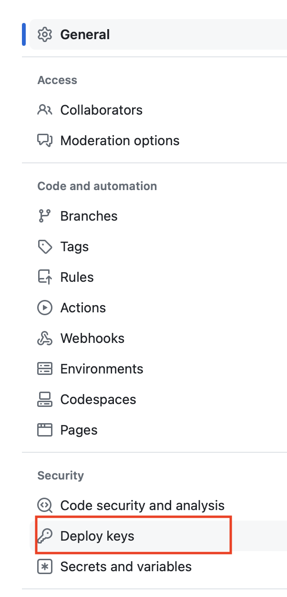

# 設定SSH KEY 連線
## Mac和windows 電腦
### 1. 建立SSH金鑰

```
ssh-keygen -t rsa -b 4096 -C "your_email@example.com"
```

輸入後會出現下面幾行:
- 會自動將金鑰建立於/Users/you/.ssh/id_rsa
- 取用這個鈕鑰有需要使用驗証碼(passphrase)嗎?(一般我直接按enter)
- 完成後,將產生私有金鑰id_rsa和公有金鑰id_rsa.pub
- 公有金鑰必需要放至github的repo內

```
Generating public/private rsa key pair.
Enter a file in which to save the key (/Users/you/.ssh/id_rsa): [Press enter]
Enter passphrase (empty for no passphrase): [Type a passphrase]
Enter same passphrase again: [Type passphrase again]
```


### 2. 啟動shh-agent
- 主要功能為可以自動存取我們的私鑰的軟體

```
Eval "$(ssh-agent -s)"
```

### 3. 將我們的將鑰加入至ssh-agent

```
ssh-add -K ~/.ssh/id_rsa
```


### 4. 顯示公鑰的內容,並複製所有內容至github repo 的設定內
- 顯示公鑰內容

```
cat ~/.ssh/id_rsa.pub
```

- 複製所有內容至github repo 的設定內




