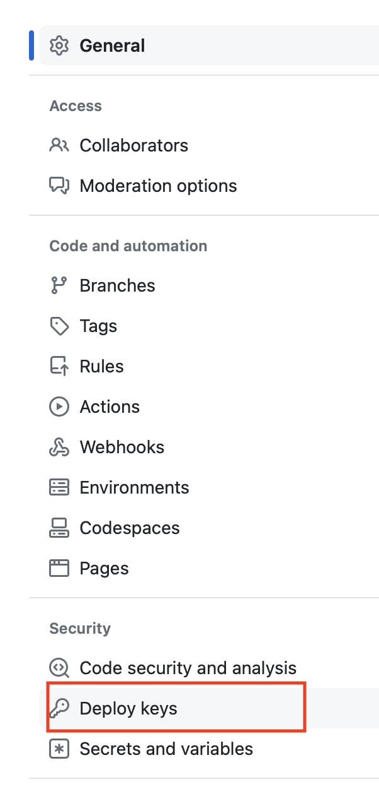

# SSH 金鑰連線 GitHub

SSH 金鑰有一對：公鑰 `.pub` 可加入 GitHub，私鑰保留在自己的電腦。**不要上傳或分享私鑰。** 本章先教帳號金鑰；不同專案不一定需要各建一把金鑰，本章先學會一個帳號一把。

## 1. 準備並建立金鑰

使用 macOS／Linux 終端機或 Windows Git Bash。先檢查是否已有金鑰，避免覆蓋：

```bash
mkdir -p ~/.ssh
ls -la ~/.ssh
```

確認 id_ed25519_github 尚未存在後，再建立（信箱請換成自己的識別註解）：

```bash
ssh-keygen -t ed25519 -C "student@example.com" -f ~/.ssh/id_ed25519_github
```

`-C` 是方便識別的註解，不是必須與 GitHub 信箱一致的驗證資料。`-f` 已指定檔名，產生私鑰 id_ed25519_github 與公鑰 id_ed25519_github.pub；不是一律產生 id_rsa。建議設定 passphrase 保護私鑰，輸入不回顯是正常現象。

## 2. 加入 ssh-agent

```bash
eval "$(ssh-agent -s)"
ssh-add ~/.ssh/id_ed25519_github
ssh-add -l
```

agent 讓你在工作階段內使用金鑰，仍可能依系統或重新登入需要再次加入。macOS 的 Keychain 整合、Linux 與 Windows 的 agent 持久化方式不同；進階設定請依 [官方金鑰與 agent 指南](https://docs.github.com/en/authentication/connecting-to-github-with-ssh/generating-a-new-ssh-key-and-adding-it-to-the-ssh-agent)。

## 3. 把公鑰加入「帳號」

```bash
cat ~/.ssh/id_ed25519_github.pub
```

複製完整公鑰，到 **GitHub 帳號 Settings → SSH and GPG keys → New SSH key**，用途選 Authentication Key，輸入名稱與公鑰。一般個人開發不是去每個 repo 的 Deploy keys 設定。

Deploy key 綁定單一儲存庫，通常用於部署機器；預設唯讀，需要寫入時另外授權。下面保留的是舊版 Deploy keys 截圖，**不是本節帳號金鑰操作的位置**。



## 4. 設定指定金鑰

用編輯器開啟 ~/.ssh/config；不存在就建立，已有內容則加入下面區段，不要覆蓋其他帳號：

```config
Host github-personal
    HostName github.com
    User git
    IdentityFile ~/.ssh/id_ed25519_github
    IdentitiesOnly yes
```

github-personal 是本機別名，User 固定為 git，GitHub 依金鑰判斷帳號。IdentitiesOnly 避免 agent 裡其他金鑰干擾。macOS 可依官方指南另外加入 AddKeysToAgent 與 UseKeychain 設定；UseKeychain 不是 Linux／Windows 通用選項，不要照搬到樹莓派。

在 macOS／Linux 上可設定合理權限：

```bash
chmod 700 ~/.ssh
chmod 600 ~/.ssh/config ~/.ssh/id_ed25519_github
```

Windows 的 ACL 與 Unix 模式不同；若有權限錯誤，依實際 OpenSSH 環境處理。

## 5. 測試與 clone

```bash
ssh -T git@github-personal
```

第一次連線可能要求確認主機指紋，先對照 [GitHub 官方 SSH 指紋](https://docs.github.com/en/authentication/keeping-your-account-and-data-secure/githubs-ssh-key-fingerprints)，符合再接受。不要靠關閉主機檢查跳過。

成功訊息會顯示你的 GitHub 帳號，並說明不提供 shell access；這個測試即使驗證成功也可能回傳狀態碼 1，請讀訊息判斷。若顯示錯誤帳號，檢查別名與金鑰。

替換 OWNER 與儲存庫名稱後，在新位置操作：

```bash
git clone git@github-personal:OWNER/class-team-demo.git
cd class-team-demo
git remote -v
```

這個網址必須使用設定中的 github-personal 別名才會套用該區段。帳號有通過 SSH 驗證，也不代表有所有儲存庫的寫入權限。

## 6. 多帳號（查詢用）

替第二個帳號建立**不同檔名**的金鑰、公鑰加入第二個帳號，再新增 Host github-work 區段，指定第二把 IdentityFile，並使用 `git@github-work:OWNER/REPO.git`。每個儲存庫內可設定 local user.name／user.email，但這只影響提交作者，不能替代 SSH 帳號切換。

完成標準：測試顯示正確帳號，clone 成功，能辨認私鑰、公鑰、Host 別名與提交信箱的用途。

參考：[加入帳號 SSH key](https://docs.github.com/en/authentication/connecting-to-github-with-ssh/adding-a-new-ssh-key-to-your-github-account)。
