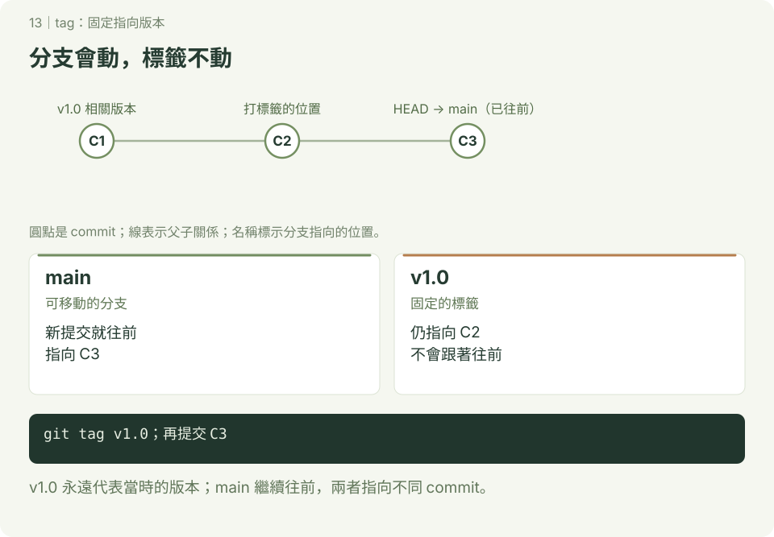

# tag：替版本加上固定名稱

**延伸圖解 · 第 13 章**　[學習路線](../README.md) · [互動圖解](../docs/README.md)

本章附 SVG 圖解；可先讀 [互動版使用說明](../docs/README.md)，再用瀏覽器開啟 `docs/index.html#tag/1`，按下一步觀察變化。GitHub 的 README 顯示靜態圖，下載教材後即可離線操作互動版。

分支會隨提交移動；tag 通常固定指向一個版本，適合標記交作業或發布的版本。tag 不會自動建立新的 commit，也不代表程式已完成測試。



## 1. 照做：加上兩個標籤

已設定提交身分，在終端機或 Git Bash 的新練習位置開始，tag-demo 尚未存在。

```bash
mkdir tag-demo
cd tag-demo
git init -b main
printf 'Release 1\n' > version.txt
git add version.txt
git commit -m "完成第一版"
git tag -a v1.0 -m "課堂第一版"
printf 'Release 2\n' > version.txt
git add version.txt
git commit -m "完成第二版"
git tag v2.0
git tag --list
git log --oneline --decorate
git show v1.0
git show v1.0:version.txt
```

預期 main 與 v2.0 在第二筆，v1.0 仍在第一筆，最後顯示 Release 1。

| 類型 | 建立方式 | 記錄 |
| --- | --- | --- |
| annotated tag | `git tag -a 名稱 -m "說明"` | 另有標記者、日期、訊息等資訊 |
| lightweight tag | `git tag 名稱` | 直接指向提交物件，不另建標籤物件 |

需要正式版本資訊時可用 annotated tag；本章不是簽章或自動發布教學。

## 2. 查看標籤版本

```bash
git switch --detach v1.0
cat version.txt
git switch main
```

預期先看到 Release 1，再回 main。detached HEAD 的新提交要用分支保留，詳見 [查看過去版本](../檢查先前修改的檔案/README.md)。

## 3. 分享到遠端（查詢用）

在已設定 origin 且有權限的專案中，`git push origin v1.0` 上傳指定標籤；一般 `git push` 不代表全部 tag 都已上傳。`git push origin --tags` 會上傳所有本地標籤，先確認每一個都適合分享。

本地刪除用 `git tag -d 名稱`，不會自動刪遠端；遠端刪除用 `git push origin --delete tag 名稱`。共享標籤可能被別人使用，不能隨意刪除或強制移到另一個版本；修正發布通常建立新名稱。

## 4. 自己做

新增第三版並建立 annotated tag v3.0。完成標準：main 在第三版，v1.0 仍顯示 Release 1，能解釋分支與 tag 的差別。

參考：[git tag 官方文件](https://git-scm.com/docs/git-tag)。
