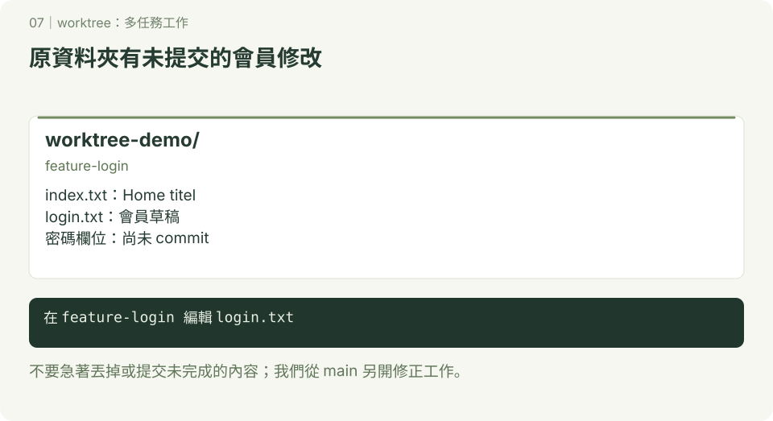
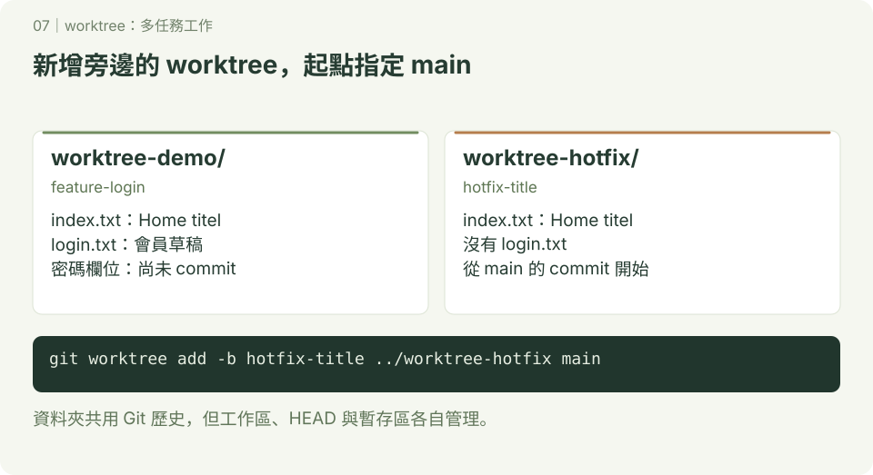
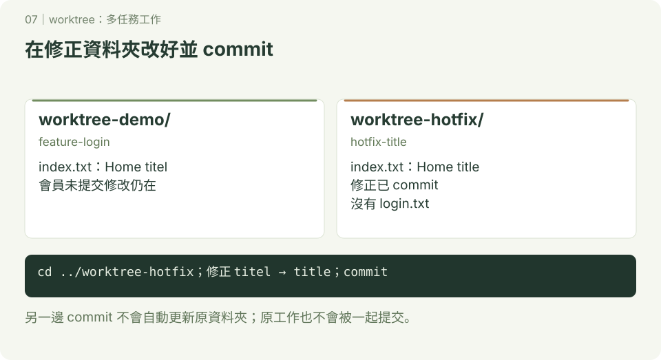
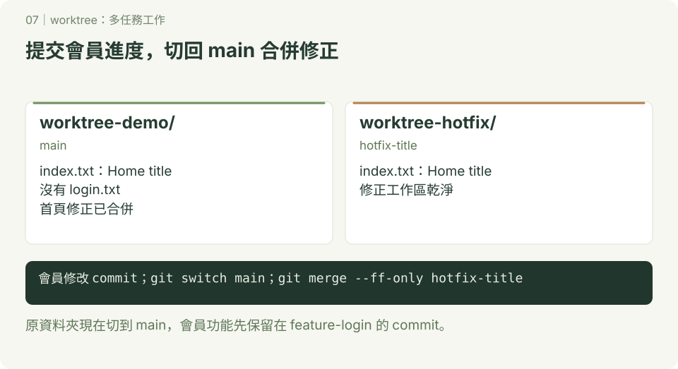
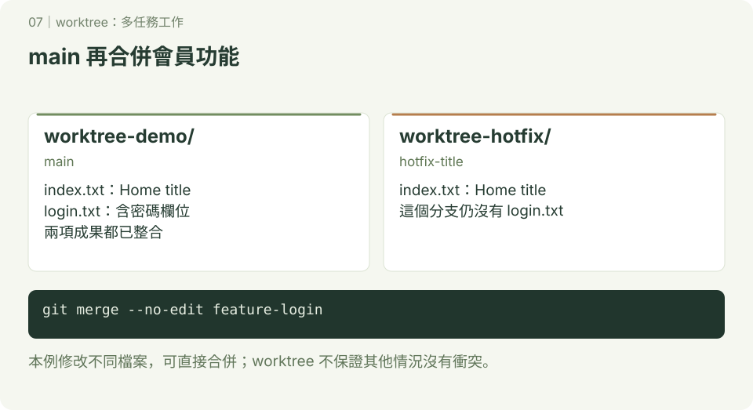
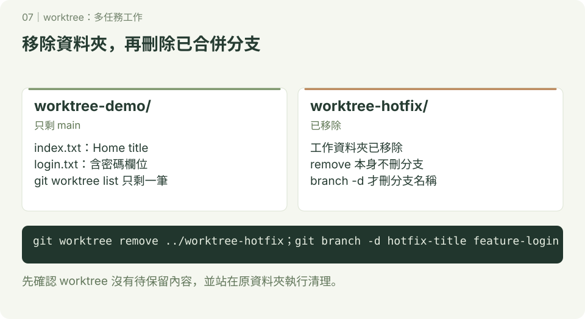

# worktree：多任務工作

**一起開發 · 第 07 章**　[學習路線](../README.md) · [互動圖解](../docs/README.md)

本章附 SVG 圖解；可先讀 [互動版使用說明](../docs/README.md)，再用瀏覽器開啟 `docs/index.html#worktree/1`，按下一步觀察變化。GitHub 的 README 顯示靜態圖，下載教材後即可離線操作互動版。

學完本章，你可以保留尚未完成的功能，在另一個資料夾修 bug，再把修正合併回主要分支。

## 1. 什麼時候會用到？

你正在寫會員功能，檔案已經改了，但還沒準備好 commit。這時老師說：「首頁的標題錯了，請先修正。」

如果只有一個工作資料夾，切換分支時可能需要先處理現有修改。worktree 可以替同一個 Git 儲存庫建立另一個工作資料夾，讓你在那裡處理修正，原本的功能檔案繼續留著。

**分支記錄開發路線；worktree 提供實際編輯這條路線的資料夾。**

| 操作 | 你會看到的變化 |
| --- | --- |
| `git branch feature-login` | 建立分支，但沒有新增工作資料夾，也沒有切換分支 |
| `git switch feature-login` | 在目前資料夾切換到另一個分支，受追蹤的檔案會依該分支更新 |
| `git worktree add -b hotfix-title ../worktree-hotfix main` | 從 main 建立新分支，並在旁邊新增資料夾，讓兩邊都能工作 |

建立後的資料夾像這樣：

```text
你選的練習位置/
├── worktree-demo/       ← feature-login：繼續寫功能
└── worktree-hotfix/     ← hotfix-title：修首頁標題
```

兩個資料夾共用 commit 紀錄與分支，但各自有自己的檔案、目前位置（HEAD）和暫存區（等待 commit 的內容）。在一邊執行 `git add`，不會把另一邊尚未提交的修改一起加入。

## 2. 開始前的準備

- 先完成 [開始使用 Git](../開始使用Git) 與 [分支](../分支) 的基本操作。
- 已安裝 Git，並設定 commit 使用的姓名與電子郵件。
- 使用 macOS／Linux 終端機，或 Windows 的 **Git Bash**。下方檔案操作指令以這些環境為準。
- 在你選的練習位置開啟終端機，確認 `worktree-demo` 與 `worktree-hotfix` 兩個資料夾名稱尚未被使用。本練習不用 GitHub 或網路。

本章所有 `bash` 區塊都是要輸入的指令；`text` 區塊是預期結果，不用輸入。請依順序做，`cd` 表示切換資料夾，`..` 表示上一層。

## 3. 實作：功能寫到一半，先去修 bug

### 步驟一：建立有初始 commit 的專案

操作位置：你選的練習位置。

```bash
mkdir worktree-demo
cd worktree-demo
git init -b main
printf 'Home titel\n' > index.txt
git add index.txt
git commit -m "建立首頁"
```

`index.txt` 故意把 title 拼成 titel，稍後要修正。先有一筆 commit，才有本練習建立新分支的起點。

### 步驟二：開始會員功能，保留尚未提交的修改




操作位置：`worktree-demo`。

```bash
git switch -c feature-login
printf 'Login form: still working\n' > login.txt
git add login.txt
git commit -m "加入會員功能草稿"
printf 'Login form: add password field\n' >> login.txt
git status --short
```

預期看到（M 前面有一個空白）：

```text
 M login.txt
```

這表示 `login.txt` 有尚未加入暫存區的修改。**先保留它，不要 commit**，用它觀察 worktree 如何讓你接著處理另一件事。

### 步驟三：從 main 建立修正用的 worktree




操作位置：仍在 `worktree-demo`，目前分支是 `feature-login`。

```bash
git worktree add -b hotfix-title ../worktree-hotfix main
git worktree list
```

指令分成四個部分：

| 部分 | 意思 |
| --- | --- |
| `git worktree add` | 新增一個工作資料夾 |
| `-b hotfix-title` | 同時建立名為 hotfix-title 的新分支 |
| `../worktree-hotfix` | 把資料夾放在目前資料夾的旁邊 |
| `main` | 從 main 的 commit 開始，避免帶入尚未完成的會員功能 |

`git worktree list` 的結果大致如下；路徑和 commit 編號會不同：

```text
/你的練習位置/worktree-demo    abc1234 [feature-login]
/你的練習位置/worktree-hotfix  def5678 [hotfix-title]
```

原本資料夾仍在 `feature-login`。新增 worktree 不會替你切換終端機位置，下一步要自己 `cd` 過去。

### 用兩個 VS Code 視窗觀察

如果已安裝 VS Code，可以用選單「檔案 → 新增視窗」，讓第一個視窗開啟 worktree-demo、第二個視窗開啟 worktree-hotfix。使用「開啟資料夾」各自選取，不需要設定 `code` 指令。

第一個視窗應看到尚未提交的 login.txt 修改；第二個視窗目前只有 index.txt。先猜一猜：在第二個視窗修好首頁並 commit，第一個視窗的首頁會立刻改變嗎？接著做步驟四、五驗證。

每個視窗的終端機也要各自確認位置：`pwd` 看資料夾，`git branch --show-current` 看分支。以下文字指令仍以原本的一個終端機依順序操作；不要在兩個終端機交錯複製 `cd`。

### 步驟四：在新資料夾修正並提交




```bash
cd ../worktree-hotfix
git branch --show-current
ls
```

預期目前分支是 `hotfix-title`，檔案只有 `index.txt`，沒有 `login.txt`。因為這個分支從 main 開始，會員功能只存在於 feature-login。

```bash
printf 'Home title\n' > index.txt
git add index.txt
git commit -m "修正首頁標題拼字"
git status --short
```

最後一行沒有輸出，表示這個 worktree 沒有待處理的變更。

### 步驟五：回原資料夾，確認進度還在

```bash
cd ../worktree-demo
git branch --show-current
git status --short
cat login.txt
cat index.txt
```

預期看到：

```text
feature-login
 M login.txt
Login form: still working
Login form: add password field
Home titel
```

會員功能的修改還在，首頁也仍是舊拼字。**另一個分支完成 commit，不代表目前分支已經收到修正。** 接下來才用 merge 整合。

### 步驟六：完成會員功能，再把修正合併回 main




操作位置：`worktree-demo`。先完成並提交手上的修改，讓後面的切換步驟容易觀察。

```bash
git add login.txt
git commit -m "新增密碼欄位草稿"
git switch main
git merge --ff-only hotfix-title
cat index.txt
ls
```

預期首頁變成 `Home title`，但 main 還沒有 `login.txt`。此時只是整合首頁修正。

本例 main 尚未增加其他 commit，因此可以 fast-forward（把分支指標往前移到修正的 commit）；`--ff-only` 要求 Git 只能用這種方式合併。

### 步驟七：把會員功能也整合回 main




操作位置：仍在 `worktree-demo` 的 main 分支。

```bash
git merge --no-edit feature-login
cat index.txt
cat login.txt
git log --oneline --graph --all
```

`--no-edit` 使用預設合併訊息，避免在練習途中開啟訊息編輯器。

預期檔案內容：

```text
Home title
Login form: still working
Login form: add password field
```

兩個分支都從原本的 main 向前開發，這次一般合併會建立 merge commit。本例修改不同檔案，所以不會發生衝突；如果兩個分支修改同一檔案的同一段，仍可能需要手動解決衝突。

### 步驟八：移除不用的 worktree，再刪除分支




操作位置：`worktree-demo` 的 main 分支。

```bash
git worktree remove ../worktree-hotfix
git branch -d hotfix-title
git branch -d feature-login
git worktree list
git status --short
```

預期只剩 `worktree-demo` 這個 worktree，分支是 main；status 沒有輸出。

`remove` 會移除那個工作資料夾與 worktree 登記，**不會刪除分支**。這裡兩個分支都已合併，所以再用 `branch -d` 刪除。不要站在準備移除的資料夾裡執行 remove。

## 4. 常用指令與卡關處理

以下是查詢用的範例，不是接續步驟八全部執行的指令。

| 目的 | 指令 |
| --- | --- |
| 查看所有 worktree | `git worktree list` |
| 從 main 建立新分支和資料夾 | `git worktree add -b feature-search ../worktree-search main` |
| 為已存在的分支建立資料夾 | `git worktree add ../worktree-search feature-search` |
| 移除已完成的工作資料夾 | `git worktree remove ../worktree-search` |

新增分支和使用既有分支是兩種選擇：如果 `feature-search` 已存在，就不要再加 `-b`。

**出現「分支已被使用／already checked out」**：一般情況下，同一個分支不能同時在兩個 worktree 中使用。先用 `git worktree list` 找出它在哪裡，直接進入那個資料夾工作，或替另一項任務建立不同分支。

**出現「分支已存在／already exists」**：`-b` 要建立全新分支。如果要使用現有分支，拿掉 `-b`，使用表格中的既有分支寫法；仍要確認該分支沒有被另一個 worktree 使用。

**無法 remove，顯示有修改或未追蹤檔案**：先進入該資料夾執行 `git status`，確認內容，提交要保留的修改，或把仍需要的未追蹤檔案搬到別處，再回到保留的 worktree 移除。不要為了跳過錯誤直接加 `--force`。

**自己刪掉資料夾，但 list 還看得到紀錄**：先執行 `git worktree prune --dry-run --verbose` 檢查，確定是已刪除且不用的資料夾，再執行 `git worktree prune --verbose` 清除符合條件的失效紀錄。prune 不會找回檔案，也不會清掉正常存在的 worktree；平常請用 remove。

**資料夾名稱重複**：換一個尚未使用的路徑；不要直接覆蓋現有資料夾。

## 5. 換你練習

保留步驟八完成的 `worktree-demo`，再做一次不同任務：

1. 從 main 建立 `feature-about` 分支，搭配旁邊的 `worktree-about` 資料夾。
2. 在新資料夾建立 `about.txt`，寫下自己的名字並 commit。
3. 回到原資料夾，確認 main 還沒有 `about.txt`。
4. 在 main 合併 feature-about，確認 `about.txt` 出現。
5. 移除 worktree-about，再刪除已合併的分支。

完成標準：main 有 `index.txt`、`login.txt`、`about.txt`；`git worktree list` 只剩原本的 worktree。

想一想：

- 步驟三為什麼指定 `main` 當起點，而不是 feature-login？
- 步驟四已經修好首頁，為什麼步驟五還看到舊拼字？
- `git worktree remove` 和 `git branch -d` 各自移除什麼？

答案提示：起點決定帶入哪些已提交內容；合併才會把另一個分支的成果整合進來；工作資料夾與分支是分開管理的。

參考：[Git 官方 git-worktree 文件](https://git-scm.com/docs/git-worktree)。

---

[← 用 Fork 交作業](../Fork交作業/README.md)　｜　[AI 開發的 Git 節奏 →](../日常工作流程/README.md)
