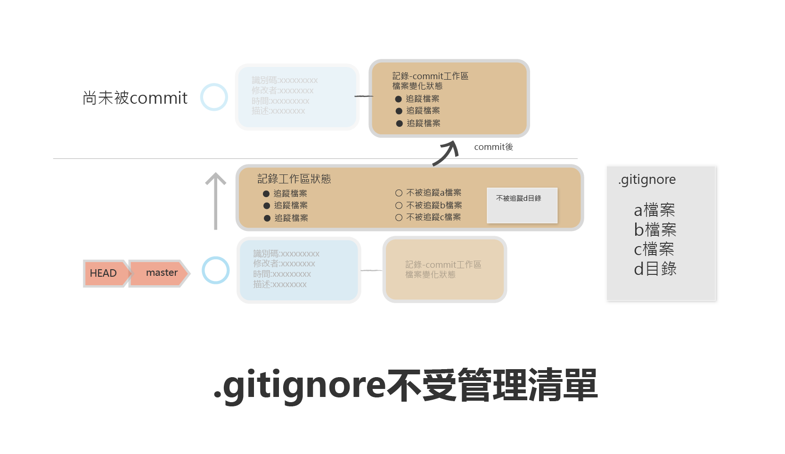

# 不想被追蹤的檔案
> 在專案中有一些檔案是不想被git管理的.例如一些編輯軟體的暫存檔或是一些token(密鎖)

> 不想被管理的檔案,可以加人至.gitignore檔案清單中



## 情境1:一開使就確認檔案不被管理

### 增加g.cer檔,gfolder目錄,目錄內加入g1.html,g2.html

```
$ touch g.cer
$ mkdir gfloder
$ cd gfloder
$ touch g1.html g2.html
$ cd ..
$ git status
_________________________________

On branch master
Untracked files:
  (use "git add <file>..." to include in what will be committed)
        g.cer
        gfloder/

nothing added to commit but untracked files present (use "git add" to track)

```

- 以上提醒我們尚未追蹤g.cer和gfloder目錄

### 建立.gitignore清單

```
$ vim .gitignore
______________________
g.cer
gfloder/*
~
~
~
~
~
______________________

$ git status
_______________________

On branch master
Untracked files:
  (use "git add <file>..." to include in what will be committed)
        .gitignore

nothing added to commit but untracked files present (use "git add" to track)
```

- 剛才的檔案,已經沒有被追蹤！

### 將.gitignore加入管理

```
$ git add .
$ git commit -m “加入.gitignore”
```


#### 情境2:已經被追蹤的檔案改為不再追蹤


