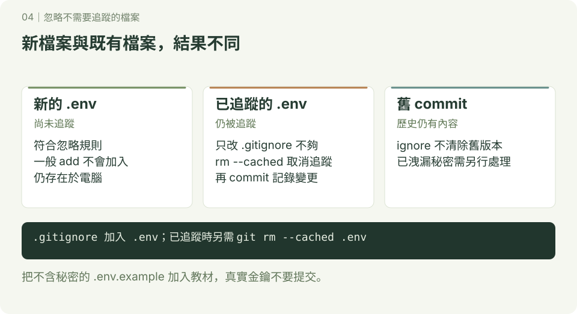

# 忽略不需要追蹤的檔案

**建立版本 · 第 04 章**　[學習路線](../README.md)


`.gitignore` 告訴 Git 哪些未追蹤檔案通常不應加入，例如快取、產生的檔案與本機設定。**它不會停止追蹤既有檔案，也不會清除舊 commit。**



## 1. 照做：忽略新檔案

已設定提交身分，使用終端機或 Git Bash，在尚無 ignore-demo 的練習位置開始。範例 `.env` 只放假資料，不要使用真實金鑰。

```bash
mkdir ignore-demo
cd ignore-demo
git init -b main
mkdir cache
printf 'temporary\n' > cache/result.txt
printf 'DEMO_VALUE=example-only\n' > .env
printf '.env\ncache/\n*.log\n' > .gitignore
printf 'DEMO_VALUE=\n' > .env.example
git status --short
git check-ignore -v .env cache/result.txt
git add .gitignore .env.example
git commit -m "設定忽略規則與範例環境檔"
git status --short --ignored
```

一般 status 只列出 .gitignore 與 .env.example；`check-ignore -v` 顯示命中的規則。最後使用 `--ignored` 時，看到 `!! .env` 與 `!! cache/`。檔案仍在電腦上，但沒有加入提交。

## 2. 照做：已追蹤的檔案要另外處理

接續 ignore-demo，故意先追蹤一個不含秘密的本機設定：

```bash
printf 'theme=light\n' > local.config
git add local.config
git commit -m "加入示範本機設定"
printf 'local.config\n' >> .gitignore
printf 'theme=dark\n' > local.config
git status --short
```

預期 .gitignore 與 local.config 都有修改。即使已寫進忽略清單，local.config 仍受追蹤。

```bash
git rm --cached local.config
git add .gitignore
git diff --staged
git commit -m "停止追蹤本機設定"
cat local.config
git ls-files
git status --short --ignored
```

`--cached` 只從暫存區移除追蹤項目，保留工作區檔案。完成提交後，`cat` 仍顯示 theme=dark，`ls-files` 不再列出 local.config；舊 commit 仍包含原設定。若要停止追蹤整個目錄，查詢用寫法是 `git rm -r --cached 目錄名稱`，先確認要移除的範圍。

## 3. 常用規則

| 規則 | 意思 |
| --- | --- |
| `*.log` | 忽略各層符合的 log 檔案 |
| `cache/` | 忽略符合名稱的 cache 目錄 |
| `/build/` | 只忽略這份 .gitignore 所在層級的 build 目錄 |
| `!keep.log` | 對符合的檔案取消前面的忽略規則 |

規則順序有影響；如果父目錄整個被排除，不能只用一條檔案例外把裡面的檔案救回，要同時處理父目錄規則。可用 `git check-ignore -v 路徑` 查未追蹤檔命中哪條規則；已追蹤路徑在 `status --ignored` 預設不會列為被忽略。

## 4. 自己做與注意事項

建立 debug.log 與 notes.txt，只讓 notes.txt 加入提交。完成標準：notes.txt 受追蹤、debug.log 被忽略，能說明 .gitignore 為什麼通常也要提交給同學。

若真實秘密已提交，刪檔或加 ignore 不足以撤回洩漏；先撤銷或更換秘密，再依團隊流程處理歷史。不要用 `git add -f` 強行把真實 .env 加入。

參考：[Git 官方 gitignore 文件](https://git-scm.com/docs/gitignore)。


---

[← 分支與合併](../分支/README.md)　｜　[GitHub 共同開發 →](../協作與PullRequest/README.md)
