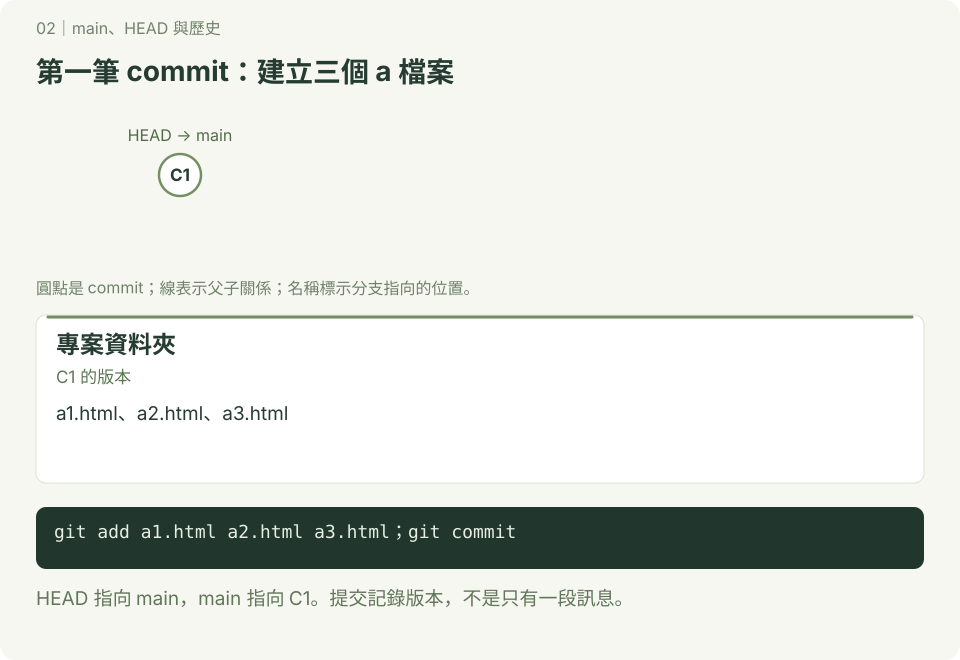
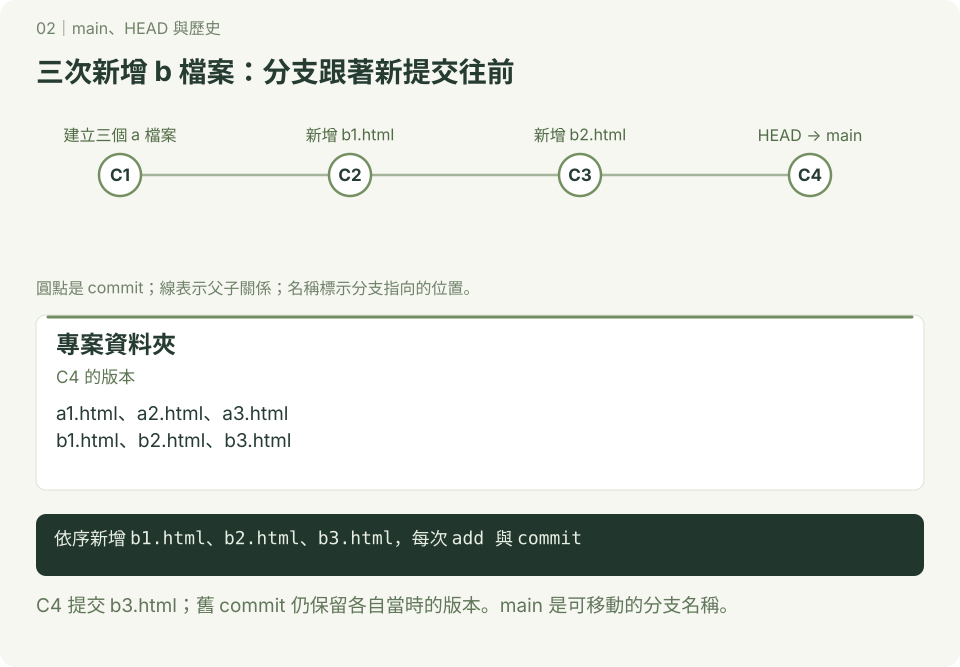
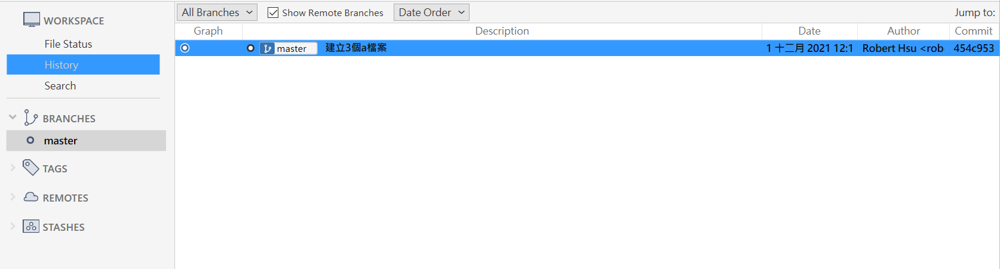

# main、HEAD 與歷史

**建立版本 · 第 02 章**　[學習路線](../README.md) · [互動圖解](../docs/README.md)


本章練習統一使用 main。main 與 master 都是分支名稱，不代表不同的 Git 功能；舊專案若看到 master，可理解為當時的主要分支名稱。

## 1. 看懂 commit、main、HEAD

commit 保存當時的專案快照、作者、訊息與父提交等資訊。分支是指向 commit 的可移動名稱；一般提交時，目前分支會移到新 commit，HEAD 則指向目前分支。HEAD 也能直接指向 commit，稱為 detached HEAD，詳見 [查看過去版本](../檢查先前修改的檔案/README.md)。

## 2. 照做：建立四筆版本

已完成環境設定，使用終端機或 Git Bash，在尚無 history-demo 的練習位置開始。

### 第一筆：三個 a 檔案



```bash
mkdir history-demo
cd history-demo
git init -b main
touch a1.html a2.html a3.html
git add a1.html a2.html a3.html
git commit -m "建立三個 a 檔案"
```

空檔案也能提交；但 Git 不直接記錄空資料夾。

### 接著：每次新增一個 b 檔案



```bash
touch b1.html
git add b1.html
git commit -m "新增 b1.html"
touch b2.html
git add b2.html
git commit -m "新增 b2.html"
touch b3.html
git add b3.html
git commit -m "新增 b3.html"
git log --oneline --graph --decorate
git rev-list --count HEAD
```

預期有四筆提交，最新一筆旁邊是 `HEAD -> main`，計數是 4。圖中的 C1～C4 是教學代號；終端機顯示的是你自己的 commit 識別碼。這裡 log 預設由新到舊顯示，不代表任何情況下 HEAD 都必須在圖最上方。

### 比較目前與過去版本

```bash
git show --stat HEAD
git ls-tree --name-only HEAD~3
git diff --name-status HEAD~3 HEAD
```

`HEAD~3` 沿第一父提交回溯三次，在這條直線歷史中就是第一筆。第一筆只有三個 a 檔案；差異列出後來新增的三個 b 檔案。這些查詢不會切換分支或改動工作區。

## 3. 分支名稱設定

下面是查詢用指令，請依需要選用：

| 目的 | 指令 |
| --- | --- |
| 新建儲存庫時直接使用 main | `git init -b main` |
| 設定日後 init 的預設名稱 | `git config --global init.defaultBranch main` |
| 將目前分支改名（main 尚不存在時） | `git branch -m main` |
| 查看目前分支 | `git branch --show-current` |

全域設定不會替已有儲存庫改名；已連結遠端的專案改名，還需要團隊協調遠端預設分支與追蹤設定。

## 4. 自己做

再新增 c1.html 並提交。完成標準：共有五筆提交，main 與 HEAD 仍指向最新版本；能用 `git show HEAD~1` 找到前一筆提交。

以下是舊版 SourceTree 截圖，若畫面顯示 master，可把它理解成當時的主要分支名稱。




---

[← 工作區與暫存區](../開始使用Git/README.md)　｜　[分支與合併 →](../分支/README.md)
