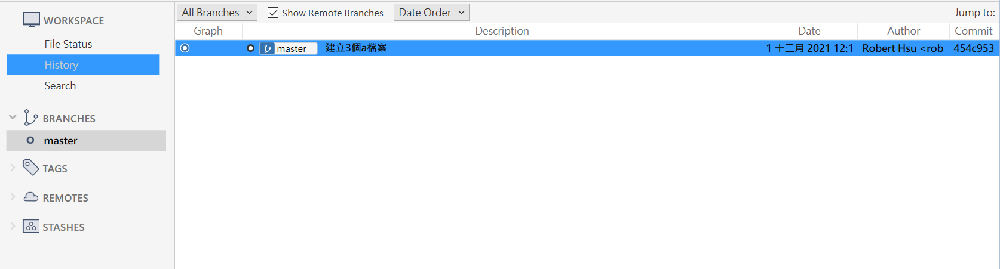
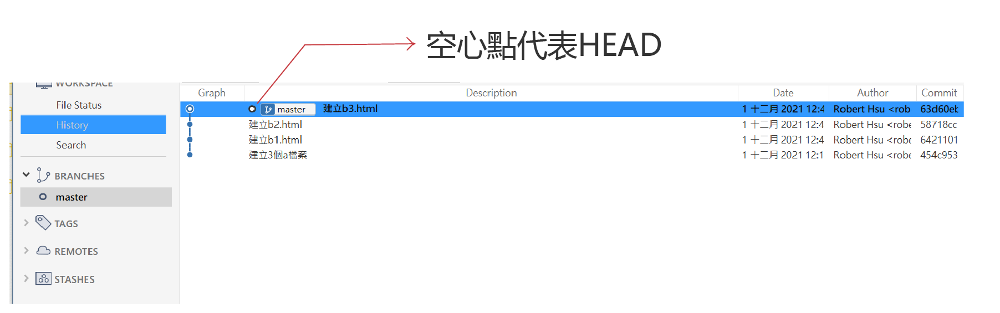
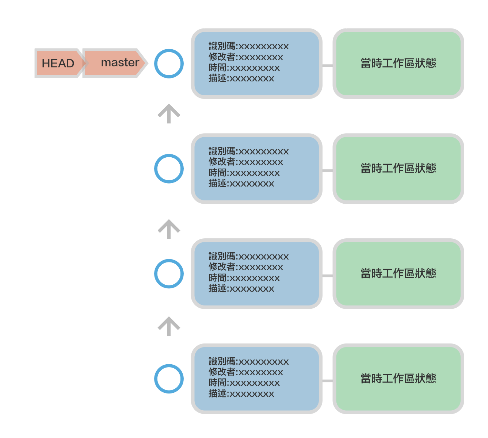

# 使用master主要分支

當使用git初始化專案時,便會產生master主要分支, 分支是什麼？我們可以把分支想像為這是我們目前工作的分支,所以也可以說現在我們的工作分支是在master分支.

## 將master分支改為main

```bash
git config --global init.defaultBranch main
```

## 建立專案和查看master分支狀態
- 開啟gitBash

```
$ cd ~/Documents        #進入文件夾
$ mkdir gitTogether1    #建立gitTogether1資料夾
$ cd gitTogether1       #進入gitTogether1資料夾
$ git init              #初始化git
$ git status

_________________________
On branch master

No commits yet

nothing to commit (create/copy files and use "git add" to track)
```

上方的On branch master,代表目前的工作分支是在master上. 


## 建立三個檔案，產生一個紀錄點(commit)

```
$ touch a1.html
$ touch a2.html
$ touch a3.html
$ git add —all
$ git commit -m “建立3個a檔案“
$ git log                   #git log 是觀察commit的歷史資料

________________________________________________________________
commit 454c9536865cfbc883084f3da2c4ec025cc09c85 (HEAD -> master)
Author: Robert Hsu <roberthsu2003@gmail.com>
Date:   Wed Dec 1 12:14:23 2021 +0800

    建立3個a檔案
```

上方的（HEAD -> master)代表目前的工作分支是在master分支

## 查看目前分支

```
$ git branch

_________________
* master
```

上方代表目前專案只有一個分支,「*」是代表目前的工作分支

下方是source tree的顯示



___

## 建立三個紀錄點(commit)

```
$ touch b1.html
$ git add b1.html
$ git commit -m “建立b1.html”

$ touch b2.html
$ git add b2.html
$ git commit -m “建立b2.html”

$ touch b3.html
$ git add b3.html
$ git commit -m “建立b3.html”

$ git log
____________________________________________________________

commit 63d60eb52ca806973f428b93e734cbea34cd3376 (HEAD -> master)
Author: Robert Hsu <roberthsu2003@gmail.com>
Date:   Wed Dec 1 12:48:40 2021 +0800

    建立b3.html

commit 58718cc8bdddb84634d94935a1ce7317fee9356b
Author: Robert Hsu <roberthsu2003@gmail.com>
Date:   Wed Dec 1 12:47:58 2021 +0800

    建立b2.html

commit 64211012f1fab196ddf1f55a214c70de8321a270
Author: Robert Hsu <roberthsu2003@gmail.com>
Date:   Wed Dec 1 12:47:12 2021 +0800

    建立b1.html

commit 454c9536865cfbc883084f3da2c4ec025cc09c85
Author: Robert Hsu <roberthsu2003@gmail.com>
Date:   Wed Dec 1 12:14:23 2021 +0800

    建立3個a檔案
```

- 有4個commit,最新的是在最上面
- HEAD代表目前所在的commit
- master代表目前master所指向的commit



_______

## 結論

- HEAD 代表目前我們所在的commit
- HEAD->master 代表我們所在的commit是master分支
- 當commit一個新的記錄點(commit)時,HEAD和master同時也會更新目前指向的記錄點.
- 依此方法,HEAD和master會永遠在這一串記錄點(commit)的最上方.(以目前所學的是如此）




