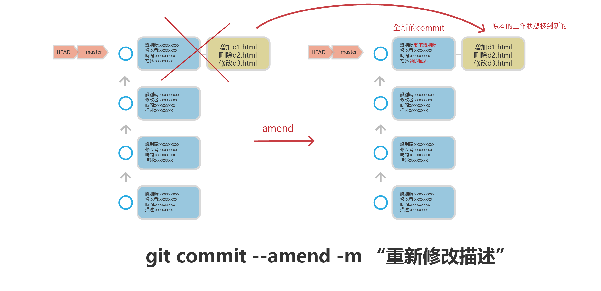

# 修改目前commit或重新修改多個commit
### - *重要*,修改尚未上傳至github上的commit(本機的commit)
### - *重要*,github pull 下來的commit,切勿修改(會影響開發團隊的其它開發人員)
- 使用時機,在上傳至github是,只想保持1個commit的上傳(不想太多的commit上傳至github)
- 修改目前的commit是一個常見的動作. 所謂修改其實是刪除現有的！建立全新的commit
### 修改目前commit
- 修改目前的commit

```
$ git commit --amend
```	


### 重新修改多個commit 

```
#修改目前的前3個commit

$ git rebase -i HEAD~3
```


### 使用 --amend



####  新增h1.html,建立commit

```
$ touch f1.html
$ git add f1.html
$ git commit -m “新增h1.html”
$ git log
_____________________________
commit fcf905a8ad0740a9f04793b42b503660339c5ea8 (HEAD -> master)
Author: Robert Hsu <roberthsu2003@gmail.com>
Date:   Mon Dec 6 14:18:33 2021 +0800

    新增f1.html

commit 059c439faadb18ab6109250858ebb5e1a3436735
Author: Robert Hsu <roberthsu2003@gmail.com>
Date:   Sat Dec 4 11:23:52 2021 +0800

    “加入新增d1.html,d2.html,d3.html,d3.html加入內容“

commit bfe5b8540761f9b4626619501fd9e0205852a95c
Author: Robert Hsu <roberthsu2003@gmail.com>
Date:   Thu Dec 2 10:27:13 2021 +0800

    新增c1.html,c2.html,c3.html,c3.html加入內容


```

- 上面建立新fcf905a的commit

#### 新增h2.html,修改commit

```
$ touch f2.html
$ git add f2.htmll
$ git commit --amend -m “新增f1.html,f2.html”
$ git log -p             # -p是查閱commit儲存的工作狀態
___________________________

commit aa7edbe6960c90de5623c5b3557f36c017caa187 (HEAD -> master)
Author: Robert Hsu <roberthsu2003@gmail.com>
Date:   Mon Dec 6 14:18:33 2021 +0800

    新增f1.html,f2.html

diff --git a/f1.html b/f1.html
new file mode 100644
index 0000000..e69de29
diff --git a/f2.html b/f2.html
new file mode 100644
index 0000000..e69de29

commit 059c439faadb18ab6109250858ebb5e1a3436735
Author: Robert Hsu <roberthsu2003@gmail.com>
Date:   Sat Dec 4 11:23:52 2021 +0800

    “加入新增d1.html,d2.html,d3.html,d3.html加入內容“

diff --git a/d1.html b/d1.html
new file mode 100644
index 0000000..e69de29
diff --git a/d2.html b/d2.html
```

- 原本的fcf905a的commit,已經消失
- 建立新的aa7edb的commit
- commit描述已經更改
- commit儲存的工作狀態是原本的commit和新的工作狀態的組合

#### 新增h3.html,修改commit 沒有-m

```
$ touch f3.html
$ git add f3.html
$ git commit --amend      #沒有-m是修改原本的描述(vim)

_______________________________
新增f1.html,f2.html
新增f3.html

# Please enter the commit message for your changes. Lines starting
# with '#' will be ignored, and an empty message aborts the commit.
#
# Date:      Mon Dec 6 14:18:33 2021 +0800
#
# On branch master
# Changes to be committed:
#       new file:   f1.html
#       new file:   f2.html
#       new file:   f3.html
#
~
~
~
~
~
~
~
~

_____________________________________

$ git log -p

_____________________________________
commit d2600ebcd971b337171a4f68e477ed36bc58c3a6 (HEAD -> master)
Author: Robert Hsu <roberthsu2003@gmail.com>
Date:   Mon Dec 6 14:18:33 2021 +0800

    新增f1.html,f2.html
    新增f3.html

diff --git a/f1.html b/f1.html
new file mode 100644
index 0000000..e69de29
diff --git a/f2.html b/f2.html
new file mode 100644
index 0000000..e69de29
diff --git a/f3.html b/f3.html
new file mode 100644
index 0000000..e69de29

commit 059c439faadb18ab6109250858ebb5e1a3436735
Author: Robert Hsu <roberthsu2003@gmail.com>
Date:   Sat Dec 4 11:23:52 2021 +0800

    “加入新增d1.html,d2.html,d3.html,d3.html加入內容“


```

- 如果沒有使用-m,將會修改先前的描述
- commit儲存的工作狀態是原本的commit和新的工作狀態的組合

### 重新修改多個commit的message

#### 增加3個commit

```
$ echo 'f4.html' >> f4.html
$ git add f4.html
$ git commit -m "新增f4.html"

[main 807884e] 新增f4.html
 1 file changed, 1 insertion(+)
 create mode 100644 f4.html
 
---------------------------------- 

$ echo 'f5.html' >> f5.html
$ git add f5.html
$ git commit -m "新增f5.html"

[main 735f5d9] 新增f5.html
 1 file changed, 1 insertion(+)
 create mode 100644 f5.html
 -------------------------------------
 
$ echo 'f6.html' >> f6.html
$ git add f6.html
$ git commit -m "新增f6.html"
[main ac95c93] 新增f6.html
 1 file changed, 1 insertion(+)
 create mode 100644 f6.html
------------------------------------------

$ git log
commit ac95c9329b2c8ade5c08011e9fcc1b562f82c3a7 (HEAD -> main)
Author: roberthsu2003 <roberthsu2003@gmail.com>
Date:   Fri Sep 8 20:07:06 2023 +0800

    新增f6.html

commit 735f5d965883319db21147aad8bbcac88edc92da
Author: roberthsu2003 <roberthsu2003@gmail.com>
Date:   Fri Sep 8 20:06:34 2023 +0800

    新增f5.html

commit 807884ec557e07619a9fd12637a97f5f9e2cfe9c
Author: roberthsu2003 <roberthsu2003@gmail.com>
Date:   Fri Sep 8 20:05:59 2023 +0800

    新增f4.html

commit 0abe09ecfe64196e6ad43b764b2077e963cfaca3
Author: roberthsu2003 <roberthsu2003@gmail.com>
Date:   Fri Sep 8 19:57:25 2023 +0800

    新增f1.html, f2.html
    新增f3.thml

```

### 一次修改3個commit message

```
$ git rebase -i HEAD~3   #修改前3個
----------------------------------------												 
#將pick改為reword改為reword(修改commit message)
#執行後,會分別出現3次新的commit message修改對話框

reword 807884e 新增f4.html
reword d0a9f5a 新增f5.html
reword 0c8d81f 新增f6.html

# Rebase 0abe09e..ac95c93 onto 0abe09e (3 commands)
#
# Commands:
# p, pick <commit> = use commit
# r, reword <commit> = use commit, but edit the commit message
```

```
$ git log   #3個commit,都被修改過了

commit b86cfdfa92386f571318b412a5e4a9e374a6349b (HEAD -> main)
Author: roberthsu2003 <roberthsu2003@gmail.com>
Date:   Fri Sep 8 20:07:06 2023 +0800

    新增f6.html修改

commit 949e35b93abb01c79d3a6d832a4b51554f8edd94
Author: roberthsu2003 <roberthsu2003@gmail.com>
Date:   Fri Sep 8 20:06:34 2023 +0800

    新增f5.html修改

commit 144a0e88afea3d218b38ee9e019c739afbb1a4e0
Author: roberthsu2003 <roberthsu2003@gmail.com>
Date:   Fri Sep 8 20:05:59 2023 +0800

    新增f4.html修改

commit 0abe09ecfe64196e6ad43b764b2077e963cfaca3
Author: roberthsu2003 <roberthsu2003@gmail.com>
Date:   Fri Sep 8 19:57:25 2023 +0800

    新增f1.html, f2.html
    新增f3.thml

```

### 將3個commit,擠壓成為1個

```
$ git rebase -i HEAD~3   #修改前3個
------------------------------------
#將第2個和第3個改為squash(向前擠壓)
#第1個保持pick
#會開啟一個對話框,可以修改新的commit message

pick 144a0e8 新增f4.html修改
squash 949e35b 新增f5.html修改
squash b86cfdf 新增f6.html修改
```

#### 修改隔合後的message

```

新增f4.html修改
新增f5.html修改
新增f6.html修改

# Please enter the commit message for your changes. Lines starting
# with '#' will be ignored, and an empty message aborts the commit.
#
# Date:      Fri Sep 8 20:05:59 2023 +0800
#
# interactive rebase in progress; onto 0abe09e
# Last commands done (3 commands done):
#    squash 949e35b 新增f5.html修改
#    squash b86cfdf 新增f6.html修改
# No commands remaining.
# You are currently rebasing branch 'main' on '0abe09e'.
#
# Changes to be committed:
#       new file:   f4.html
#       new file:   f5.html
#       new file:   f6.html
#

```

#### 3個commit 變一個

```
$ git log
---------------------------------------
commit 94c8275759f686feafcf64643d6cd9264491e76a (HEAD -> main)
Author: roberthsu2003 <roberthsu2003@gmail.com>
Date:   Fri Sep 8 20:05:59 2023 +0800

    新增f4.html修改
    新增f5.html修改
    新增f6.html修改

commit 0abe09ecfe64196e6ad43b764b2077e963cfaca3
Author: roberthsu2003 <roberthsu2003@gmail.com>
Date:   Fri Sep 8 19:57:25 2023 +0800

    新增f1.html, f2.html
    新增f3.thml

```


