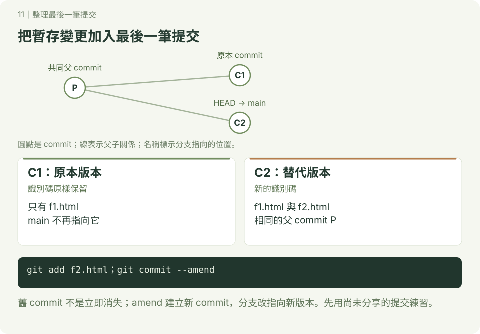

# 整理最後一筆提交

**復原與整理 · 第 11 章**　[學習路線](../README.md) · [互動圖解](../docs/README.md)

圖解已重畫為 SVG；圖中使用 main 與簡化 commit 名稱，舊範例若使用 master，主要分支的概念相同。互動版見 [Git 圖解教室](../docs/README.md)。
### - *重要*,修改尚未上傳至github上的commit(本機的commit)
### - *重要*,github pull 下來的commit,切勿修改(會影響開發團隊的其它開發人員)
- 使用時機,在上傳至github是,只想保持1個commit的上傳(不想太多的commit上傳至github)
- 修改目前的commit是一個常見的動作. amend 會建立新的替代 commit，分支改指向新 commit；原 commit 不會立即刪除
### 修改目前commit
- 修改目前的commit

```
$ git commit --amend
```	


### 使用 --amend



####  新增h1.html,建立commit

```
$ touch f1.html
$ git add f1.html
$ git commit -m “新增h1.html”
$ git log
_____________________________
commit fcf905a8ad0740a9f04793b42b503660339c5ea8 (HEAD -> master)
Author: Robert Hsu <roberthsu2003@gmail.com>
Date:   Mon Dec 6 14:18:33 2021 +0800

    新增f1.html

```

- 上面建立新fcf905a的commit

#### 新增h2.html,修改commit

```
$ touch f2.html
$ git add f2.html
$ git commit --amend -m “新增f1.html,f2.html”
$ git log -p             # -p是查閱commit儲存的工作狀態
___________________________

commit aa7edbe6960c90de5623c5b3557f36c017caa187 (HEAD -> master)
Author: Robert Hsu <roberthsu2003@gmail.com>
Date:   Mon Dec 6 14:18:33 2021 +0800

    新增f1.html,f2.html
```

- 原本的 fcf905a 不再是分支的最新 commit，但不會立即從 Git 刪除
- 建立新的aa7edb的commit
- commit描述已經更改
- commit儲存的工作狀態是原本的commit和新的工作狀態的組合

#### 新增h3.html,修改commit 沒有-m
- 進入編輯comit message 的畫沒

```
$ touch f3.html
$ git add f3.html
$ git commit --amend      #沒有-m是修改原本的描述(vim)

_______________________________
新增f1.html,f2.html
新增f3.html

# Please enter the commit message for your changes. Lines starting
# with '#' will be ignored, and an empty message aborts the commit.
#
# Date:      Mon Dec 6 14:18:33 2021 +0800
#
# On branch master
# Changes to be committed:
#       new file:   f1.html
#       new file:   f2.html
#       new file:   f3.html
#
~
~
~
~
~
~
~
~

_____________________________________

$ git log -p

_____________________________________
commit d2600ebcd971b337171a4f68e477ed36bc58c3a6 (HEAD -> master)
Author: Robert Hsu <roberthsu2003@gmail.com>
Date:   Mon Dec 6 14:18:33 2021 +0800

    新增f1.html,f2.html
    新增f3.html

diff --git a/f1.html b/f1.html
new file mode 100644
index 0000000..e69de29
diff --git a/f2.html b/f2.html
new file mode 100644
index 0000000..e69de29
diff --git a/f3.html b/f3.html
new file mode 100644
index 0000000..e69de29
```

- 如果沒有使用-m,將會修改先前的描述
- commit儲存的工作狀態是原本的commit和新的工作狀態的組合

---

[← reset 的三種模式](../git_reset/README.md)　｜　[延伸：rebase →](../git_rebase/README.md)
