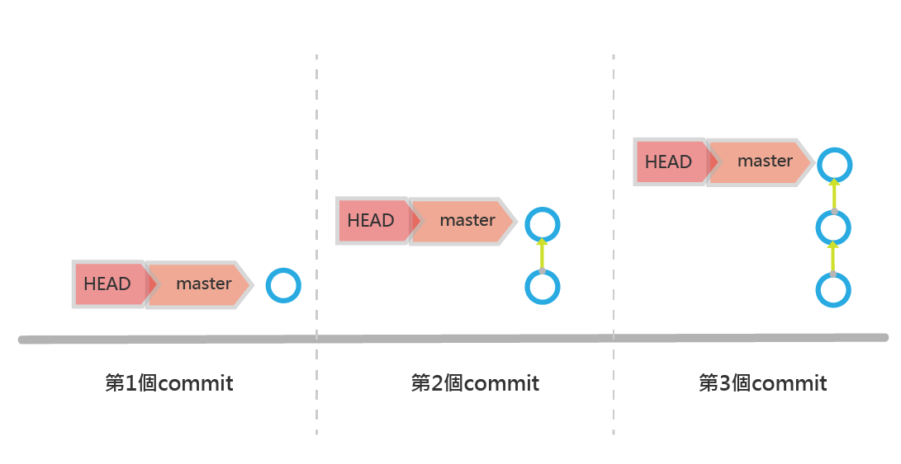
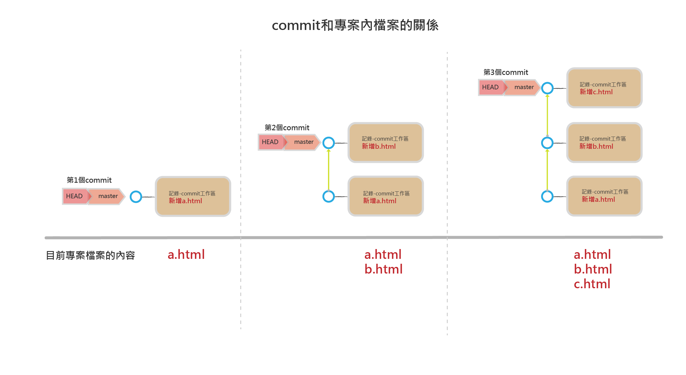
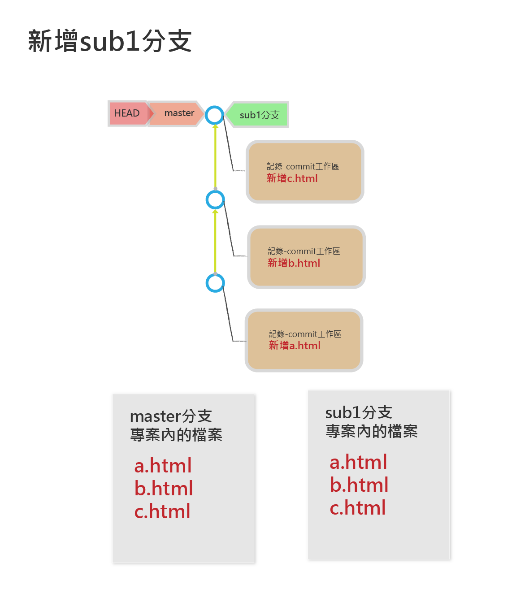
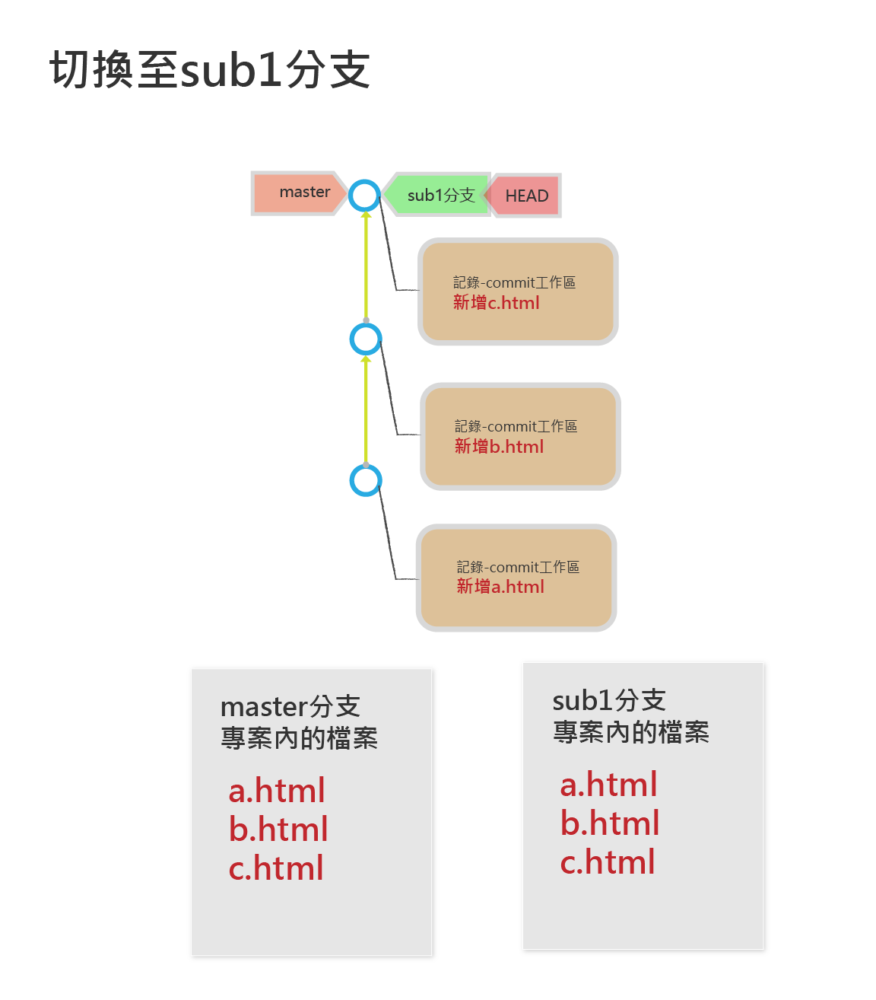
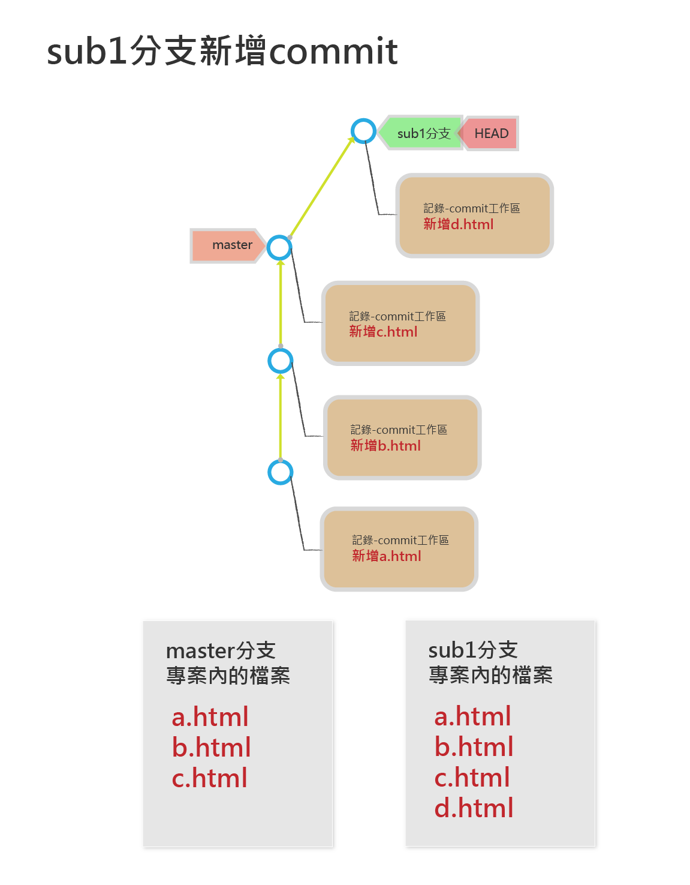
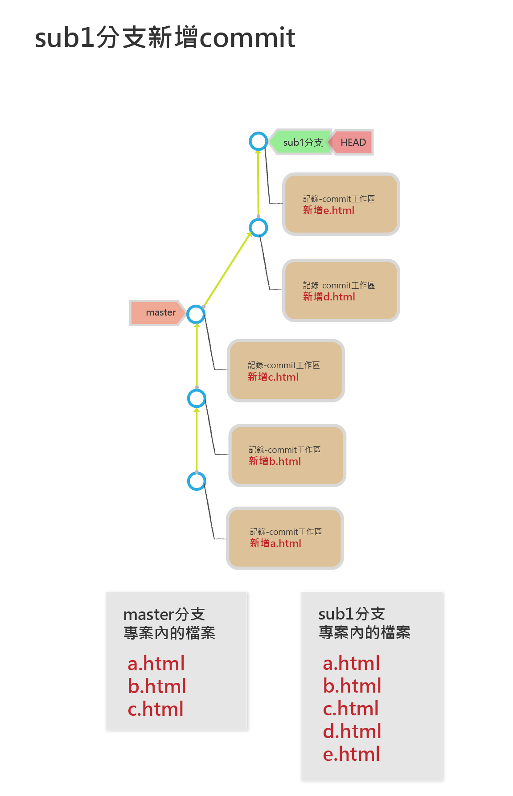
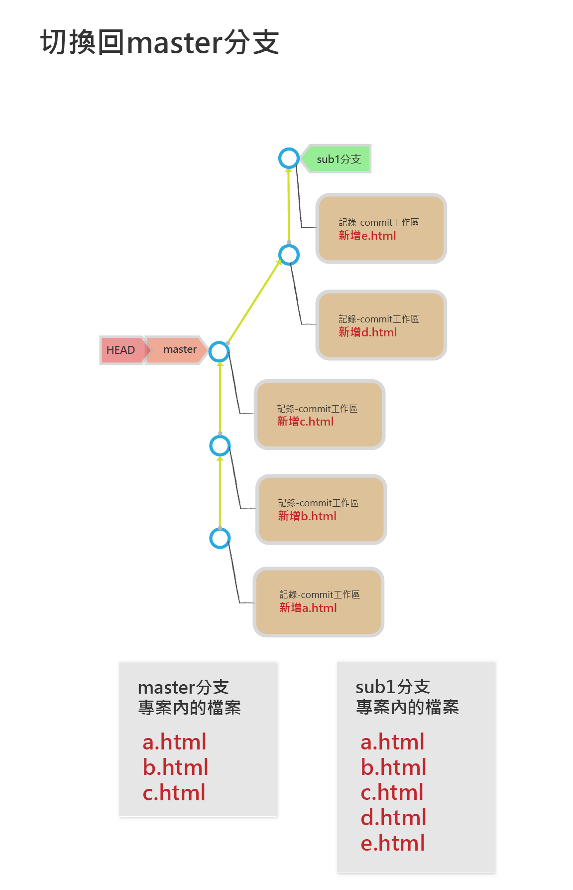
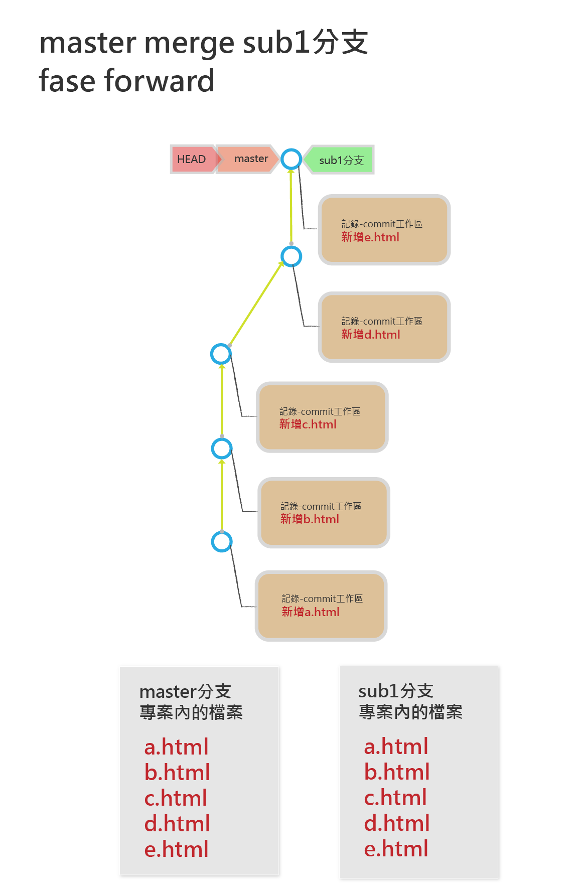
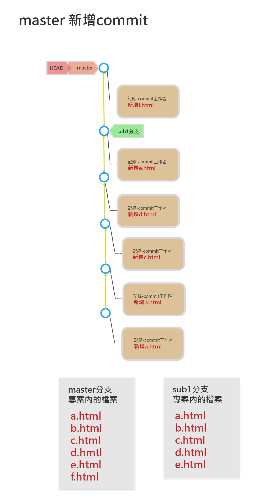

# 共同分支的好幫手-分支
## master和commit的關係



## master,commit和專案檔案關係




## 主要分支（master)
> 一個專案至少要有一個分支
> 
> 預設分支的名稱是master
> 
> master分支是一個指向單一commit的指標,可以想像是一張貼在commit上的標籤
> 
> master是可以移動的標籤

## HEAD是什麼？

> HEAD代表目前在哪一個commit上
> 
> HEAD也是可以移動的標籤
> 
> HEAD一般都貼在分支上,當分支移動時,HEAD也會跟著移動
>
> HEAD可以切換到不同分支,HEAD一次只可以貼在一個分支上

## 分支是什麼？
## 為何建立分支?
## 建立分支和切換分支和合併分支

### 新增分支語法

```
$ git branch 新的分支名稱
```

### 檢視目前分支

```
$ git branch
```


### 切換分支

```
$ git checkout 分支名稱
```

### 合併分支

```
$ git merge 分支名稱
```

### 刪除分支

```
$ git branch -d 分支名稱
```

### 實作流程

#### 新增專案

```
$ mkdir worktogether1
$ cd worktogether1
$ git init

$ touch a.html
$ git add a.html
$ git commit -m “新增a.html”

$ touch b.html
$ git add b.html
$ git commit -m “新增b.html”

$ touch c.html
$ git add c.html
$ git commit -m “新增c.html”
```

#### 新增分支sub1

```

$ git branch sub1
$ git branch

________________________
* master
  sub1

```




#### 切換分支至sub1

```
#切換分支

$ git checkout sub1
$ git branch
___________________________
  master
* sub1
```



___

#### 在sub1分支增加commit

```
$ touch d.html
$ git add d.html
$ git commit -m “新增d.html”
```



___

#### 在sub1分支增加commit

```
$ touch e.html
$ git add e.html
$ git commit -m “新增e.html”
$ ls 
_________________________
a.html	b.html	c.html	d.html	e.html
```



___

#### 切換回分支master

```
$ git checkout master
$ ls
___________________________
a.html	b.html	c.html
```



___

#### master合併分支sub1(使用fast-forward)

```
$ git merge sub1
_____________________
Updating 40351bf..af5116d
Fast-forward

 d.html | 0

 e.html | 0

 2 files changed, 0 insertions(+), 0 deletions(-)

 create mode 100644 d.html
 create mode 100644 e.html

$ ls
_____________________________
a.html	b.html	c.html	d.html	e.html
```




___

#### master新增commit

```
$ touch f.html
$ git add f.html
$ git commit -m “新增f.html”
____________________________
a.html	b.html	c.html	d.html	e.html

```



___

#### 刪除分支sub1

```
$ git branch -d sub1
```


