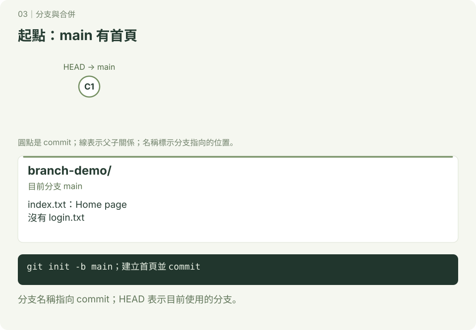
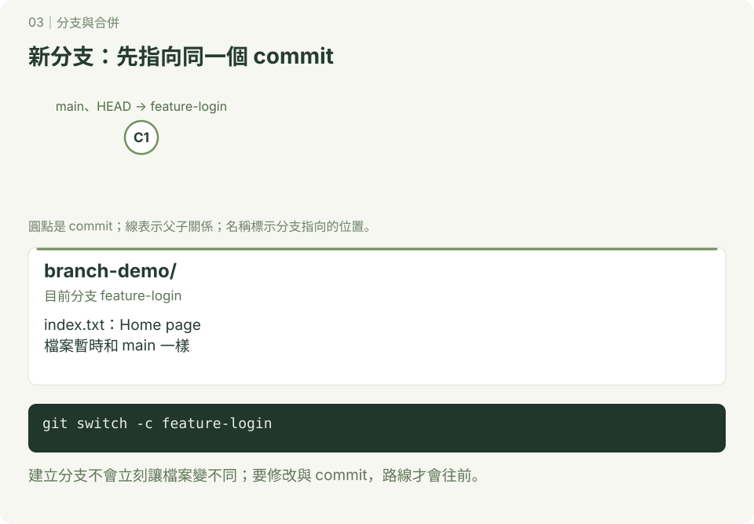
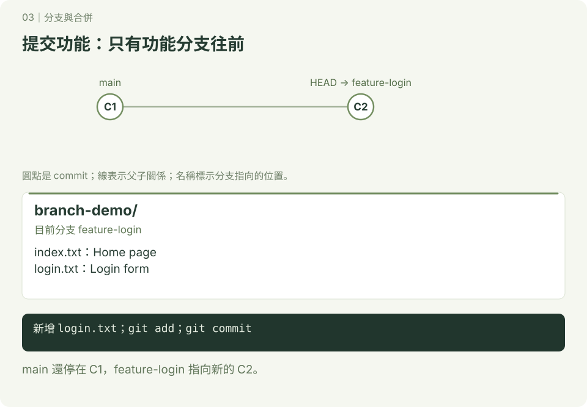
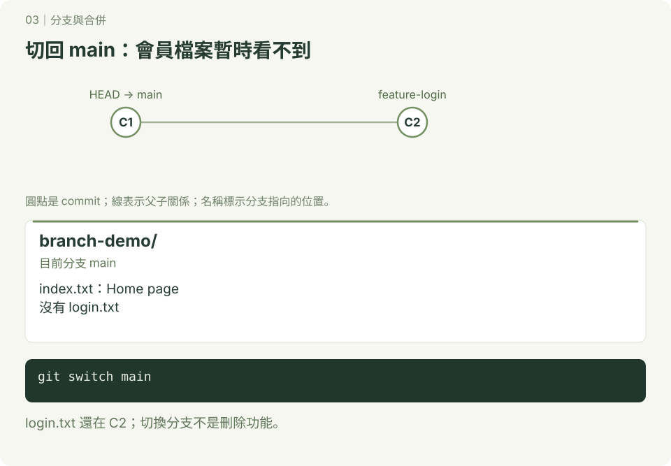
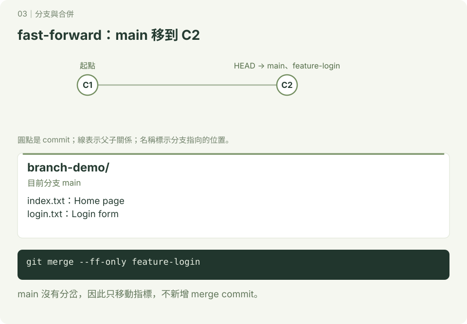
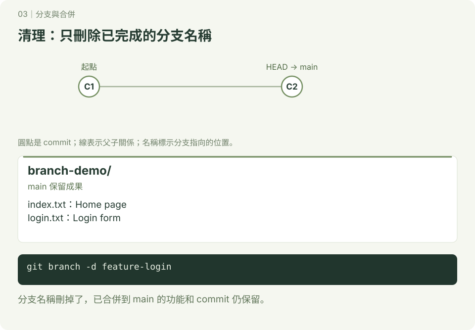

# 分支與合併

**建立版本 · 第 03 章**　[學習路線](../README.md) · [互動圖解](../docs/README.md)

本章附 SVG 圖解；可先讀 [互動版使用說明](../docs/README.md)，再用瀏覽器開啟 `docs/index.html#branch/1`，按下一步觀察變化。GitHub 的 README 顯示靜態圖，下載教材後即可離線操作互動版。

你想新增會員功能，但又想保留目前可以使用的版本。分支可以記錄不同的開發路線；完成後，再把成果合併回主要分支。

先學會 `git add`、`git commit`、`git status`。本章統一使用 `main`；舊專案若叫 `master`，它也能作為主要分支，名稱不同不代表功能不同。

## 1. 先認識三個名稱

| 名稱 | 意思 |
| --- | --- |
| commit | 一次已記錄的檔案版本 |
| branch（分支） | 指向某個 commit 的名稱，提交後會往新的 commit 移動 |
| HEAD | 目前所在的位置；一般操作時指向目前分支 |

建立分支時，兩個分支可以先指向同一個 commit。切換分支後新增 commit，這條分支才開始走自己的路。

`git switch` 在同一個資料夾切換分支；受追蹤的檔案會依目標版本更新。尚未提交的修改可能跟著切換，也可能阻止切換，因此本練習先提交再切換。

## 2. 照做：新增會員功能

使用 macOS／Linux 終端機或 Windows Git Bash。已設定 Git 姓名與電子郵件，在你選的練習位置操作；`branch-demo` 必須是尚未使用的資料夾名稱。`bash` 區塊是指令，`text` 區塊是預期結果。

### 步驟一：建立起點




操作位置：你選的練習位置。

```bash
mkdir branch-demo
cd branch-demo
git init -b main
printf 'Home page\n' > index.txt
git add index.txt
git commit -m "建立首頁"
```

預期：主要分支叫 main，裡面有 index.txt。

### 步驟二：建立並切換分支




操作位置：`branch-demo`。

```bash
git switch -c feature-login
git branch
```

預期：

```text
* feature-login
  main
```

星號表示目前分支。`switch -c` 同時建立與切換；單獨使用 `git branch feature-login` 只會建立，不會切換。

### 步驟三：提交新功能




操作位置：`branch-demo` 的 feature-login 分支。

```bash
printf 'Login form\n' > login.txt
git add login.txt
git commit -m "新增會員登入頁"
ls
```

預期：有 index.txt 與 login.txt。

先猜一猜：切換回 main 後，login.txt 還看得到嗎？

### 步驟四：回到主要版本




```bash
git switch main
ls
```

預期：只剩 index.txt。login.txt 已保存在 feature-login 的 commit 中，沒有遺失。

### 步驟五：合併與確認




操作位置：`branch-demo` 的 main 分支。

```bash
git merge --ff-only feature-login
cat login.txt
git log --oneline --graph --all
```

預期：login.txt 出現，內容是 `Login form`。合併方向是「把 feature-login 整合進目前所在的 main」。

這次 main 沒增加其他 commit，只要把 main 指標往前移，稱為 fast-forward。`--ff-only` 表示只接受這種合併；如果兩邊都繼續開發，Git 會拒絕這個選項，需要改用一般合併並檢查是否有衝突。

### 步驟六：刪除已完成的分支




```bash
git branch -d feature-login
git branch
git status --short
```

預期：只剩 main，status 沒有輸出。刪除已合併的分支名稱，不會刪掉 main 裡已整合的檔案。

## 3. 自己做：新增關於我們頁面

接著使用 branch-demo，不提供完整答案，請自己組合指令：

1. 從 main 建立並切換到 feature-about。
2. 新增 about.txt，寫一段自我介紹並提交。
3. 回到 main，確認尚未看到 about.txt。
4. 把 feature-about 合併到 main。
5. 確認檔案後刪除已合併的功能分支。

完成標準：main 有 index.txt、login.txt、about.txt；工作區乾淨；只剩 main 分支。

## 4. 常用指令速查

以下是速查，不用按表格順序全部執行。

| 目的 | 指令 |
| --- | --- |
| 看目前分支 | `git branch --show-current` |
| 看本地分支 | `git branch` |
| 建立並切換新分支 | `git switch -c 分支名稱` |
| 切換已存在的分支 | `git switch 分支名稱` |
| 合併到目前分支 | `git merge --no-edit 來源分支` |
| 刪除已合併分支 | `git branch -d 分支名稱` |

## 5. 進階概念：完成基礎練習後再讀

| 方式 | 適合情況 | 歷史會怎樣？ |
| --- | --- | --- |
| 一般 merge | 兩邊都開發過，想保留原有歷史 | 非 fast-forward 時建立 merge commit，保留雙方歷史 |
| `merge --no-ff` | 即使能 fast-forward，也想留下合併點 | 建立 merge commit |
| `merge --squash` 後再 commit | 把某功能的變更整理成一筆提交 | 不建立 merge commit，也不把來源分支各筆 commit 接入目標歷史 |
| rebase | 整理自己的開發歷史 | 可能重建 commit、改變識別碼；不要隨意改寫別人正在使用的分支 |

squash 後，Git 不一定把原分支判定為「已合併」，`branch -d` 可能拒絕刪除。初學練習先用一般合併，理解歷史後再學整理。

延伸：[worktree：同時在不同資料夾工作](../worktree)、[GitHub 共同開發與 Pull Request](../協作與PullRequest)、[rebase 進階筆記](../git_rebase)。

---

[← main、HEAD 與歷史](../使用master主要分支/README.md)　｜　[忽略不需要追蹤的檔案 →](../不想被追蹤的檔案/README.md)
