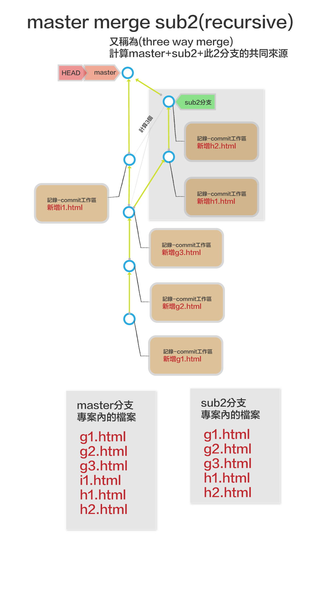

# branch(分支)
- git branch 
	- 查詢branch
- git branch 分支名稱
	- 建立新的分支
- git branch -D 分支名稱
	- 刪除分支
- git branch -M 分支名稱
	- 改變分支名稱
- git switch 分支名稱
	- 切換分支
- git switch -c 分支名稱
	- 同時建立新分支和切換分支
- git merge
	- 合併分支(自動,fast forward或--no-ff)
- git merge --no-ff
	- 強制不使用fast forward
- git rebase
	- 改變基底

## master和commit的關係


## master,commit和專案檔案關係


## 主要分支（master)
> 一個專案至少要有一個分支
> 
> 預設分支的名稱是master 或 main
> 
> master分支是一個指向單一commit的指標,可以想像是一張貼在commit上的貼紙
> 
> master是可以移動的貼紙

## HEAD是什麼？

> HEAD代表目前在哪一個commit上
> 
> HEAD也是可以移動的標籤
> 
> HEAD一般都貼在分支上,當分支移動時,HEAD也會跟著移動
>
> HEAD可以切換到不同分支,HEAD一次只可以貼在一個分支上

## 分支是什麼？
> 分支就是在主要分支建立另一條支線,而每一條分支都有特定的任務！

比方說開發一個購物網頁有會員功能,購物功能,最新訊息,產品上架….,每一個功能都可以建立一個分支,完成後可以合併至主分支

修改一個bug也可以建立一個分支

測試一個功能也可以建立一個分支


## 建立分支和切換分支和合併分支


### 檢視目前分支

```
$ git branch
```

### 新增分支

```
$ git branch 新的分支名稱
```

### 切換分支

```
$ git switch 分支名稱
```

### 新增並切換分支

```
$ git checkout -b 新的分支名稱
```

### 合併分支

```
$ git merge 分支名稱
$ git merge --no-ff 分支名稱
$ git merge --squash 分支名稱
```

### 刪除分支

```
$ git branch -d 分支名稱
```

### 實作流程(fast-forward)

#### 新增專案

```
$ mkdir worktogether1
$ cd worktogether1
$ git init

$ touch a.html
$ git add a.html
$ git commit -m “新增a.html”

$ touch b.html
$ git add b.html
$ git commit -m “新增b.html”

$ touch c.html
$ git add c.html
$ git commit -m “新增c.html”
```

#### 新增分支sub1

```

$ git branch sub1
$ git branch

________________________
* master
  sub1

```


#### 切換分支至sub1

```
#切換分支

$ git switch sub1
$ git branch
___________________________
  master
* sub1
```


___

#### 在sub1分支增加commit

```
$ touch d.html
$ git add d.html
$ git commit -m “新增d.html”
```


___

#### 在sub1分支增加commit

```
$ touch e.html
$ git add e.html
$ git commit -m “新增e.html”
$ ls 
_________________________
a.html	b.html	c.html	d.html	e.html
```


___

#### 切換回分支master

```
$ git switch master
$ ls
___________________________
a.html	b.html	c.html
```


___

#### master合併分支sub1(使用fast-forward)
- 切換回master分支

```
$ git merge sub1 #如果不要fast-forward,要用git merge --no-ff sub1
_____________________
Updating 40351bf..af5116d
Fast-forward

 d.html | 0

 e.html | 0

 2 files changed, 0 insertions(+), 0 deletions(-)

 create mode 100644 d.html
 create mode 100644 e.html

$ ls
_____________________________
a.html	b.html	c.html	d.html	e.html
```


___

#### master目前的commit

```
$ git log --oneline
---------------
b8ea456 (HEAD -> main, sub1) 新增e.html
42598c2 新增d.html
88b7fa3 新增c.html
6f4f91d 新增b.html
a41b3de 新增a.html
```

#### master新增commit

```
$ touch f.html
$ git add f.html
$ git commit -m “新增f.html”
____________________________
a.html	b.html	c.html	d.html	e.html

```


___

#### 刪除分支sub1

```
$ git branch -d sub1
```


___

### 實作流程(squash)

#### 新增sub2分支

```
$ touch g1.html
$ git add g1.html
$ git commit -m “新增g1.html”

$ touch g2.html
$ git add g2.html
$ git commit -m “新增g2.html”

$ touch g3.html
$ git add g3.html
$ git commit -m “新增g3.html”

$ git branch sub2
```


___

#### 切換至sub2分支

```
$ git switch sub2
```


___

#### sub2分支增加一個commit

```
$ touch h1.html
$ git add h1.html
$ git commit -m “新增h1.html”
```


___

#### sub2分支增加一個commit

```
$ touch h2.html
$ git add h2.html
$ git commit -m “新增h2.html”
```


___

#### 切換至master分支

```
$ git switch master
```


___

#### master分支增加一個commit

```
$ touch i1.html
$ git add i1.html
$ git commit -m “新增i1.html”
```


___

#### master 合併 sub2分支(squash)
- 合併後2個來源的commit要結合為一個新的commit
- 會跳出編輯視窗,修改新的commit的message


```
$ git merge sub2
```




```
$ git log --oneline

----------
aed5872 (HEAD -> master) Merge branch 'sub2' #這個為合併後建立的
eb69cf3 新增i1.html
e8c12ca (sub2) 新增h2.html
b5f7dd4 新增h1.html
a8e23d0 新增g3.html
6c65a56 新增g2.html
2e43837 新增g1.html
```

### 實作流程(rebase)

#### 新增sub2分支

```
$ touch g1.html
$ git add g1.html
$ git commit -m “新增g1.html”

$ touch g2.html
$ git add g2.html
$ git commit -m “新增g2.html”

$ touch g3.html
$ git add g3.html
$ git commit -m “新增g3.html”

$ git branch sub2
```


___

#### 切換至sub2分支

```
$ git switch sub2
```


___

#### sub2分支增加一個commit

```
$ touch h1.html
$ git add h1.html
$ git commit -m “新增h1.html”
```


___

#### sub2分支增加一個commit

```
$ touch h2.html
$ git add h2.html
$ git commit -m “新增h2.html”
```


___

#### 切換至master分支

```
$ git switch master
```


___

#### master分支增加一個commit

```
$ touch i1.html
$ git add i1.html
$ git commit -m “新增i1.html”
```


___

#### 由sub2 rebase master
- 將sub2重新建立基底

```
$ git switch sub2
$ git rebase master
------------------------
Successfully rebased and updated refs/heads/sub2.

$ git log --oneline     
----------------------
377f87c (HEAD -> sub2) 新增h2.html
f3df131 新增h1.html
0e1bf3a (master) 新增i1.html  #這裏是由master移進來的
72bd8f4 新增g3.html
3df4a30 新增g2.html
34d9980 新增g1.html
```

#### 由master rebase sub2
- 將master重新建立基底

```
$ git switch master
$ git log --oneline
-----------------------
0e1bf3a (HEAD -> master) 新增i1.html
72bd8f4 新增g3.html
3df4a30 新增g2.html
34d9980 新增g1.html

$ git rebase sub2
-------------------------
Successfully rebased and updated refs/heads/master

$ git log --oneline
377f87c (HEAD -> master, sub2) 新增h2.html
f3df131 新增h1.html
0e1bf3a 新增i1.html
72bd8f4 新增g3.html
3df4a30 新增g2.html
34d9980 新增g1.html
```


