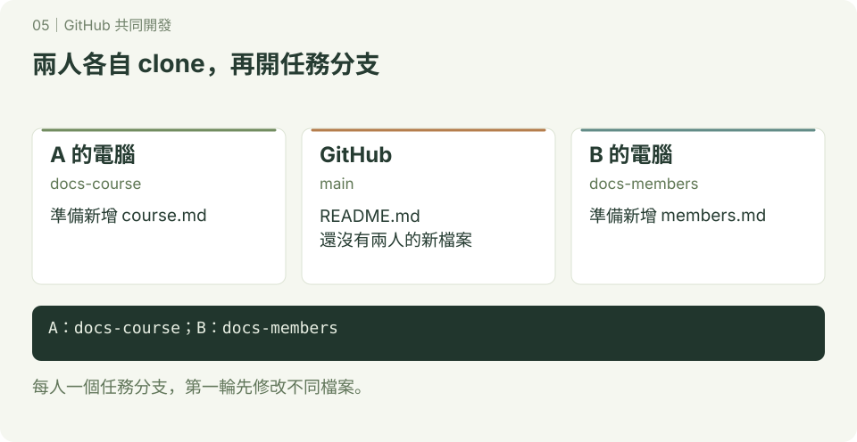
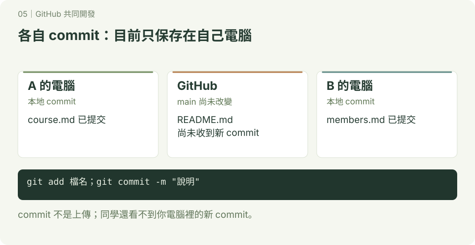
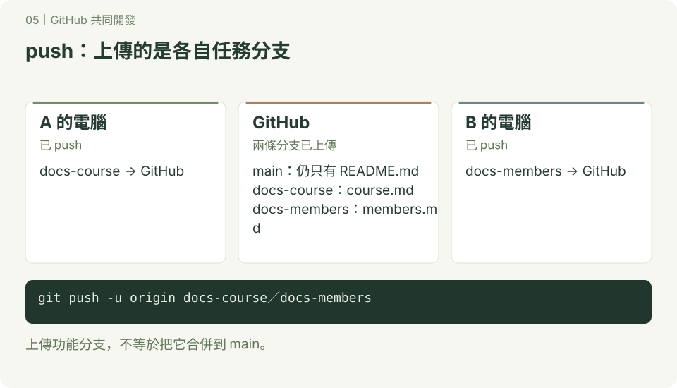
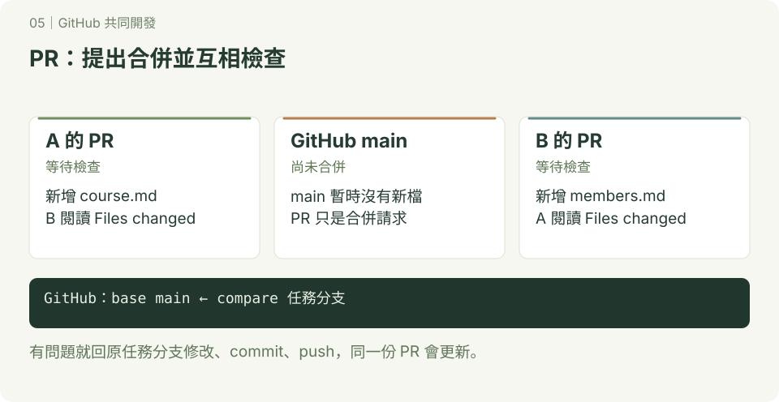
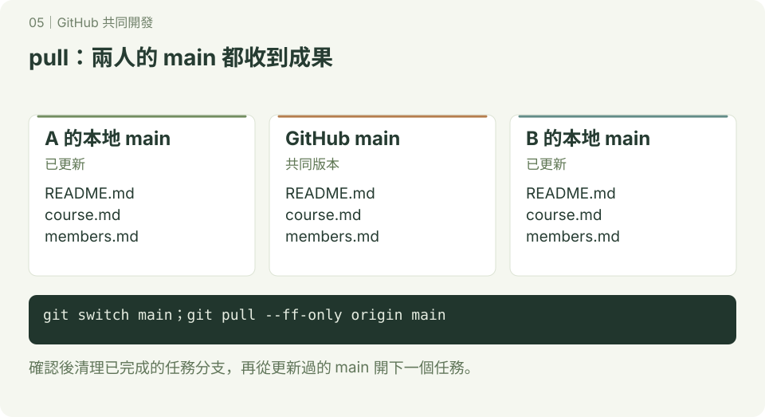

# GitHub 共同開發

**一起開發 · 第 05 章**　[學習路線](../README.md) · [互動圖解](../docs/README.md)

本章附 SVG 圖解；可先讀 [互動版使用說明](../docs/README.md)，再用瀏覽器開啟 `docs/index.html#collaboration/1`，按下一步觀察變化。GitHub 的 README 顯示靜態圖，下載教材後即可離線操作互動版。

Git 管理版本，GitHub 讓大家分享 Git 儲存庫、討論修改、審查與合併成果。先完成 [分支練習](../分支)，並閱讀 [GitHub 基本操作](../github/README.md) 準備帳號、clone 與登入方式，再做本章。

## 1. 選一種合作方式

| 方式 | 適合情況 | 操作流程 |
| --- | --- | --- |
| GitHub 網頁編輯 | 文件、小幅文字修正 | 開新分支 → 網頁編輯並 commit → PR → 同學檢查 → 合併 |
| 同組共用一個儲存庫 | 小組作業，有寫入權限 | clone → 個人任務分支 → commit → push → PR → 合併 |
| Fork 到自己帳號 | 沒有原專案寫入權限，例如向老師交作業 | Fork → clone 自己的副本 → 分支 → push → 向原專案送 PR |

**PR（Pull Request）是提出合併請求，不是已經合併；push 也只是上傳 commit，不會自動把功能分支合併到 main。**

我們使用 GitHub flow：小任務開分支，完成後送 PR，檢查後合併，再更新本地 main。這是本教材的小組合作約定；若要由 GitHub 強制執行，管理者需另行設定適用的分支保護或 ruleset。

## 2. 最簡單：只用 GitHub 網頁

先由 A 同學建立名為 `class-team-demo` 的練習儲存庫，勾選新增 README，確認預設分支是 main。透過儲存庫 Settings 中的 Collaborators／存取管理邀請 B 同學，B 接受邀請；不同帳號類型可能顯示不同名稱。

接著由 B 操作：

1. 在分支選單從 main 建立 `docs-class-intro`，並確認目前選到這個分支。
2. 開啟 README.md，按編輯按鈕，新增一段班級介紹。
3. 選 Commit changes，訊息填「新增班級介紹」，提交到 docs-class-intro。
4. 到 Pull requests → New pull request，選 **base: main**、**compare: docs-class-intro**，檢查差異後建立 PR。
5. A 打開 PR 的 Files changed，確認文字；需要修改時留下意見。B 在同一分支繼續修改與提交，PR 會更新。
6. A 確認後選 Merge pull request，再確認合併。若只有其他合併方式可選，先檢查儲存庫設定；本章練習使用一般 merge。
7. 回到 main，確認新內容出現，再刪除已完成的分支。

先猜一猜：第 3 步提交完成時，main 的內容會改變嗎？答案是不會，直到 PR 合併後才會改變。

## 3. 兩人實作：本地開發，再用 PR 整合

### 步驟一：每人 clone 一份




沿用上一節的儲存庫與邀請。兩人各自在自己的電腦操作，使用終端機或 Git Bash。將網址中的 `OWNER` 換成 A 的 GitHub 帳號；不要原樣輸入。

```bash
git clone https://github.com/OWNER/class-team-demo.git
cd class-team-demo
git branch --show-current
```

預期目前分支是 main。clone 會自動把這個網址命名為 origin。

若 push 需要驗證，使用已設定的 SSH，或 HTTPS 搭配 GitHub 登入／憑證工具或 personal access token；GitHub 帳號密碼不能作為 HTTPS Git 操作的密碼。設定方式見 [SSH](../ssh) 與 [憑證](../credential)。

### 步驟二：A 新增課程介紹




操作位置：A 電腦的 class-team-demo。開始前確認工作區乾淨；若有修改，先處理自己的內容再切換。

```bash
git status --short
git switch main
git pull --ff-only origin main
git switch -c docs-course
printf '# 課程介紹\n本課程練習 Git 與 GitHub。\n' > course.md
cat course.md
```

最後一行讓你看新檔案內容。一般 `git diff` 不顯示未追蹤的新檔，所以先讀檔，再於下一步用 `git diff --staged` 檢查暫存內容。

```bash
git add course.md
git diff --staged
git commit -m "新增課程介紹"
git push -u origin docs-course
```

預期 GitHub 上有 docs-course 分支。`-u` 設定追蹤關係；之後在這個分支通常可直接 `git push`。

### 步驟三：B 新增小組成員




操作位置：B 電腦的 class-team-demo。B 不必等 A 完成，可以從自己的 main 開始。

```bash
git status --short
git switch main
git pull --ff-only origin main
git switch -c docs-members
printf '# 小組成員\n- A 同學\n- B 同學\n' > members.md
git add members.md
git diff --staged
git commit -m "新增小組成員"
git push -u origin docs-members
```

預期有兩條任務分支，每人只處理自己的檔案。這次故意分開檔案，先練成功流程。

### 步驟四：互相檢查 PR




操作位置：GitHub 網站。

1. A 建立 PR，base 選 main、compare 選 docs-course；B 用 docs-members 建立另一個 PR。
2. 標題寫清楚新增什麼，描述寫「修改內容、如何確認、還有哪些未完成」。
3. B 看 A 的 Files changed，A 看 B 的 Files changed；確認內容與需求一致。
4. 要修正時，在原任務分支修改、commit、push；不用為同一件事再開一個 PR。
5. 有寫入權限的人依約定逐一合併兩個 PR，選一般 Merge pull request。若有檢查失敗或衝突，先處理後再合併。

互相檢查，不只按 Approve：實際閱讀新增內容；程式專案還要依專案說明執行與測試。

### 步驟五：兩人都更新自己的 main




先在 GitHub 確认兩個 PR 都已合併。兩人各自在自己的 class-team-demo 執行：

```bash
git switch main
git pull --ff-only origin main
ls
git status --short
```

預期都看得到 course.md 與 members.md，status 沒有輸出。GitHub 合併不會自動更新你的電腦。

A 執行 `git branch -d docs-course`，B 執行 `git branch -d docs-members`。GitHub 可刪掉兩個遠端任務分支；本地再用 `git fetch --prune` 更新遠端追蹤紀錄。

完成標準：main 上有兩人的成果；有兩份合併完成的 PR；兩人的本地 main 都已更新。

## 4. 沒有寫入權限：接著學 Fork

本章的共用儲存庫方式需要寫入權限。向老師或其他人的專案提出修改時，可以先 Fork 到自己的帳號，再送 PR。

操作方式已整理成獨立的 [第 06 章：用 Fork 交作業](../Fork交作業/README.md)，包含 origin／upstream、PR 方向與同步的完整練習。

## 5. 同學改了 main，我的任務還沒完成怎麼辦？

以下以仍在開發的 docs-members 為例；只在該分支尚未刪除時使用。先把自己的修改提交，確認工作區乾淨，再在 class-team-demo 操作：

```bash
git switch docs-members
git fetch origin
git merge --no-edit origin/main
```

沒有衝突時，重新檢查功能，再 `git push`。如果出現衝突，Git 會列出檔案：

1. 用 `git status` 找出有衝突的檔案，與同學確認要保留的內容。
2. 編輯檔案，處理 `<<<<<<<`、`=======`、`>>>>>>>` 之間的內容，移除標記。
3. `git add 實際檔名`，再 `git commit -m "整合 main 並解決衝突"`。
4. 執行專案檢查，再 push，PR 會更新。

如果決定暫停這次合併，在合併仍進行中時用 `git merge --abort`。不要在沒有弄清楚內容時叫 AI 全部選 ours 或 theirs。

## 6. 小組約定與自己做

- 一個任務一條分支，不讓兩人同時把不同任務 push 到同一條功能分支。
- main 保留可使用的版本；日常修改走 PR。
- 開始任務前更新 main；送 PR 前閱讀差異與檢查結果。
- 第一輪分開檔案，熟悉後再練同一檔案的衝突處理。

換你們做：A 新增 schedule.md，B 新增 contact.md，各自開分支、送 PR、互相檢查、合併。完成後交換角色，說明 push、PR、merge、pull 各做了什麼。

參考：[GitHub flow](https://docs.github.com/en/get-started/using-github/github-flow)、[建立 PR](https://docs.github.com/en/pull-requests/how-tos/create-pull-requests/creating-a-pull-request)、[Fork 儲存庫](https://docs.github.com/en/pull-requests/how-tos/work-with-forks/fork-a-repo)、[GitHub 驗證方式](https://docs.github.com/en/authentication/keeping-your-account-and-data-secure/about-authentication-to-github)。

---

[← 忽略不需要追蹤的檔案](../不想被追蹤的檔案/README.md)　｜　[用 Fork 交作業 →](../Fork交作業/README.md)
