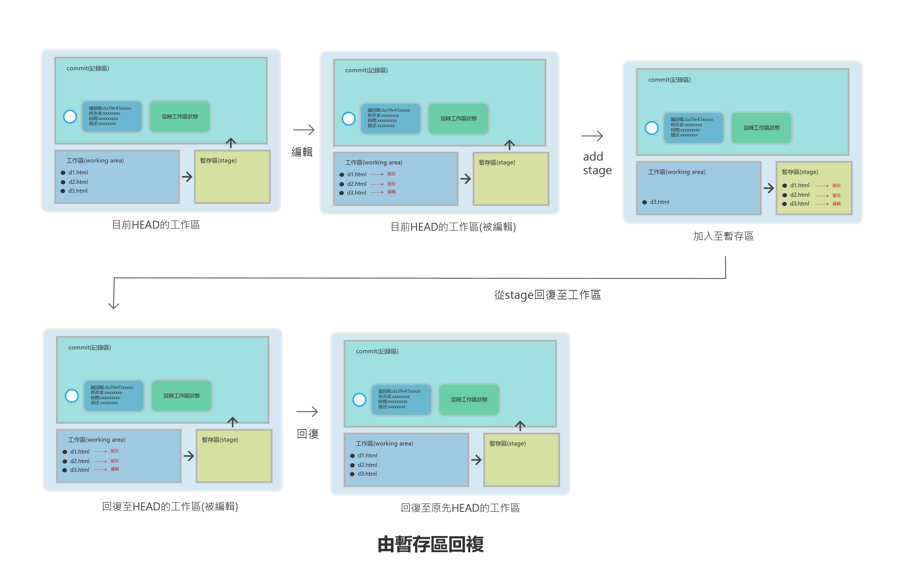
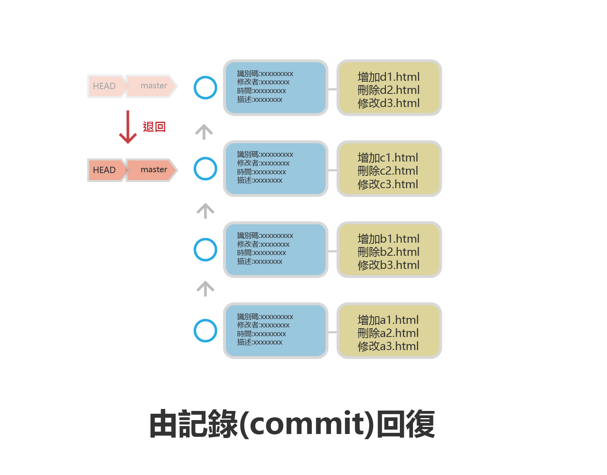

# 回復被刪除的檔案或被編輯的內容

> 在有些情景，我們可能會刪除一些檔案或編輯一些內容,如何回復到目前HEAD的原始狀態.


1. 從工作區回復
2. 從暫存區回復

## 從工作區回復

- 使用git restore

### 新增c1.html,c2.html,c3.html,c3.html加入內容

```
$ touch c1.html
$ touch c2.html
$ touch c3.html
$ vim c3.html
____________________________
我是原始狀態
~
~
~
~
~
~
~
~
~
~
~
~
~
~
~
~
~
~
~
~
~


# 建立新的commit

$ git add —all
$ git commit -m “新增c1.html,c2.html,c3.html,c3.html加入內容”
$ git log —oneline       #用簡短方式顯示log

______________________________
bfe5b85 (HEAD -> master) 新增c1.html,c2.html,c3.html,c3.html加入內容
63d60eb 建立b3.html
58718cc 建立b2.html
6421101 建立b1.html
454c953 建立3個a檔案

$ ls -al          #檢示目前的檔案
____________________________________

total 13
drwxr-xr-x 1 User 197121  0 Dec  2 10:25 ./
drwxr-xr-x 1 User 197121  0 Dec  1 11:46 ../
drwxr-xr-x 1 User 197121  0 Dec  2 10:27 .git/
-rw-r--r-- 1 User 197121  0 Dec  1 12:11 a1.html
-rw-r--r-- 1 User 197121  0 Dec  1 12:11 a2.html
-rw-r--r-- 1 User 197121  0 Dec  1 12:11 a3.html
-rw-r--r-- 1 User 197121  0 Dec  1 13:48 b1.html
-rw-r--r-- 1 User 197121  0 Dec  1 13:48 b2.html
-rw-r--r-- 1 User 197121  0 Dec  1 13:49 b3.html
-rw-r--r-- 1 User 197121  0 Dec  2 10:11 c1.html
-rw-r--r-- 1 User 197121  0 Dec  2 10:11 c2.html
-rw-r--r-- 1 User 197121 19 Dec  2 10:12 c3.html
```

- 以上表示我們最新狀態HEAD是在bfe5b85
- 以上新增c1.html,c2.html,c3.html

### 刪除c1.html,c2.html和修改c3.html

```
$ rm c1.html
$ rm c2.html
$ vim c3.html

________________________________________

我是原始狀態
這是新編輯的內容
~
~
~
~
~
~
~
~
~


________________________________________

$ git status

___________________________________________

On branch master
Changes not staged for commit:
  (use "git add/rm <file>..." to update what will be committed)
  (use "git restore <file>..." to discard changes in working directory)
        deleted:    c1.html
        deleted:    c2.html
        modified:   c3.html

no changes added to commit (use "git add" and/or "git commit -a")

____________________________________________________

```

以上代表：
- deleted:    c1.html
- deleted:    c2.html
- modified:   c3.html


### 回復至原來工作區的狀態

> 使用git restore file file  檔案回復

> 使用git restore . 全部回復


```
$ git restore c1.html c2.html
$ git restore .
$ git status

________________________
On branch master
nothing to commit, working tree clean
_____________________________________

$ vim c3.html
________________________________
我是原始狀態
~
~
~

________________________________

$ ls -al

________________________________
total 13
drwxr-xr-x 1 User 197121  0 Dec  2 11:04 ./
drwxr-xr-x 1 User 197121  0 Dec  1 11:46 ../
drwxr-xr-x 1 User 197121  0 Dec  2 11:00 .git/
-rw-r--r-- 1 User 197121  0 Dec  1 12:11 a1.html
-rw-r--r-- 1 User 197121  0 Dec  1 12:11 a2.html
-rw-r--r-- 1 User 197121  0 Dec  1 12:11 a3.html
-rw-r--r-- 1 User 197121  0 Dec  1 13:48 b1.html
-rw-r--r-- 1 User 197121  0 Dec  1 13:48 b2.html
-rw-r--r-- 1 User 197121  0 Dec  1 13:49 b3.html
-rw-r--r-- 1 User 197121  0 Dec  2 11:00 c1.html
-rw-r--r-- 1 User 197121  0 Dec  2 11:00 c2.html
-rw-r--r-- 1 User 197121 20 Dec  2 11:00 c3.html
________________________________
```

以上表示全部回復


## 從暫存區回復



### 新增d1.html,d2.html,d3.html,d3.html加入內容

```
$ touch d1.html
$ touch d2.html
$ vim d3.html         #d3自己加入內容
$ git add .
$ git commit -m “加入新增d1.html,d2.html,d3.html,d3.html加入內容“
$ ls d*.html -al

___________________
-rw-r--r-- 1 User 197121  0 Dec  4 11:13 d1.html
-rw-r--r-- 1 User 197121  0 Dec  4 11:13 d2.html
-rw-r--r-- 1 User 197121 22 Dec  4 11:14 d3.html

$ git status
On branch master
nothing to commit, working tree clean
```


### 刪除d1.html,d2.html,編輯d3.html,加入暫存區

```
$ rm d1.html
$ rm d2.html
$ vim d3.html    # 修改內容
$ git add d1.html d2.html d3.html
$ git status
________________________________

-On branch master
Changes to be committed:
  (use "git restore --staged <file>..." to unstage)
        deleted:    d1.html
        deleted:    d2.html
        modified:   d3.html

$ ls d*.html -al
________________________________
-rw-r--r-- 1 User 197121 44 Dec  4 11:32 d3.html

```

- 以上代表被放入至stage
- 只剩 d3.html

### 回復至工作區

```
$ git restore --staged d1.html d2.html d3.html

____________________________
On branch master
Changes not staged for commit:
  (use "git add/rm <file>..." to update what will be committed)
  (use "git restore <file>..." to discard changes in working directory)
        deleted:    d1.html
        deleted:    d2.html
        modified:   d3.html

no changes added to commit (use "git add" and/or "git commit -a")

```

- 代表回復至工作區

### 回復到HEAD原始狀態

```
$ git restore .
$ git status
____________________________
On branch master
nothing to commit, working tree clean

$ ls d*.* -al
______________________________
-rw-r--r-- 1 User 197121  0 Dec  4 11:47 d1.html
-rw-r--r-- 1 User 197121  0 Dec  4 11:47 d2.html
-rw-r--r-- 1 User 197121 23 Dec  4 11:47 d3.html

```

- 代表回復到HEAD原始狀態
- 檔案回復了


## 從記錄區(commit)回復



### 新增e1.html,e2.html,e3.html,並建立記錄點(commit)

```
$ touch e1.html
$ touch e2.html
$ touch e3.html
$ git add .
$ git commit  -m “新增e1.html,e2.html,e3.html”   
$ git status
_______________________
On branch master
nothing to commit, working tree clean

```

### 刪除e1.html,e2.html,e3.html,並建立記錄點(commit)

```
$ rm e1.html e2.html e3.html
$ git commit -a -m “刪除e1.html,e2.html,e3.html”    #已經追蹤的檔案可以直接使用 -a 加入暫存庫

$ git log --oneline
_____________________________________
d4e1b24 (HEAD -> master) 刪除e1.html,e2.html,e3.html
c1a6019 新增e1.html,e2.html,e3.html
059c439 “加入新增d1.html,d2.html,d3.html,d3.html加入內容“
bfe5b85 新增c1.html,c2.html,c3.html,c3.html加入內容
63d60eb 建立b3.html
58718cc 建立b2.html
6421101 建立b1.html
454c953 建立3個a檔案

```

- 以上代表HEAD識別碼是d4e1b24
- 前一個識別碼是c1a6019

### 使用git reset 回到前一個comit（HEAD,master都改為指向c1a6019)

```
$ git reset c1a6019 --hard    #--hard將在後面章節講解
_____________________________________________
HEAD is now at c1a6019 新增e1.html,e2.html,e3.html

$ git log --oneline 
_________________________

c1a6019 (HEAD -> master) 新增e1.html,e2.html,e3.html
059c439 “加入新增d1.html,d2.html,d3.html,d3.html加入內容“
bfe5b85 新增c1.html,c2.html,c3.html,c3.html加入內容
63d60eb 建立b3.html
58718cc 建立b2.html
6421101 建立b1.html
454c953 建立3個a檔案

$ ls e*.html
___________________________
e1.html  e2.html  e3.html

```

- 上面代表回到前一個記錄點(commit)
- 刪除的檔案救回來了


