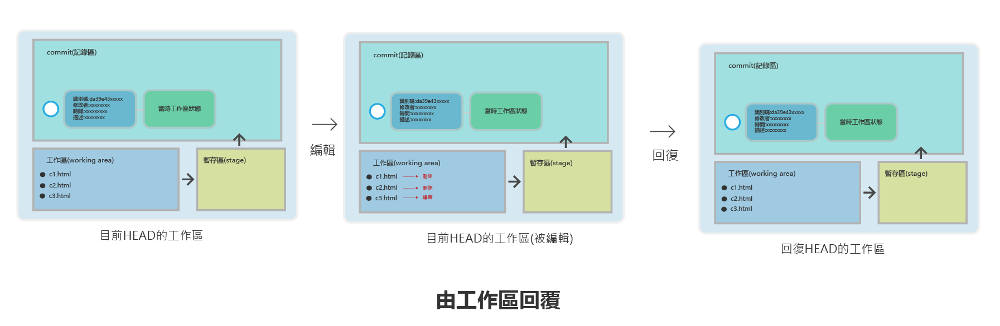

# 回復被刪除的檔案或被編輯的內容

> 在有些情景，我們可能會刪除一些檔案或編輯一些內容,如何回復到目前HEAD的原始狀態.



- 使用git restore

## 從工作區回復

### 新增c1.html,c2.html,c3.html,c3.html加入內容

```
$ touch c1.html
$ touch c2.html
$ touch c3.html
$ vim c3.html
____________________________
我是原始狀態
~
~
~
~
~
~
~
~
~
~
~
~
~
~
~
~
~
~
~
~
~


# 建立新的commit

$ git add —all
$ git commit -m “新增c1.html,c2.html,c3.html,c3.html加入內容”
$ git log —oneline       #用簡短方式顯示log

______________________________
bfe5b85 (HEAD -> master) 新增c1.html,c2.html,c3.html,c3.html加入內容
63d60eb 建立b3.html
58718cc 建立b2.html
6421101 建立b1.html
454c953 建立3個a檔案

$ ls -al          #檢示目前的檔案
____________________________________

total 13
drwxr-xr-x 1 User 197121  0 Dec  2 10:25 ./
drwxr-xr-x 1 User 197121  0 Dec  1 11:46 ../
drwxr-xr-x 1 User 197121  0 Dec  2 10:27 .git/
-rw-r--r-- 1 User 197121  0 Dec  1 12:11 a1.html
-rw-r--r-- 1 User 197121  0 Dec  1 12:11 a2.html
-rw-r--r-- 1 User 197121  0 Dec  1 12:11 a3.html
-rw-r--r-- 1 User 197121  0 Dec  1 13:48 b1.html
-rw-r--r-- 1 User 197121  0 Dec  1 13:48 b2.html
-rw-r--r-- 1 User 197121  0 Dec  1 13:49 b3.html
-rw-r--r-- 1 User 197121  0 Dec  2 10:11 c1.html
-rw-r--r-- 1 User 197121  0 Dec  2 10:11 c2.html
-rw-r--r-- 1 User 197121 19 Dec  2 10:12 c3.html
```

- 以上表示我們最新狀態HEAD是在bfe5b85
- 以上新增c1.html,c2.html,c3.html

### 刪除c1.html,c2.html和修改c3.html

```
$ rm c1.html
$ rm c2.html
$ vim c3.html

________________________________________

我是原始狀態
這是新編輯的內容
~
~
~
~
~
~
~
~
~
~
~
~
~
~
~
~
~
~
~
~

________________________________________

$ git status

___________________________________________

On branch master
Changes not staged for commit:
  (use "git add/rm <file>..." to update what will be committed)
  (use "git restore <file>..." to discard changes in working directory)
        deleted:    c1.html
        deleted:    c2.html
        modified:   c3.html

no changes added to commit (use "git add" and/or "git commit -a")

____________________________________________________

```

以上代表：
- deleted:    c1.html
- deleted:    c2.html
- modified:   c3.html


### 回復至原來工作區的狀態

> 使用git restore file file  檔案回復

> 使用git restore . 全部回復


```
$ git restore c1.html c2.html
$ git restore .
$ git status

________________________
On branch master
nothing to commit, working tree clean
_____________________________________

$ vim c3.html
________________________________
我是原始狀態
~
~
~

________________________________

$ ls -al

________________________________
total 13
drwxr-xr-x 1 User 197121  0 Dec  2 11:04 ./
drwxr-xr-x 1 User 197121  0 Dec  1 11:46 ../
drwxr-xr-x 1 User 197121  0 Dec  2 11:00 .git/
-rw-r--r-- 1 User 197121  0 Dec  1 12:11 a1.html
-rw-r--r-- 1 User 197121  0 Dec  1 12:11 a2.html
-rw-r--r-- 1 User 197121  0 Dec  1 12:11 a3.html
-rw-r--r-- 1 User 197121  0 Dec  1 13:48 b1.html
-rw-r--r-- 1 User 197121  0 Dec  1 13:48 b2.html
-rw-r--r-- 1 User 197121  0 Dec  1 13:49 b3.html
-rw-r--r-- 1 User 197121  0 Dec  2 11:00 c1.html
-rw-r--r-- 1 User 197121  0 Dec  2 11:00 c2.html
-rw-r--r-- 1 User 197121 20 Dec  2 11:00 c3.html
________________________________
```

以上表示全部回復


