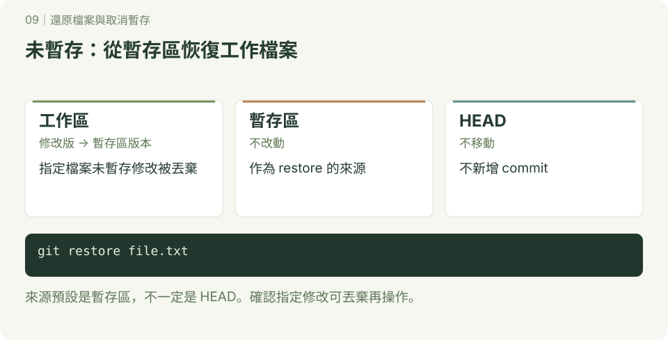
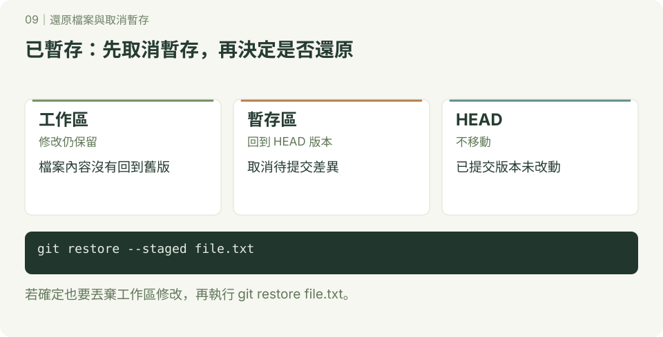

# 還原檔案與取消暫存

**復原與整理 · 第 09 章**　[學習路線](../README.md)


先判斷修改在哪裡，再選操作。`restore` 針對檔案與暫存區；已提交的錯誤通常用新的修正 commit 或 revert 處理。

## 1. 復原來源與影響範圍

| 指令（查詢用） | 來源 | 改變哪裡？ |
| --- | --- | --- |
| `git restore -- file.txt` | 暫存區 | 工作區；丟棄此檔案未暫存修改 |
| `git restore --staged -- file.txt` | HEAD | 暫存區；工作區修改保留 |
| `git restore --source=HEAD --staged --worktree -- file.txt` | HEAD | 暫存區與工作區；兩者修改都會丟棄 |
| `git restore --source=HEAD~1 -- file.txt` | 前一筆提交 | 工作區；還要 add、commit 才記錄復原 |

沒有 `--staged` 時，restore 的預設來源是**暫存區**，不是一律 HEAD。指定 `.` 會涵蓋目前目錄及下層；初學先寫明檔名，確認內容可以丟棄後再操作。

## 2. 照做：還原未暫存修改與刪檔

使用終端機或 Git Bash，已設定提交身分，在尚無 restore-demo 的練習位置開始。以下丟棄操作只針對練習資料。

```bash
mkdir restore-demo
cd restore-demo
git init -b main
printf 'Version 1\n' > note.txt
git add note.txt
git commit -m "建立筆記起點"
printf 'Wrong draft\n' > note.txt
git diff
git restore -- note.txt
cat note.txt
rm note.txt
git status --short
git restore -- note.txt
cat note.txt
```

預期兩次 cat 都顯示 Version 1。未暫存刪除時 status 是前方有空格的 `D note.txt`（` M` 表未暫存修改、`M ` 表已暫存），restore 從暫存區取回檔案，不會建立 commit。

## 3. 照做：取消暫存不等於丟棄修改



接續 restore-demo：

```bash
printf 'Version 2\n' > note.txt
git add note.txt
git restore --staged -- note.txt
git status --short
cat note.txt
```

預期 ` M note.txt`，工作區仍是 Version 2。若確認這份練習修改不要了，再做：



```bash
git restore -- note.txt
cat note.txt
git status --short
```

回到 Version 1，status 沒有輸出。反過來說，若 Version 2 已 add 而尚未取消暫存，單獨 restore 會取回暫存的 Version 2。

## 4. 照做：已提交的刪除，用 revert 撤銷

```bash
git rm note.txt
git commit -m "示範誤刪筆記"
git revert --no-edit HEAD
cat note.txt
git log --oneline -3
```

預期檔案回來，歷史仍保留刪除提交，並新增 Revert。這裡撤銷的是一筆一般提交；merge commit 要判斷主線，不套用同一寫法。revert 也可能遇到衝突。

如果只要取回某個舊檔案，而不撤銷整筆提交，先用 `git log --oneline -- 檔名` 找版本，再用 `git restore --source=實際識別碼 -- 檔名`，檢查後 add、commit。這是查詢範例，識別碼與路徑請換成實際值。

## 5. 未追蹤檔案與清理

Git 沒保存過的新檔案，不能用 restore 復原；不需要的檔案可手動刪除。大量清理時先預覽：

```bash
printf 'temporary\n' > scratch.txt
git clean -nd -- scratch.txt
```

只有確認列出的 scratch.txt 可以刪除，再在這個練習中執行：

```bash
git clean -fd -- scratch.txt
git status --short
```

clean 不會把檔案搬進資源回收筒；預設不刪被忽略的檔案。不要為了清空畫面隨意加 `-x`。

## 6. 自己做

新增已提交的 practice.txt，依序製造未暫存修改、已暫存修改、已提交的刪除；分別使用 restore、restore --staged 取消暫存與 revert。每次先說出來源與影響區域。完成時工作區乾淨，檔案存在，歷史保留復原紀錄。

參考：[git restore](https://git-scm.com/docs/git-restore)、[git revert](https://git-scm.com/docs/git-revert)、[git clean](https://git-scm.com/docs/git-clean)。


---

[← AI 開發的 Git 節奏](../日常工作流程/README.md)　｜　[reset 的三種模式 →](../git_reset/README.md)
