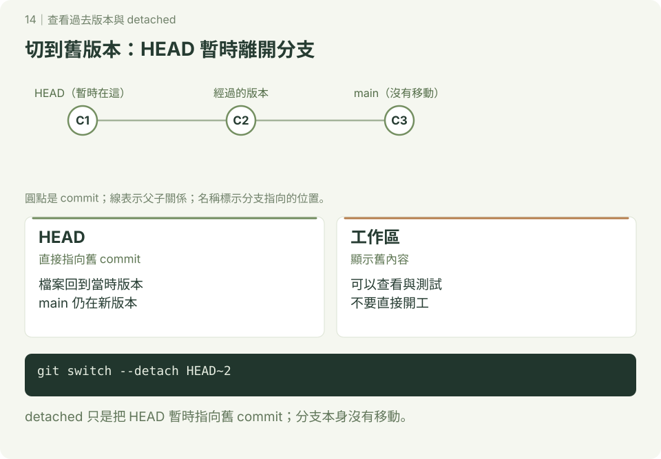

# 查看過去版本

**延伸圖解 · 第 14 章**　[學習路線](../README.md) · [互動圖解](../docs/README.md)

本章附 SVG 圖解；可先讀 [互動版使用說明](../docs/README.md)，再用瀏覽器開啟 `docs/index.html#checkout/1`，按下一步觀察變化。GitHub 的 README 顯示靜態圖，下載教材後即可離線操作互動版。

先用 log、show 查詢；只有真的要在整個舊版本操作時才切換。以下是獨立練習，已設定提交身分，使用終端機或 Git Bash，在尚無 history-view-demo 的位置開始。



## 1. 建立三筆提交

```bash
mkdir history-view-demo
cd history-view-demo
git init -b main
printf 'A\n' > a.txt
git add a.txt
git commit -m "新增 a.txt"
printf 'B\n' > b.txt
git add b.txt
git commit -m "新增 b.txt"
printf 'C\n' > c.txt
git add c.txt
git commit -m "新增 c.txt"
git log --oneline --graph --all --decorate
```

預期最新一筆旁有 HEAD -> main，資料夾中有 a、b、c 三個檔案。識別碼依你的操作而不同。

## 2. 不改動工作區的查詢

```bash
git show HEAD~2:a.txt
git ls-tree --name-only HEAD~2
git log --oneline -- a.txt
git diff --name-status HEAD~2 HEAD
```

第一筆有 a.txt、內容 A，之後新增 b、c。`--` 用來區分版本與路徑。`git log --all` 查看所有參照可到達的歷史，不是找出曾經存在的每個物件。

## 3. 切到舊版本：detached HEAD

先確認工作區乾淨，再操作：

```bash
git status --short
git switch --detach HEAD~2
ls
git status
git log --oneline --all --decorate
```

預期只見 a.txt，HEAD 直接指向第一筆，main 仍指向第三筆。受追蹤檔案隨版本更新，並非把 b、c 的歷史刪掉。舊寫法 `git checkout 識別碼` 也可進入 detached HEAD；初學用 switch 明確區分切換與還原檔案。

```bash
git switch main
ls
```

回來後再次看到三個檔案。

## 4. 想從舊版本繼續開發

查詢用寫法：`git switch -c experiment 實際識別碼`。建立分支後再提交，成果會有分支名稱保留。若已在 detached HEAD 做了提交，**離開前**用 `git switch -c experiment` 保留目前成果；不要以為回到 main 就會自動把它合併。

自己做：不切換工作區，用 show 讀出第一筆 a.txt；再從第二筆建立練習分支，新增 d.txt。完成標準：main 仍保留原版本，練習分支有自己的新增提交。

參考：[git switch](https://git-scm.com/docs/git-switch)、[git show](https://git-scm.com/docs/git-show)。
