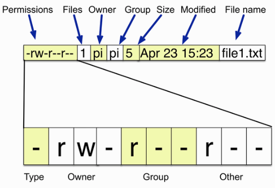
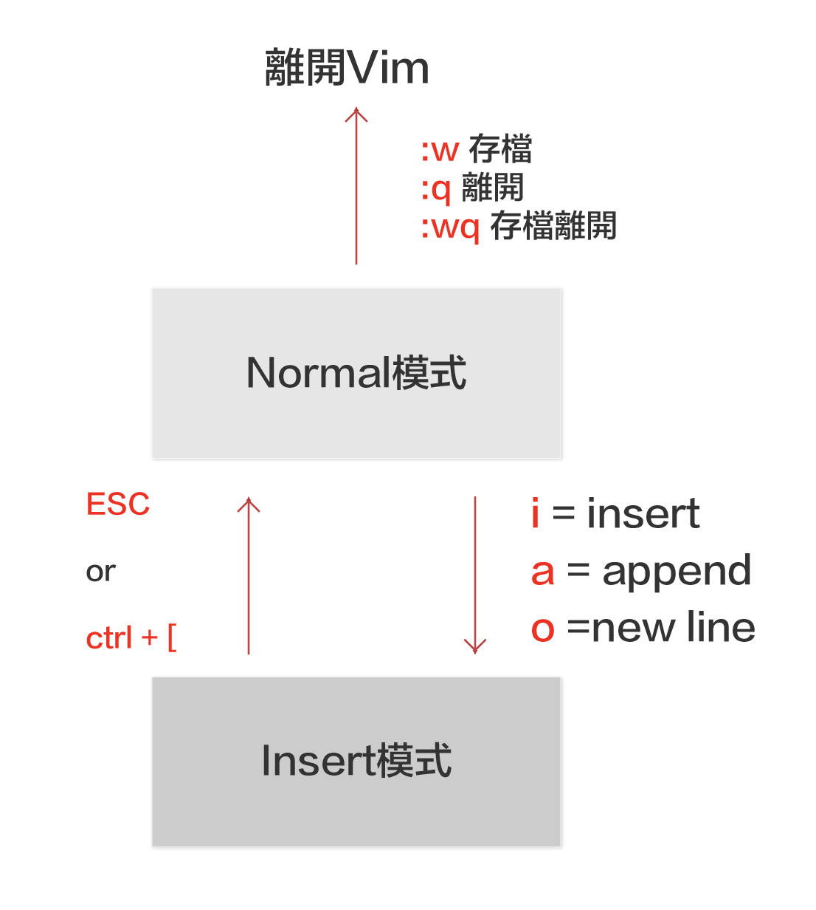

# git環境安裝與設定

- 安裝git
- 會使用基本命令做檔案的管理
- 會操作nano,Vim

## 安裝git
[git官網git-scm.com](https://git-scm.com)

## 查詢目前git版本
- windows使用git bash軟體
- mac 做用terminal
- linux 使用terminal

```
$ git --version
git version 2.31.1
```


## 查詢git安裝的位置

```
$ which git
/mingw64/bin/git

```

## 安裝視窗軟體gitHub Desktop(mac,window)
[github desktop 官網](https://desktop.github.com/)

## 安裝視窗軟體SourceTree(mac,window)

[sourceTree](https://www.sourcetreeapp.com)

## 安裝視窗軟體gitk(linux)

```
$ sudo apt-get install gitk
```

## 安裝 vscode 
[vscode 官網](https://code.visualstudio.com/)

## 使用者設定

### 1.0 建立使用者姓名和使用者email(必設)

```bash
$ git config --global user.name "Robert"
$ git config --global user.email "roberthsu2003@gmail.com"
```

### 說明: `git config` 命令用於設置 Git 的配置選項，而這些選項可以在不同的範圍內設置。

主要有三個範圍：
- `--local`
- `--global`
- `--system`

#### 以下是它們之間的差異：

#### --local

- **範圍**：僅適用於當前 Git 儲存庫。
- **配置文件**：設置會保存在儲存庫目錄中的 `.git/config` 文件中。
- **用法**：適用於特定儲存庫的配置，不會影響其他儲存庫。

```bash
git config --local user.name "本地儲存庫的名字"
git config --local user.email "local@example.com"
```

#### 例子：
當你在某個專案中需要不同於全局配置的用戶名稱和電子郵件地址時，可以使用 `--local` 來設置。

#### --global
- **範圍**：適用於當前用戶的所有儲存庫。
- **配置文件**：設置會保存在用戶主目錄中的 `~/.gitconfig` 文件中。
- **用法**：適用於該用戶所有儲存庫的配置，除非在單個儲存庫中被覆蓋。

```bash
git config --global user.name "全局名字"
git config --global user.email "global@example.com"
```

#### 例子：
當你想在所有儲存庫中使用相同的用戶名稱和電子郵件地址時，可以使用 `--global` 來設置。

#### --system

- **範圍**：適用於系統上所有用戶的所有儲存庫。
- **配置文件**：設置會保存在 Git 安裝目錄中的 `etc/gitconfig` 文件中。
- **用法**：需要管理員權限，適用於系統範圍的配置。

```bash
git config --system core.editor "vim"
```

#### 例子：
當你想為整個系統設置 Git 的默認編輯器時，可以使用 `--system` 來設置。

#### 優先順序

當同一配置項目在多個範圍內設置時，優先順序如下：

1. **--local**（儲存庫級別）設定的值會覆蓋其他範圍的設定。
2. **--global**（全局級別）設定的值會覆蓋系統級別的設定。
3. **--system**（系統級別）設定的值是最基礎的，如果沒有其他設置，會使用系統級別的配置。

#### 例子：

如果你在三個範圍內都設置了 `user.name`，例如：

```bash
git config --system user.name "系統名字"
git config --global user.name "全局名字"
git config --local user.name "本地名字"
```

那麼在特定儲存庫中使用 `git log` 查看提交記錄時，看到的 `user.name` 會是 "本地名字"。如果該儲存庫沒有設置本地配置，則會使用全局配置的 "全局名字"。如果全局配置也沒有設置，則使用系統配置的 "系統名字"。


### 3 git pull和fetch 更改預設的方式為merge
> 預設其實就是merge,但使用vscode工具時,在下載更新時,時常遇到此**_提示訊息_**,所以使用vscode最好加上這一行設定

```bash
$ git config pull.rebase false
```

#### 3.1 檢查當前的 pull.rebase 設定

```base
$ git config --get pull.rebase
```

#### 3.2 設定 git config pull.rebase false 的原因是告訴 Git 在執行 git pull 時，不要使用 rebase 的方式來合併從遠端倉庫拉取的變更。具體來說，這個設定會讓 git pull 使用默認的 merge 策略而不是 rebase 策略。

#### 3.3 什麼是 `git pull`？
git pull 是一個常用的命令，用來從遠端倉庫拉取最新的更改並將它們合併到本地分支中。它實際上是 git fetch 和 git merge 的組合。

#### 4.0 git 設定default branch name

```
git config --global init.defaultBranch main
```

- ### 查看使用者環境設定

```
$ git config --list

diff.astextplain.textconv=astextplain
filter.lfs.clean=git-lfs clean -- %f
filter.lfs.smudge=git-lfs smudge -- %f
filter.lfs.process=git-lfs filter-process
filter.lfs.required=true
http.sslbackend=openssl
http.sslcainfo=C:/Program Files/Git/mingw64/ssl/certs/ca-bundle.crt
core.autocrlf=true
core.fscache=true
core.symlinks=false
pull.rebase=false
credential.helper=manager-core
credential.https://dev.azure.com.usehttppath=true
init.defaultbranch=master
filter.lfs.clean=git-lfs clean -- %f
filter.lfs.smudge=git-lfs smudge -- %f
filter.lfs.process=git-lfs filter-process
filter.lfs.required=true
user.name=roberthsu2003@gmail.com
user.email=roberthsu2003@gmail.com
```

## 常用命令列

```
#使用者目錄(/home/pi)
pi@raspberrypi:$ ~
```

```
#查看當前所在目錄(print working directory)
pi@raspberrypi: ~ $ pwd
/home/pi
```

```
#回到上層目錄
$ cd ..
$ pwd
/home
```

```
#絕對路徑(/xxxx/xxxxx/xxxx)
#相對路徑(./xxxx/xxxx/xxx)
```

```
#回到電腦根目錄
$ cd /
$ pwd
/
```

```
#回到使用者目錄
$ cd ~
```


```
#檢查目前目錄內容
$ ls
$ ls -l
$ ls -al
```

### 複製檔案或資料夾
```
#建立文字檔
$ echo "hello" > myfile.txt
$ ls
myfile.txt

#複製文字檔
$ cp myfile.txt myfile2.txt
$ ls
myfile.txt myfile2.txt

#複製文字檔至別的目錄
$ cp myfile.txt /tmp

#複製整個目錄和內容
$ cp -r mydirectory mydirectory2
```


### 重新命名檔案名稱或資料夾名稱

```
$ mv my_file.txt my_file.rtf
```

### 檢視檔案內容

```
$ cat myfile.txt
$ more myfile.txt
$ less myfile.txt
```

### 建立編輯檔案

```
$ touch my_file.txt
$ nano my_file.txt
```


### 建立目錄

```
$ cd ~
$ mkdir my_directory
$ cd my_directory
$ ls
```

### 刪除檔案或目錄

```
# 刪除檔案
$ cd ~
$ rm my_file.txt
$ ls

# 刪除同檔名但不同副檔名的檔案
$ rm my_file.*

# 刪除所有檔案
$ rm *

# 刪除目錄和內容
$ rm -r mydir
```

### 了解檔案權限



### 改變檔案權限

```
$ chmod u+x file2.txt
# u 代表user
# g 代表group
# o 代表other

# + 代表增加權限
# - 代表移除權限

# x 代表可執行的權利

```

### Vim基本操作

Vim 主要是使用模式的切換來進行輸入、移動游標、選取、複製及貼上等操作。在 Vim 主要常用的有幾個模式:Normal 模式以及 Insert 模式:



1. Normal模式，又稱命令模式，在這個模式下，無法輸入文字，僅能進行複製、貼上、存 檔或離開動作。
2. 要開始輸入文字，需要先按下 i 、 a 或 o 這三個鍵其中一個進入 Insert 模式，便能 開始打字。其中， i 表示 insert ， a 表示 append ，而 o 則是表示會新增一行並開 始輸入。
3. 在 Insert 模式下，按下 ESC 鍵或是 Ctrl + [ 組合鍵，可退回至 Normal 模式。
4. 在 Normal 模式下，按下 :w 會進行存檔，按下 :q 會關閉這個檔案(但若未存檔會提
示先存檔再離開)，而 :wq 則是存檔完成後直接關閉這個檔案。

5. 在一般模式下,按下shift + v,進入virtual line 模式(選取整行),可使用方向鍵,選取多行, 按下d可以刪除整行


