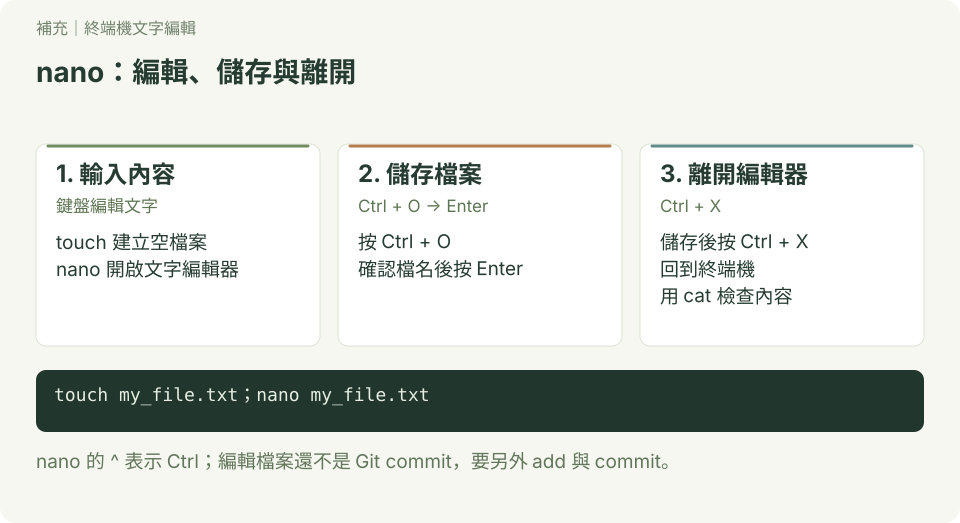
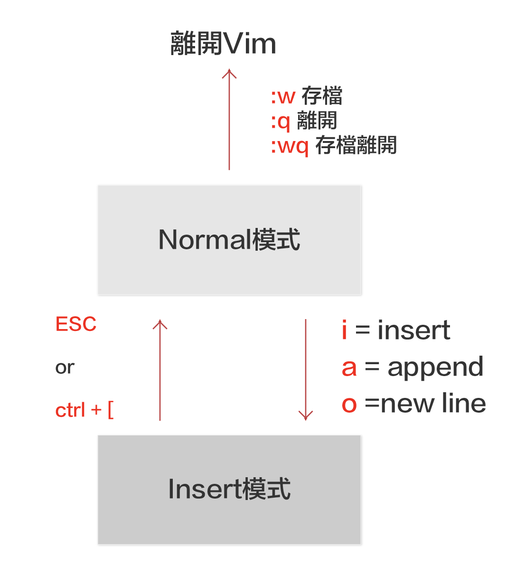
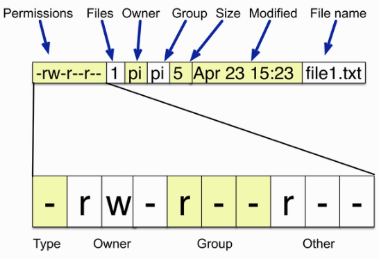

# 環境安裝與設定

完成本章，你應能開啟終端機、確認操作位置、建立檔案，並設定 Git 提交身分。

## 1. 安裝與確認

從 [Git 官方安裝頁](https://git-scm.com/install/) 依作業系統安裝受維護版本。Windows 請使用 Git for Windows 附的 Git Bash；macOS／Linux 使用終端機。教材的檔案操作指令以這些 shell 為準，PowerShell 與 cmd 的語法可能不同。

```bash
git --version
```

本教材使用 `switch`、`restore` 與 `init -b`，Git 至少需要 2.28，建議安裝目前受維護版本。版本輸出與安裝路徑依電腦不同，不需與截圖一致。

可以使用 VS Code 或其他文字編輯器；Git GUI 也能提交與合併。本教材以指令教學，GUI 可輔助看圖，不需要同時安裝所有工具。

## 2. 設定提交身分

下面姓名與信箱請換成自己的資料，不要原樣輸入：

```bash
git config --global user.name "你的名字"
git config --global user.email "你的電子郵件"
git config --global init.defaultBranch main
git config --global --get user.name
git config --global --get user.email
```

這是寫進 commit 的作者身分，**不是 GitHub 登入帳密**。公開儲存庫的提交資訊可能公開；需要隱藏信箱時，可使用 GitHub 帳號設定提供的 noreply 地址，詳見 [官方信箱設定](https://docs.github.com/en/account-and-profile/how-tos/email-preferences/setting-your-commit-email-address)。改設定只影響後續提交，不會改掉 log 裡已有的作者。

| 範圍 | 指令範例 | 作用 |
| --- | --- | --- |
| global | `git config --global user.name "名字"` | 目前使用者的預設設定 |
| local | `git config user.name "專案用名字"` | 目前儲存庫，需在儲存庫內執行 |
| system | `git config --system ...` | 整台電腦，通常需要管理權限 |

常用範圍的優先順序是 local 高於 global 高於 system；命令列等其他來源也可能覆蓋設定。global 通常在 ~/.gitconfig，也可能使用 XDG 位置。查設定來源可用：

```bash
git config --show-origin --list
```

不要公開貼出整份設定，可能含私人路徑或其他敏感設定。

## 3. 終端機最小練習

在自己選的練習位置開始，確認 terminal-demo 尚未存在：

```bash
pwd
mkdir terminal-demo
cd terminal-demo
printf 'Hello Git\n' > index.txt
ls
cat index.txt
mkdir empty-folder
rmdir empty-folder
cd ..
```

完成標準：能說出目前位置，找到 terminal-demo/index.txt，內容是 Hello Git。

| 指令 | 用途與注意 |
| --- | --- |
| `pwd` | 看目前位置 |
| `cd 路徑` | 切換資料夾；有空白的路徑加雙引號 |
| `cd ..` | 上一層 |
| `cd ~` | 回家目錄；單獨輸入 ~ 不是切換指令 |
| `ls -a` | 包含隱藏項目，例如 .git |
| `touch 檔名` | 不存在時建立空檔，存在時更新時間 |
| `printf '內容\n' > 檔名` | 寫入並覆蓋原內容 |
| `printf '內容\n' >> 檔名` | 接在原內容後面 |
| `rm 明確檔名` | 刪除檔案，通常不進資源回收筒 |
| `rmdir 目錄` | 移除空目錄 |

教材不需要用 rm 的萬用字元清空專案。若練習要建立的檔名已存在，先用 pwd、ls、cat 確認位置與內容，不要直接覆蓋自己的作品。

## 4. 提交訊息編輯器

初學可用 `git commit -m "訊息"`。沒有 -m 時，Git 可能開啟編輯器。

使用 VS Code 且 `code` 指令已可用時，可設定 `git config --global core.editor "code --wait"`。未安裝 code 指令時，先由 VS Code 的設定方式處理，不要照抄後誤以為 Git 壞掉。

### nano

編輯後 Ctrl+O 儲存、Enter 確認檔名，Ctrl+X 離開；按鍵名稱以底部提示為準。



### Vim

Normal 模式可以移動與執行編輯命令；按 i 進 Insert 輸入文字，Esc 回 Normal。輸入 `:wq` 儲存離開，`:q!` 放棄本次編輯離開。Shift+V 是 Visual line（整行選取）模式。**離開編輯器不等於取消 Git 操作**；純新建 commit 時 `:q!` 不存檔通常會因空訊息而中止提交，但 `--amend`／merge 等已有訊息時，`:q!` 仍可能沿用原訊息完成操作，不想繼續時要再用 `git status` 確認結果。

以下為舊版安裝／設定截圖，只供辨認介面，請依目前安裝程式與上面的指令確認。





## 5. pull 策略先不用全域硬改

`git pull` 先 fetch，再依選項與設定整合，不是一律 merge。教材一般更新 main 時明確用 `git pull --ff-only origin main`；分岔時先看歷史，再選 merge 或 rebase。不要為配合某個編輯器，把自己所有專案的 pull 策略改掉。

若 chmod 出現在後面的 SSH 設定，它是 Unix 權限操作，不是 Git 的設定，也不是 Git 的存取權限設定；Windows 的檔案權限與 Unix 模式不同。

參考：[git config](https://git-scm.com/docs/git-config)、[git pull](https://git-scm.com/docs/git-pull)。

[開始第一章 →](../開始使用Git/README.md)
