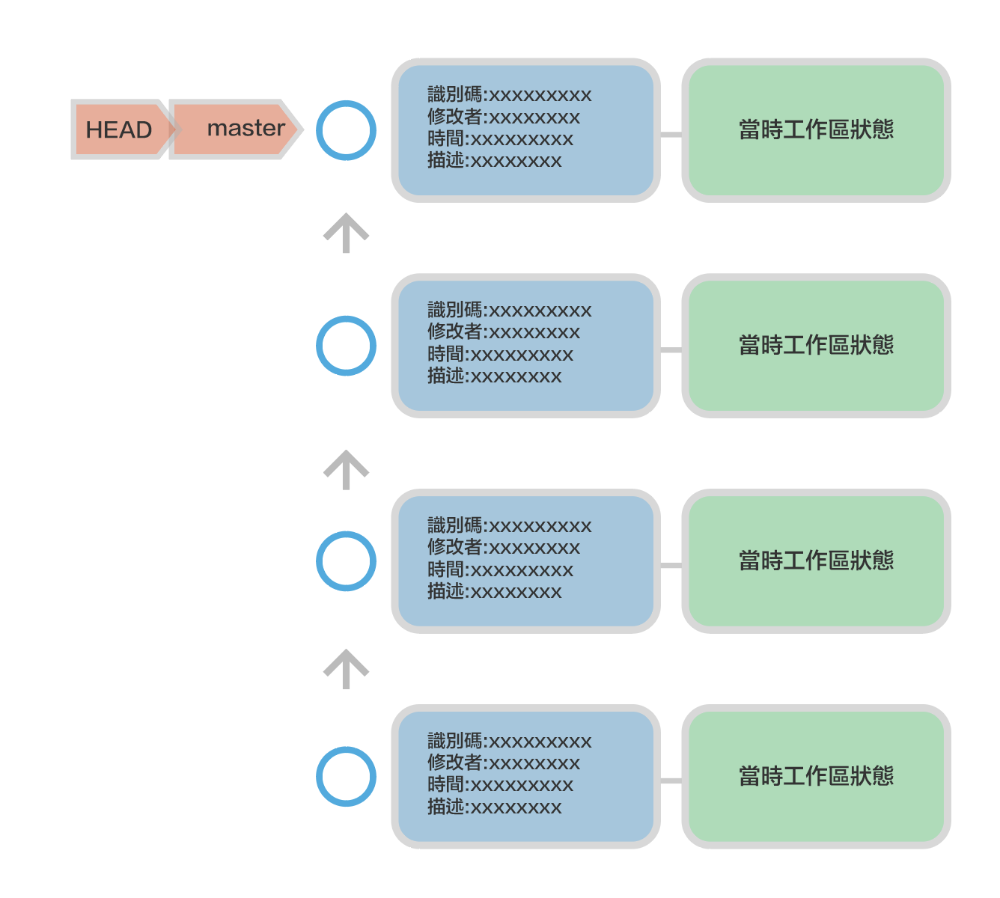

# 開始使用Git

## git是什麼?

就是在專案開始到結束時, 建立非常多的記錄點(commit),在開發的過程中,我們可以在記錄點上遊走,說簡單點就是我們可以回到記錄點被建立當下的專案檔案的狀態。

## 建立記錄點有什麼好處呢?

### 1. 當專案測試新功能時，發現不好可以回到測試前的記錄點，重新開始
### 2. 不怕專案不小心被刪了
### 3. 可以多人同時開發相同專案
### 4. 可以記錄每一個檔案是誰修改的，時間點，改了那些東西，簡單的註記說明
### 5. 可以保存在git server(github)

## 使用 「GUI介面」 還是「Command line」介面較好?

不會command line介面，基本上就不會使用GUI介面。GUI介面只是一個方便檢視(view)功能，不建議在GUI操作功能

##  Git好學嗎?

好學，難熟練。學20%功能，就可以使用80%功能。所以初學者一開始不要鑽牛角尖。

## 開始將專案交給git管理

