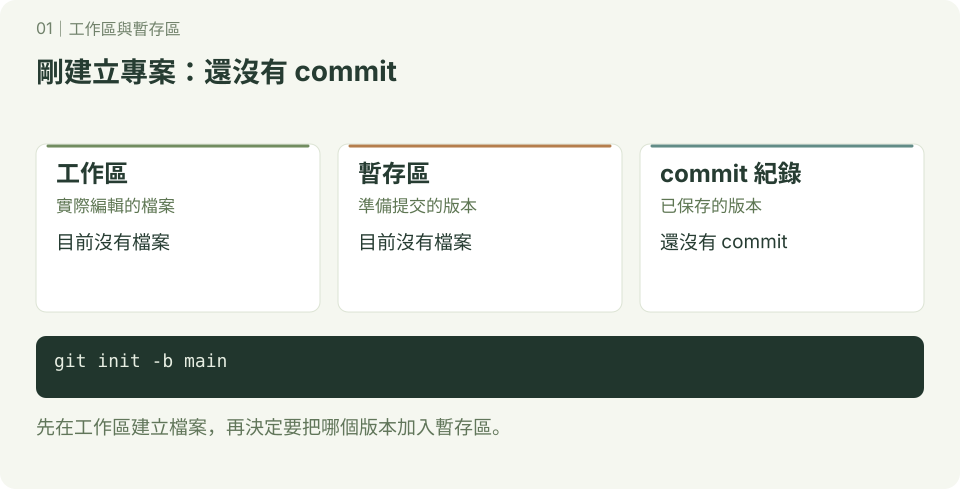
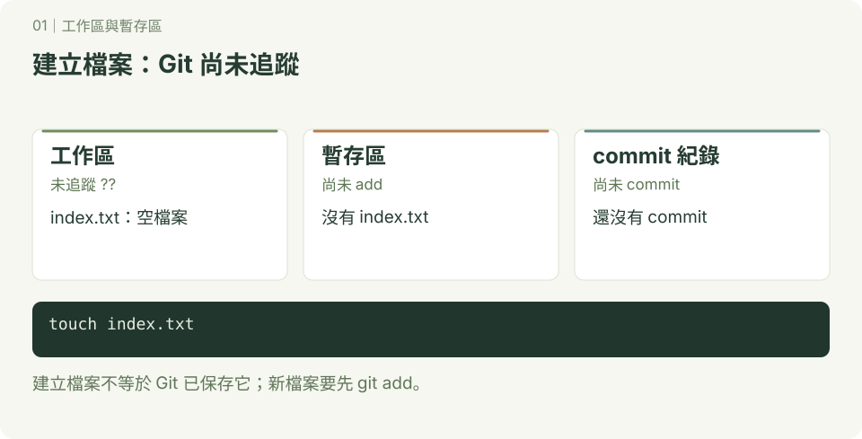
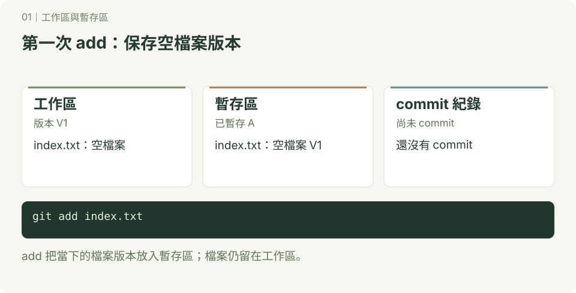
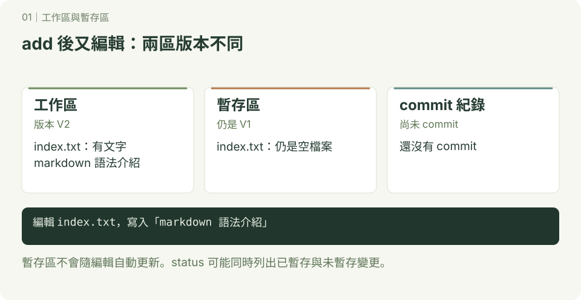
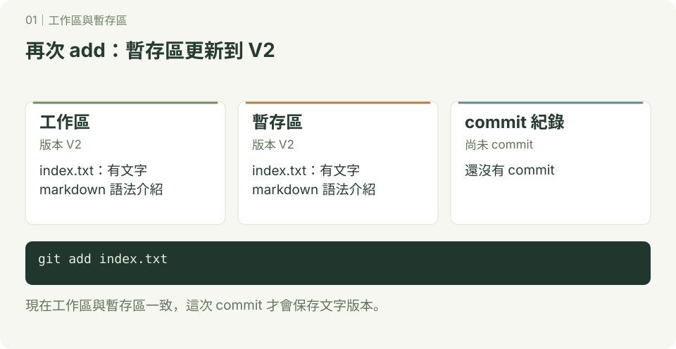
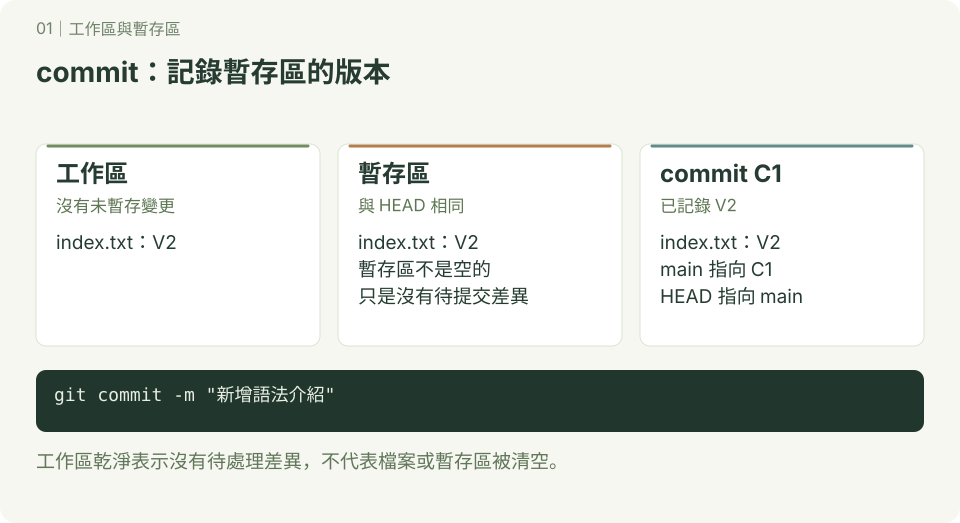
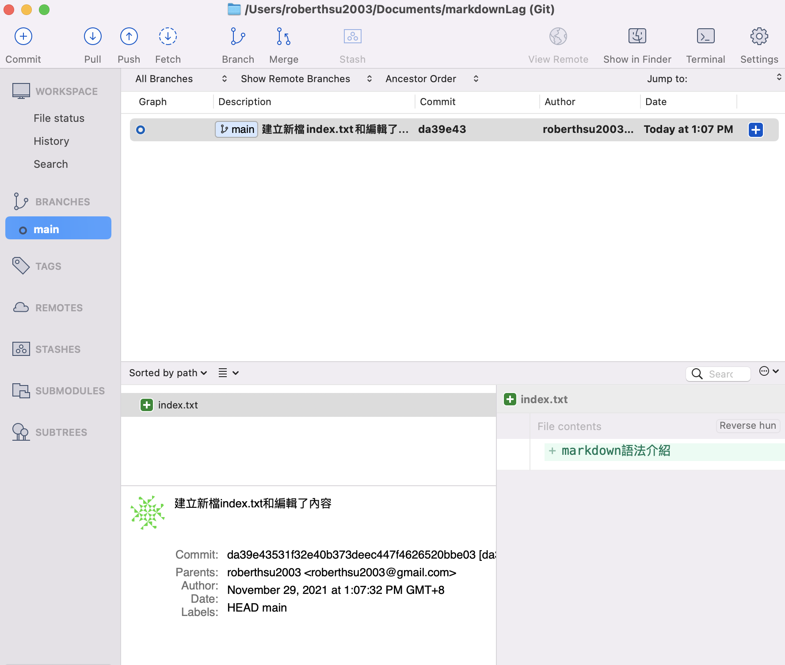

# 工作區與暫存區

**建立版本 · 第 01 章**　[學習路線](../README.md)


Git 記錄專案版本，讓你比較修改、回看已提交內容。它不會自動保存所有檔案；整個資料夾連同 `.git` 都刪掉時，本地歷史也會消失。重要專案還需要遠端儲存庫或備份。

## 1. 三個區域先分清楚

| 區域 | 保存什麼？ | 怎麼更新？ |
| --- | --- | --- |
| 工作區 | 現在實際編輯的檔案 | 編輯器、建檔或刪檔 |
| 暫存區（index） | 下一次提交要使用的檔案版本 | `git add` |
| commit | 已記錄的專案快照與提交資訊 | `git commit` |

**commit 使用暫存區的版本。** add 後又編輯，新的修改不會自動進入暫存區。提交後暫存區仍記錄檔案版本，只是與 HEAD 沒有待提交差異。

## 2. 照做：add 後再修改

先完成 [環境設定](../環境安裝與設定/README.md)。以下在 macOS／Linux 終端機或 Windows Git Bash 執行；選一個練習位置，確認 staging-demo 尚未存在。`bash` 是指令，`text` 是預期結果，請不要把輸出一起輸入。

### 步驟一：建立儲存庫



```bash
mkdir staging-demo
cd staging-demo
git init -b main
git status
```

預期目前分支 main，尚無 commit。`.git` 是 Git 保存資料的目錄；不要為了重做練習把它刪掉，另開新的練習資料夾即可。

### 步驟二：建立空檔案



```bash
touch index.txt
git status --short
```

```text
?? index.txt
```

`??` 表示未追蹤。此時一般 `git diff` 不會列出這個新檔案。

### 步驟三：暫存空檔案版本



```bash
git add index.txt
git status --short
```

```text
A  index.txt
```

### 步驟四：再修改工作區



```bash
printf 'markdown 語法介紹\n' > index.txt
git status --short
git diff
```

```text
AM index.txt
```

兩欄分別表示「暫存區相對 HEAD」與「工作區相對暫存區」的狀態：A 是新增已暫存，M 是又有未暫存修改。**現在直接 commit，只會保存空檔案。**

### 步驟五：更新暫存版本並檢查



```bash
git add index.txt
git diff --staged
git status --short
```

預期 staged 差異有 `+markdown 語法介紹`，status 回到 `A  index.txt`。

### 步驟六：提交與確認



```bash
git commit -m "新增語法介紹"
git status --short
git log --oneline
git show HEAD:index.txt
```

status 沒有輸出；log 有一筆提交；最後一行顯示已保存的文字。識別碼依你的操作而不同，不需要與教材相同（`--oneline` 只顯示識別碼與主題，不顯示作者與日期）。

## 3. 自己做與完成標準

新增 notes.txt，先寫 V1 並 add，再改成 V2。先用 `git diff` 與 `git diff --staged` 說明兩個版本；再次 add 後提交。完成時 status 沒有輸出，`git show HEAD:notes.txt` 是 V2。

| 指令 | 比較什麼？ |
| --- | --- |
| `git status` | 哪些路徑已暫存、未暫存、未追蹤 |
| `git diff` | 已追蹤檔案的工作區與暫存區差異 |
| `git diff --staged` | 暫存區與 HEAD 的差異 |
| `git show HEAD` | 最近一筆提交的資訊與差異 |

GUI 工具也能 add、commit、切換與合併，不只是查看歷史。本教材以指令呈現，是為了讓不同平台都能照做。以下是舊版 SourceTree 畫面，介面可能不同，請以實際狀態與指令結果為準。




---

[← 開始前的準備](../環境安裝與設定/README.md)　｜　[main、HEAD 與歷史 →](../使用main主要分支/README.md)
