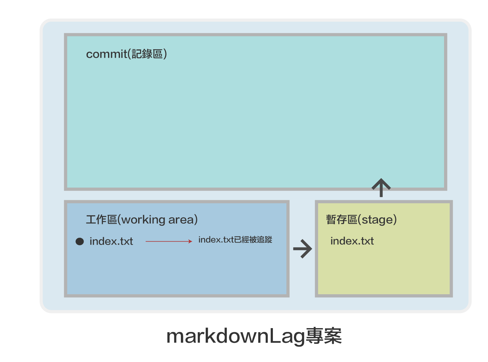

# 開始使用Git

## git是什麼?


就是在專案開始到結束時, 建立非常多的記錄點(commit),在開發的過程中,我們可以在記錄點上遊走,說簡單點就是我們可以回到記錄點被建立當下的專案檔案的狀態。

## 建立記錄點有什麼好處呢?

### 1. 當專案測試新功能時，發現不好可以回到測試前的記錄點，重新開始
### 2. 不怕專案不小心被刪了
### 3. 可以多人同時開發相同專案
### 4. 可以記錄每一個檔案是誰修改的，時間點，改了那些東西，簡單的註記說明
### 5. 可以保存在git server(github)

## 使用 「GUI介面」 還是「Command line」介面較好?

不會command line介面，基本上就不會使用GUI介面。GUI介面只是一個方便檢視(view)功能，不建議在GUI操作功能

##  Git好學嗎?

好學，難熟練。學20%功能，就可以使用80%功能。所以初學者一開始不要鑽牛角尖。

## 開始將專案交給git管理
#### - 建立一個資料夾，這資料夾將是我們的專案
#### - 將資料夾交給git管理

```
$ cd ~/Documents      #進入文件資料夾
$ mkdir markdownLag   #建立markdownLag
$ cd markdownLag      #進入markdownLag資料夾 
$ git init            #初始化git, 將資料夾交給git管理
```

#### 檢查markdownLag資料夾內的檔案內容:


```
$ ls -al

---------------
drwxr-xr-x   3 roberthsu2003  staff   96 11 29 11:26 .
drwx------+ 19 roberthsu2003  staff  608 11 29 11:25 ..
drwxr-xr-x   9 roberthsu2003  staff  288 11 29 11:26 .git
```

以上資料夾建立了一個隱藏檔「.git 」，未來所有的git資訊將儲存於.git內，也代表此資料夾目前已經被git管理。

下方為您可以想像的圖像:

- 工作區(就是在這資料內的檔案和目錄),目前是空的
- 暫存區(要將檔案加入至記錄區時，必需先加入至暫存區)
- 記錄區(記錄當時工作區的狀態)


---

## 新增1個檔案,並交由git管理

```
$ touch index.txt           #建立一個index.txt檔
```


---

```
$ git status

-------------
On branch main

No commits yet

Untracked files:
  (use "git add <file>..." to include in what will be committed)
	index.txt

```

代表說明index.txt是新建立的檔案尚未被追蹤


---

```
$ git add index.txt         #git開始追蹤index.txt檔
```

---

```
$ git status 

--------------------
On branch main

No commits yet

Changes to be committed:
  (use "git rm --cached <file>..." to unstage)
	new file:   index.txt

```

代表index.txt已經被追蹤，等待被加入記錄區



---

#### 修改index.txt的內容

```
$ vim index.txt #:wq存檔並離開

-----------------------------

markdown語法介紹
~                                                                               
~                                                                               
~                                                                               
~                                                                               
~                                                                               
~                                                                               
~                                                                               
~                                                                               
~                                                                               
~                                                                               
~                                                                                                                                                             
 
```

---

#### 檢查目前git狀態

```
$ git status

---------------------
Changes to be committed:
  (use "git rm --cached <file>..." to unstage)
	new file:   index.txt

Changes not staged for commit:
  (use "git add <file>..." to update what will be committed)
  (use "git restore <file>..." to discard changes in working directory)
	modified:   index.txt

```

1. 暫存區內有記錄新增了一個檔
2. 工作區內的index.txt已經被編輯，尚未加入至暫存區內


---

#### 將編輯的狀態加入暫存區，並檢目前狀態

```
$ git add --all #代表將工作區內所有有改變的檔案，加入至暫存區
$ git status

-------------------------
On branch main

No commits yet

Changes to be committed:
  (use "git rm --cached <file>..." to unstage)
	new file:   index.txt

```

1. 暫存區內有記錄index.txt編輯的狀態
2. 工作區內內目前沒有任何變化


---

#### 將目前的暫存區建立記錄點並加入至記錄區內，並檢目前狀態和log

```
$ git commit -m "建立新檔index.txt和編輯了內容"
------------
[main (root-commit) da39e43] 建立新檔index.txt和編輯了內容
 1 file changed, 1 insertion(+)
 create mode 100644 index.txt
 
  
$ git status
-------------------
On branch main
nothing to commit, working tree clean

$ git log
--------------------------
commit da39e43531f32e40b373deec447f4626520bbe03 (HEAD -> main)
Author: roberthsu2003 <roberthsu2003@gmail.com>
Date:   Mon Nov 29 13:07:32 2021 +0800

    建立新檔index.txt和編輯了內容


```

1. 代表建立在記錄區內的第一個記錄點，識別碼前面的7個字元是「da39e43」,記錄點的註解是"建立新檔index.txt和編輯了內容"

2. 目前工作區沒有任何改變，暫存區沒有任何暫存

3. 說明如下圖:


#### 在source tree出現的畫面


